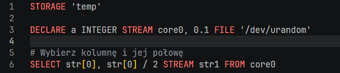
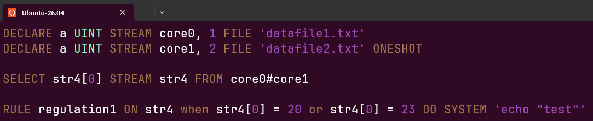
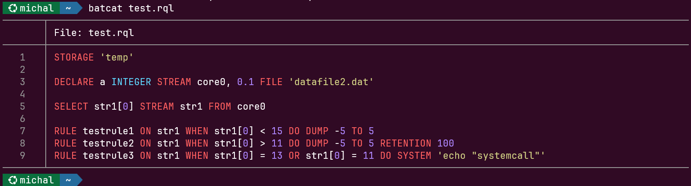

# RQL Syntax Highlighting

RetractorDB query files have the `.rql` extension. The repository ships ready-made syntax-highlighting definitions for three environments: Visual Studio Code, Vim, and the `bat`/`batcat` tool. All the necessary files live in the project's `scripts/` directory.

## Visual Studio Code

The `rql-vscode` extension adds full RQL language support to VS Code: syntax highlighting, recognition of the `.rql` extension, and a file icon.

**Installing from the GitHub repository:**

```bash
git clone https://github.com/michalwidera/rql-vscode.git
cd rql-vscode
npm install
npm run compile
code --install-extension *.vsix
```

If the repository contains a ready-made `.vsix` file, you can skip compiling and install it directly:

```bash
code --install-extension rql-vscode-*.vsix
```

After installation, VS Code automatically recognizes `.rql` files and applies syntax highlighting. No user-settings changes are needed.

**Example of a highlighted query in VS Code:**

```rql
STORAGE 'temp'

DECLARE a INTEGER STREAM core0, 0.1 FILE '/dev/urandom'

# Select a column and half of it
SELECT str[0], str[0] / 2 STREAM str1 FROM core0
```



_Fig. 62. RQL syntax highlighting in the Visual Studio Code editor_

As shown in Fig. 62, keywords (`STORAGE`, `DECLARE`, `SELECT`, `FROM`) are highlighted as commands, and data types (`INTEGER`) as types. In current RQL, `#` starts a comment only as the first non-whitespace character of a whole line; inside a `FROM` clause it is always the interleaving operator. A line-ending comment starts with `//`, and a block comment has the form `/* ... */`. The highlighting definition should preserve this distinction.

***

## Vim

The repository contains two Vim files in the `scripts/.vim/` directory:

| File                            | Description                                                        |
| ------------------------------- | ----------------------------------------------------------- |
| `scripts/.vim/syntax/rql.vim`   | Definition of the syntax groups and their color assignments |
| `scripts/.vim/ftdetect/rql.vim` | Automatic filetype detection by the `.rql` extension   |

### Installing via buildrdb.sh

The most convenient method — the script copies both files into the appropriate `~/.vim/` subdirectories:

```bash
scripts/buildrdb.sh vimsyntax
```

The script creates any missing directories and reports the destination location:

```
-- RetractorQL vim syntax installed to /home/user/.vim
```

### Installing via CMake

The `vimconf` target from `scripts/CMakeLists.txt` copies the entire `.vim` directory into the home directory:

```bash
cmake --build build --target vimconf
```

### Manual installation

```bash
mkdir -p ~/.vim/syntax ~/.vim/ftdetect
cp scripts/.vim/syntax/rql.vim   ~/.vim/syntax/
cp scripts/.vim/ftdetect/rql.vim ~/.vim/ftdetect/
```

After installation, Vim automatically activates highlighting for every file with the `.rql` extension. The file `ftdetect/rql.vim` contains a single line:

```vim
au BufRead,BufNewFile *.rql set filetype=rql
```

### Highlighted elements

| Vim group  | Examples                                                                 |
| ---------- | ------------------------------------------------------------------------- |
| `Keyword`  | `SELECT`, `DECLARE`, `STREAM`, `FROM`, `FILE`, `RULE`, `ON`, `WHEN`, `DO` |
| `PreProc`  | `STORAGE`, `ROTATION`, `SUBSTRAT`                                         |
| `Operator` | `AND`, `OR`, `NOT`                                                        |
| `Constant` | `MEMORY`, `POSIX`, `DIRECT`, `GENERIC`, `TEXTSOURCE`                      |
| `Type`     | `INTEGER`, `FLOAT`, `BYTE`, `CHAR`, `UINT`, `STRING`, `DOUBLE`            |
| `Function` | `MIN`, `MAX`, `AVG`, `Count`, `Sqrt`, `Abs`, `ToNumber`                   |
| `Comment`  | `# comment`, `// comment`, `/* block */`                               |
| `String`   | `'path/to/file.dat'`                                                  |
| `Number`   | `42`, `3.14`, `1/2`, `1e5`                                                |

**Example query file with highlighted fragments:**

```rql
DECLARE a UINT STREAM core0, 1 FILE 'datafile1.txt'
DECLARE a UINT STREAM core1, 2 FILE 'datafile2.txt' ONESHOT

SELECT str4[0] STREAM str4 FROM core0#core1

RULE regulation1 \
ON str4 \
WHEN str4[0] = 20 OR str4[0] = 23 \
DO SYSTEM 'echo "test"'
```

The text view in the vim editor is shown in Fig. 63.



_Fig. 63. RQL syntax highlighting in the vim editor_

***

## bat / batcat

The `bat` tool (available as `batcat` on some distributions) is an improved `cat` replacement with built-in syntax-highlighting support. It supports Sublime Text 3 format syntax definitions, which the RetractorDB repository provides at `scripts/sublime/retractorql.sublime-syntax`.

### Prerequisite

Make sure `bat` is installed:

```bash
# Debian/Ubuntu
sudo apt-get install bat

# Check which command is available (may be bat or batcat depending on the distro)
command -v batcat || command -v bat
```

### Installing via buildrdb.sh

```bash
scripts/buildrdb.sh batsyntax
```

The script automatically detects the command (`bat` or `batcat`), copies the syntax file into the correct config directory, and rebuilds the syntax cache:

```
-- RetractorQL syntax installed to /home/user/.config/bat/syntaxes
```

### Manual installation

```bash
# Detect the command name
BAT=$(command -v batcat || command -v bat)

# Create the directory for syntax definitions
mkdir -p "$($BAT --config-dir)/syntaxes"

# Copy the definition
cp scripts/sublime/retractorql.sublime-syntax "$($BAT --config-dir)/syntaxes/"

# Rebuild the cache
$BAT cache --build
```

### Usage

After installation, `bat` automatically highlights `.rql` files:

```bash
bat query.rql
```

The `.desc` extension (stream descriptor files) is also recognized. Highlighting can be forced manually if the file has a different extension:

```bash
bat --language rql any-file.txt
```

**Verifying the installation — available languages:**

```bash
bat --list-languages | grep -i rql
# RetractorQL:rql,desc
```

### Example invocation

For a file `query.rql` containing:

```rql
STORAGE 'temp'

DECLARE a INTEGER STREAM core0, 0.1 FILE 'datafile2.dat'

SELECT str1[0] STREAM str1 FROM core0

RULE testrule1 ON str1 WHEN str1[0] < 15 DO DUMP -5 TO 5
RULE testrule2 ON str1 WHEN str1[0] > 11 DO DUMP -5 TO 5 RETENTION 100

RULE testrule3 \
ON str1 \
WHEN str1[0] = 13 OR str1[0] = 11 \
DO SYSTEM 'echo "systemcall"'
```

Running `bat query.rql` displays the file's content with line numbers and syntax highlighting in the terminal, where keywords, types, comments, and string literals get distinct colors according to `bat`'s active theme (Fig. 64).

<figure><figcaption><p>Fig. 64. RQL syntax highlighting in the terminal — the batcat command</p></figcaption></figure>
