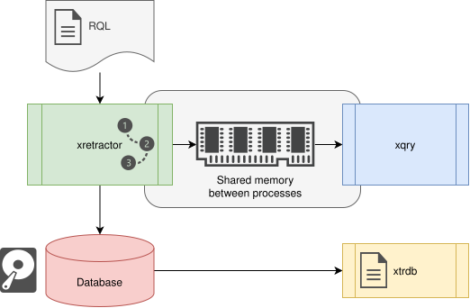

# General Perspective

The system is built around 3 programs available as system commands. The first is the compiler and query-plan execution engine. The second is the client for accessing current data. The third is the program that provides access to binary dumps. Their names are, in order:

* xretractor
* xqry
* xtrdb

The xretractor program creates a process that executes one independent RetractorDB plan. Several named instances can run on a host, each with its own shared-memory area. The xqry program creates processes that communicate with a selected instance, while a shared bus enables discovery and routing. The xtrdb program is used to analyze data and metadata stored in the database's files.

Below, Fig. 12 schematically shows RetractorDB's architecture. All currently existing components are included. The areas enclosed in boxes with headers filled with system commands correspond to the existing components. The artifact-storage area is a symbolic representation of the filesystem.

<figure><figcaption>
Fig. 12. Data-flow diagram between RetractorDB processes
</figcaption></figure>

In Fig. 12 we see the processes carried out by the xretractor, xtrdb, and xqry programs. The figure presents one execution instance; in a multi-server deployment, the `xretractor` block together with its IPC and clients is repeated for every name. Relationships between instances are described in [Multiple Instances and the Bus](multiple-instances-and-bus.md).

An xretractor process communicates with xqry processes through its own named shared-memory area. In this memory, a data queue is created for every xqry subscription. Data is received by xqry processes on an ongoing basis. The job of the xqry processes is to forward the data on to other systems or processes. If an xqry process dies or is terminated, the relevant xretractor instance frees the resources dedicated to that client.

Besides directing data for delivery through shared memory, RetractorDB also writes data to the so-called artifact-storage area. Currently this is a directory to which the results of the stream-processing carried out according to RetractorDB's query execution plans are continuously written.

> **⚠️ Warning**
>
> The "Database" shown in the figure is not a relational database. By "database" in the figure shown, we mean a set of binary or text files managed by RetractorDB. Data is pulled from devices and written to rotating or non-rotating binary or text files. Access to this data is carried out via the xtrdb tool, or, while the system is running, via the xqry process.

The file with RQL queries and directives is given as the first argument to the command that starts the system. That argument is **optional**: invoking `xretractor` without a query file starts it in **idle mode** — the process comes up, takes the service lock, opens the IPC channel and waits, building neither a plan nor a timeline. This lets a systemd unit come up together with the operating system, before the operator supplies a query set. The exception is `--onlycompile` mode, where a missing file remains an error — there is nothing to compile.

A query set can be supplied later in three ways. `xqry -a` adds one `SELECT`, `DECLARE`, or `RULE` to an active plan. `xqry --reset file.rql` atomically replaces the complete plan without restarting the process and can start the first epoch of an idle instance. Running `xretractor file.rql` while the service is live can instead validate the file, store it as the startup plan, and restart the systemd unit. The latter two routes accept a complete set including `:STORAGE`, `:SUBSTRAT`, and `:ROTATION` directives.

> **_NOTE:_** Idle mode is covered by the `service_idle` test (variants using the `--service` flag and the `XRETRACTOR_SERVICE` environment variable).
