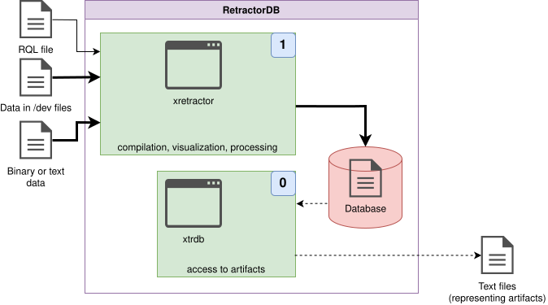

# Artifact Analysis

Looking more broadly at the potential data paths in Fig. 13, the last undescribed path is the one involving the xtrdb tool.

While building the system, I needed a tool for accessing artifacts in order to run integration tests. To verify correctness, I had to compare processing results at various stages. Fig. 31 shows the complete data flow, including the role of the xtrdb tool.

<figure><figcaption><p>Fig. 31. Data flow in artifact analysis</p></figcaption></figure>

To present the artifact-analysis process, the entire processing chain needs to be taken into account. We'll use the same query as before. However, we'll run our data-processing process a bit differently this time.

```
$ xretractor -m 10 query.rql
```

A query-processing run invoked this way will finish after 10 processing cycles. The `-m` parameter specifies the number of iterations of the main loop, not the number of seconds — the running time depends on the interval of the source streams. For streams with a 0.1 s interval (10 Hz), this means \~1 second of runtime. After it finishes, and we look at the directory in which we ran the query, we should see the following files:

```
$ ls -al
total 32
drwxr-xr-x  2 michal michal 4096 Oct  4 18:01 .
drwxr-xr-x 10 michal michal 4096 Oct  4 17:59 ..
-rw-r--r--  1 michal michal   51 Oct  4 18:01 core0.desc
-rw-r--r--  1 michal michal   43 Oct  4 18:01 core1.desc
-rw-r--r--  1 michal michal   27 Oct  4 17:59 datafile1.txt
-rw-r--r--  1 michal michal  180 Oct  4 18:00 query.rql
-rw-r--r--  1 michal michal   72 Oct  4 18:01 str1
-rw-r--r--  1 michal michal   34 Oct  4 18:01 str1.desc
```

As you can see, three .desc files were created, plus one file containing artifacts. If we look inside the str1 file, we'll see fairly modest content:

```
$ hexdump str1
0000000 0014 0000 0015 0000 0015 0000 0016 0000
0000010 0016 0000 0017 0000 0017 0000 0018 0000
0000020 0018 0000 0019 0000 0019 0000 001a 0000
0000030 001a 0000 001b 0000 001b 0000 001c 0000
0000040 001c 0000 001d 0000
0000048
```

Alongside the artifact file, metadata files are also created. Their content describes the structure of the file.

```
$ cat str1.desc
{       INTEGER str1_0
        INTEGER str1_1
}
```

The descriptions of the ephemeris files are far more interesting. The description files for ephemeral data point to files in the Linux filesystem.

```
$ cat core0.desc
{       INTEGER a
        REF "datafile1.txt"
        TYPE TEXTSOURCE
}
$ cat core1.desc
{       BYTE a
        REF "/dev/urandom"
        TYPE DEVICE
}
```

Metadata description files are created automatically the moment an object is registered in RetractorDB. Remember to delete these descriptors if you modify the query.rql file.

Once the xtrdb program is started in a terminal, the tool displays a dot (`.`) as its prompt. This character is just a prompt — it is not part of the command. You can start interacting with the tool right away. Example session:

```
$ xtrdb
.open str1
ok
.desc
{       INTEGER str1_0
        INTEGER str1_1
}
.list 1
{ str1_0:20 str1_1:21 }
.quit
```

Working with this tool feels like working with a classic, old-school dbase database. There's no state machine here, no loops or conditions — just reading and modifying binary files described by metadata.

The main goal of this tool was to support the creation of test scripts. RetractorDB is deterministic. The system has no race conditions — data that arrives on the input should always produce the same results on the output. Unless, of course, we mix in random data, as in the example shown here.

> **_NOTE:_** The functionality described here is covered by the tests: `issue113_meta_xtrdb`, `issue113_meta`, `issue113_null_txtsrc`, `Pattern5`, described in the appendix [Integration Tests](../appendices/integration-tests.md).

A very useful feature of this tool is the `list` and `rlist` functions — listing the initial elements of a file, or the final elements of a file, respecting the structure described in the metadata.

```
.list 4
{ str1_0:20 str1_1:21 }
{ str1_0:21 str1_1:22 }
{ str1_0:22 str1_1:23 }
{ str1_0:23 str1_1:24 }
.rlist 4
{ str1_0:28 str1_1:29 }
{ str1_0:27 str1_1:28 }
{ str1_0:26 str1_1:27 }
{ str1_0:25 str1_1:26 }
```

I encourage you to experiment and browse the source of this tool. It's one of the less complicated, yet very useful, parts of RetractorDB.

## Inspecting null/gap metadata

Every artifact has an associated `.meta` index file, described in detail in the chapter on the storage format. Its content can be viewed directly in xtrdb with the `meta` command:

```
.open str1
ok
.meta
record 0: count=9 gap=false nullBitset=00
```

The `gap=false` entry means there is no gap in the data; `nullBitset` shows which fields contain null values (one bit per field). Data with no gaps at all forms a single entry `count=N`, where N is the total number of records.
