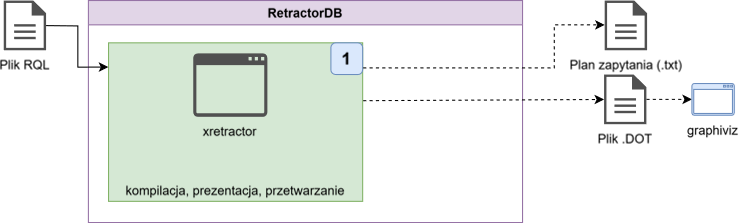
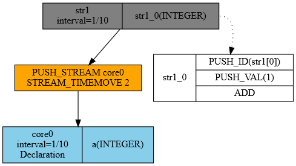

# Compilation and Plan Construction

The compilation process happens before every run of the xretractor process. An argument in the form of a file with a sequence of commands and queries is required. Based on the flow shown in Fig. 13, I prepared a description of the process in Fig. 25, showing the compilation process in development mode. The compilation process can be invoked even while another xretractor process is already running. Locking a single instance of the data-processing process applies only to the query-execution-plan process. Invoking compilation in this case, even if that process is already running in the system, will not report an error. Attempting to start another processing run — it will.

<figure><figcaption><p>Fig. 25. The compilation process</p></figcaption></figure>

As an example file for compilation, we'll use a file query.rql with the following content:

```
DECLARE a INTEGER \
STREAM core0, 0.1 \
FILE 'datafile1.dat'

SELECT str1[0]+1 \
STREAM str1 \
FROM core0>2
```

This is a very simple example of a file containing two directives. The first declares the existence of an ephemeris in the form of a binary data source containing 4-byte INTEGER values. Data from this file will be read at a rate of 10 times per second. And the name of this object is core0.

The second command creates an artifact named str1, taking ephemeral data shifted in time by two reads, i.e. 0.2 seconds. While building successive elements of the output stream, the data read from core0 is processed, and the value 1 is added to every value read.

To compile this file, the following command must be invoked:

```
$ xretractor -c query.rql
```

The following system response will be printed on the screen:

```
str1(1/10)
      :- PUSH_STREAM(core0)
      :- STREAM_TIMEMOVE(2)
      str1_0: INTEGER
            PUSH_ID(str1[0])
            PUSH_VAL(1)
            ADD
core0(1/10) datafile1.dat
      a: INTEGER
```

Omitting the -c parameter will cause the system to attempt compilation and immediately send the compiled query execution plan for execution. This will cause an error, since the data file datafile1.dat presumably hasn't been prepared yet.

Besides the text view, we can also look at the compilation output in graphical form. To do this, invoke the following sequence of commands:

```
$ xretractor -c -d -f -s query.rql > out.dot && dot -Tpng out.dot -o out.png
```

Assuming you have the dot program from the graphviz package installed in your runtime environment, this command will generate an image file showing the system's response in the form of a graph.

<figure><figcaption><p>Fig. 26. Graphical representation of a query plan</p></figcaption></figure>

RetractorDB can generate an image in response to one of the requested data-processing chains. The graphical presentation is most suitable for creating and presenting data-processing graphs. Unfortunately, readability suffers for very complex schemas.

Fig. 26 shows the trivial query execution plan produced by compiling the two-line query.rql file. At the very top we see the object str1, producing artifacts at a rate of 10 records per second. Information about the artifact-creation rate does not appear in the query; it is computed based on the algebraic expression in the FROM clause of the SELECT query. We can also see how successive records of the str1 stream are produced. Here we have a typical stack-based data-processing algorithm. First, the ephemeral value produced by the algebraic expression is pushed onto the stack, then the value 1 is placed on the stack. The ADD instruction pops both values off the stack, leaving the sum on the stack. What remains on the stack — i.e. the result of the addition — is placed into the field of the record being created.

On the other side we see stream operations. Stream operations are carried out in a different domain. There, we process objects of one or two values. Operations act either on two streams, or on a single stream with an argument. The classic stack has no application for algebraic stream operations. For simplicity, the notation resembles stack operations somewhat. We see, in the attached example, that operations on current data are carried out by shifting the data in time by 2. I deliberately do not say that this is 2 seconds — here 2 denotes a relative value with respect to the arrival rate. For an arrival rate of 10 samples per second, the value 2 means a time shift of 0.2 seconds.

Complex algebraic expressions involving at least two stream operators give rise to the substrates mentioned in previous chapters. Every query whose FROM-clause algebraic expression contains more than one operator is broken down into interdependent two-argument operations. The substrate's argument list is, by default, the full expansion of the schema.

## Available xretractor flags

Different sets of flags are available in compile mode (`-c`) and in execution mode. Below are the compile-mode flags used for generating graphs:

| Flag  | Full name         | Meaning                                            |
| ----- | ------------------ | --------------------------------------------------- |
| `-c`  | `--onlycompile`    | compile only — does not start processing            |
| `-d`  | `--dot`            | generate output in DOT (graphviz) format             |
| `-f`  | `--fields`         | show stream fields in the DOT graph                  |
| `-s`  | `--streamprogs`    | show stream programs in the DOT graph                |
| `-u`  | `--rules`          | show RULE rules in the DOT graph                      |
| `-p`  | `--transparent`    | transparent background for the DOT graph               |
| `-i`  | `--hideruleprog`   | hide the rule-condition program (with `-u`)           |
| `-m`  | `--csv`            | output in CSV format                                  |

Execution-mode flags (without `-c`):

| Flag   | Full name        | Meaning                                             |
| ------ | ----------------- | ----------------------------------------------------- |
| `-m N` | `--tlimitqry N`   | run N processing cycles, then exit                    |
| `-k`   | `--noanykey`      | don't wait for a keypress — daemon/script mode         |
| `-t`   | `--realtime`      | real-time mode (SCHED\_FIFO, mlockall)                 |
| `-x`   | `--xqrywait`      | wait for the first xqry connection before starting     |
| `-s`   | `--status`        | check whether an xretractor instance is already running |
| `-v`   | `--verbose`       | print stream parameters at startup                      |

> **ℹ️ Info**
>
> The `-m N` parameter counts iterations of the main loop, not seconds. For streams with a 0.1 s interval (10 Hz), `-m 10` means \~1 second of processing.


> **⚠️ Warning**
>
> When using `-m N` in scripts and tests, always add `-x` (`--xqrywait`). Without this flag, the server may process all N cycles before the client (`xqry`) manages to connect — the client will receive no data and will wait until it times out. The `-x` flag holds off processing until the first command arrives from `xqry`.


A full list of all options with a description of each — including the `--realtime` option, which requires system privileges — can be found in [Appendix A](../appendices/command-line-options/xretractor.md).
