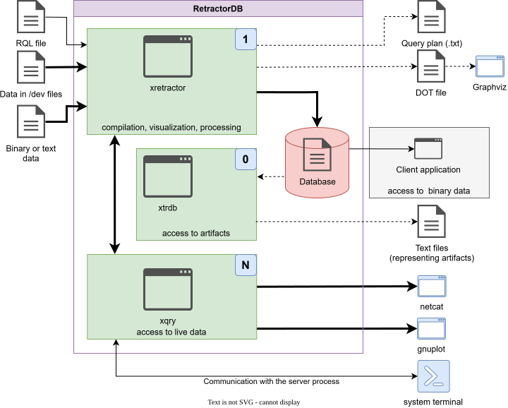

# Data and Control Flow

Data and control in RetractorDB give rise to several potential ways of using the system's components. Fig. 13 schematically shows the flow of data between RetractorDB's processes, Linux system processes, and the source data and results produced by each process.

The thickest lines represent the flow that is always present in the process of processing regular time series. To start, the xretractor process currently needs an .rql file containing a sequence of queries. After compiling, the xretractor process builds the query plan tree and begins processing incoming data and creating binary files containing artifacts.

> **_NOTE:_** The functionality described here is covered by the test: `consistency`, described in the appendix [Integration Tests](../appendices/integration-tests.md).

To control the xretractor process once it has started, we use the xqry process. Through it, we can stop the xretractor process, retrieve statistics, or request access to current data.

The remaining arrows represent data flows that depend on the specific process being carried out with RetractorDB. Dashed arrows are typically intended for diagnostic purposes.

Each process on the diagram is additionally labeled with the number of continuous processes of that kind maintained in the system. The label "1" next to the xretractor process means that this program ensures only one instance of this process runs in the system. Attempting to start another one will fail with an error message at startup. The xtrdb program does not maintain any continuous or unbounded processes. It reads data, processes it, returns results, and exits. It also offers an interactive mode. The xqry process is labeled "N" — meaning that more than one xqry process can be invoked. This is a typical usage scenario for RetractorDB. By definition, there can be several clients communicating with the query-execution-plan processor.

<figure><figcaption><p>Fig. 13. Data and control flow</p></figcaption></figure>

## Stopping xretractor

The xretractor process handles system signals and shuts down in a controlled manner upon receiving:

| Signal    | Command             | Meaning                                 |
| --------- | -------------------- | ---------------------------------------- |
| `SIGINT`  | Ctrl+C in a terminal  | interactive interrupt                    |
| `SIGTERM` | `kill <pid>`          | standard process termination              |
| `SIGHUP`  | `kill -HUP <pid>`     | termination on terminal close             |

All three signals produce the same effect: a graceful shutdown — the processing loop finishes the current cycle and stops. This allows xretractor, running as a service, to be shut down safely without risking corruption of artifact files.

### Stopping via xqry

Besides system signals, xretractor can be stopped programmatically — using the command:

```bash
xqry --kill
```

#### How the shutdown proceeds step by step

**1. xqry sends a "kill" request**

The xqry process builds an IPC message and places it on the `RetractorQueryQueue` message queue — the shared channel connecting all clients to xretractor. The message contains the xqry process's identifier (PID) and the `kill` command.

**2. xretractor receives the command and sets the stop flag**

xretractor's communication thread (`commandProcessorLoop`) continuously listens on `RetractorQueryQueue`. Upon receiving a `kill` message, it sets the atomic variable `iTimeLimitCnt` to `stop_now`. The same mechanism is used by the system-signal handler — regardless of the source (a `SIGINT`/`SIGTERM`/`SIGHUP` signal, or the xqry `--kill` command), the effect is identical.

**3. The main processing loop detects the flag and finishes the current cycle**

The main loop checks `iTimeLimitCnt` on every iteration. When it detects the value `stop_now`, it finishes the current cycle and exits the loop — without interrupting mid-computation. This ensures the integrity of the artifacts being written.

**4. xretractor notifies all connected clients (OOB broadcast)**

After exiting the loop, xretractor calls `boradcastOutOfBussiness()`. This function walks the internal `id2StreamName_Relation` map, which contains an entry for every xqry process subscribed to a data stream (every `xqry --select` invocation registers itself in this map via the `show` command). For every registered client, xretractor sends a special `OUT_OF_BUSSINESS` message to its dedicated queue.

**5. Every xqry client receives the termination signal and exits**

Every running xqry process has its own individual message queue named `brcdbr<PID>`. Upon receiving the `OUT_OF_BUSSINESS` message, xqry sets its internal `done` flag and shuts down in a controlled manner — regardless of how much data it had received up to that point.

**6. IPC resource cleanup**

Finally, xretractor removes all shared IPC resources: the `RetractorShmemMap` shared-memory segment, the `RetractorQueryQueue` command queue, the `RetractorMapMutex` mutex, and every client's individual queue.

#### What happens with multiple xqry processes

RetractorDB is designed to work with multiple parallel clients. If, say, three xqry processes are running simultaneously, subscribed to different streams, and one of them calls `xqry --kill`:

- xretractor processes the kill request **once**, regardless of which client sent it,
- the `boradcastOutOfBussiness()` mechanism sends the `OUT_OF_BUSSINESS` message to **all** registered clients at the same time,
- each of the three xqry processes receives the termination signal and exits on its own,
- clients that hadn't subscribed to any stream (e.g. xqry invoked only with `--dir` or `--hello`) are not entered in the map and don't need to be notified — these commands exit immediately after providing their response.

It's worth noting that xqry also detects server inactivity: if no data arrives for 10 seconds, the client shuts itself down with a warning in the log. This is a safeguard in case xretractor crashes suddenly without being able to send the OOB message.

