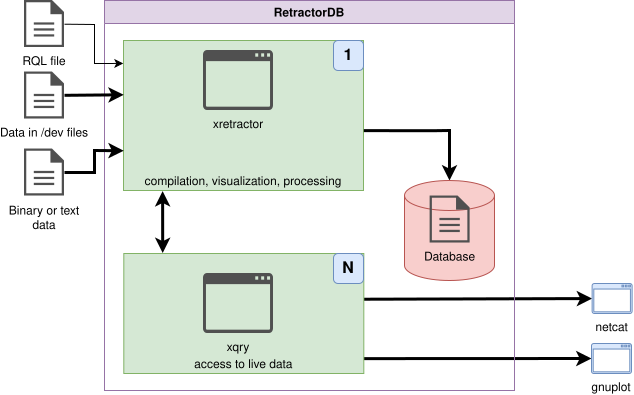
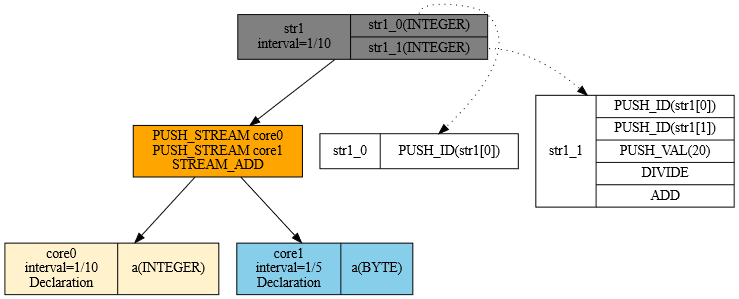
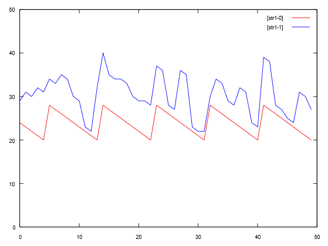
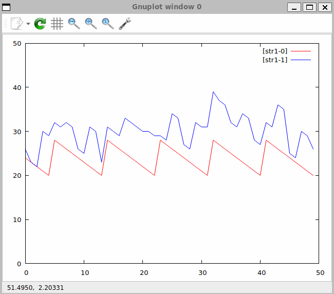

# Data Processing and Distribution

Starting the data-processing process and analyzing the diagram shown in Fig. 13, we can identify the following flow — Fig. 27:

<figure><figcaption><p>Fig. 27. Control-flow diagram of the processing workflow</p></figcaption></figure>

To carry out the processing, we'll need to prepare data and build a data-processing chain. As input to this chain we'll use a prepared query-plan file, and we'll prepare a binary file with data. We'll build a process that processes the data and displays the results.

We'll change the source query.rql file to the following:

```
DECLARE a INTEGER \
STREAM core0, 0.1 \
FILE 'datafile1.txt'

DECLARE a BYTE \
STREAM core1, 0.2 \
FILE '/dev/urandom'

SELECT str1[0], str1[0] + str1[1]/20 \
STREAM str1 \
FROM core0 + core1
```

In this example we declare the existence of a text file containing text data. I suggest filling the file datafile1.txt with the following content:

```
$ seq 20 28 > datafile1.txt
```

```
20
21
22
23
24
25
26
27
28
```

The file will contain consecutive numbers from 20 to 28.

A look at the query execution plan gives us the picture in Fig. 28:

<figure><figcaption><p>Fig. 28. Graphical representation of query plan 2</p></figcaption></figure>

Once we've prepared the data file, we can start the compilation and data-processing process. We do this by running the following command:

```
$ xretractor query.rql
```

And here an important property of the system comes into play. The system should immediately begin executing the process. Any key pressed in the terminal will interrupt this process.

I suggest opening a second terminal window and continuing the session there. In the second terminal window we can run the following command:

```
$ xqry -d
| str1|1/10|6912|864|             |0|
|core0|1/10|  -1| 49|datafile1.txt|1|
|core1| 1/5|  -1| 25| /dev/urandom|1|
```

Something similar should appear. Of course, the counters for str1 should differ. It's logical that with every read we'll get larger values for the accumulated size of the str1 stream.

If we want to see, on screen, what's happening inside the data-processing process right now, I suggest issuing the command below, and after a few lines appear on screen, pressing any key to interrupt the process:

```
$ xqry -s str1
20 26
21 33
22 34
23 27
24 28
25 35
26 36
27 28
```

The first column contains the sequence of numbers — exactly as we entered them into the datafile1.txt file. The second column contains the result of processing. A value taken from the pseudo-random number generator, divided by 20, is added — the second column flows along beneath the first.

How can we see this graphically? I suggest running the following command:

```
$ xqry -s str1 -p 50,50 | gnuplot
```

The following window will appear on screen, with data streaming in live:

<figure><figcaption><p>Fig. 29. Snapshot of the gnuplot window showing incoming data</p></figcaption></figure>

In Fig. 29 we see what the data represented numerically looks like. The sawtooth shape is the first column; the irregular shape wrapping around the sawtooth is the second column. The figure shows a static snapshot — but in the actual window, this data streams in and the picture updates continuously.

A typical way to send data outside the machine on which xretractor and xqry are running is to use the command:

```
$ xqry -s str1 | nc -l 8888
```

on the second computer, you need to write:

```
$ nc server_name_or_ip 8888
```

> **ℹ️ Info**
>
> The `-p` flag in netcat (BSD syntax) is not supported by the GNU netcat available on modern Ubuntu/Debian systems. The correct syntax is `nc -l 8888` (without `-p`).


Data transmission will take place over the network.

If we want to stop the xretractor process using the xqry command, we can run the following command:

```
$ xqry -k
kill sent to server
ok.
```

After issuing this command, the xretractor process will shut down and interrupt the query plans being processed.

A recording of the process shown on screen (Fig. 30) looks as follows:

<figure><figcaption><p>Fig. 30. Recording of real-time data processing</p></figcaption></figure>
