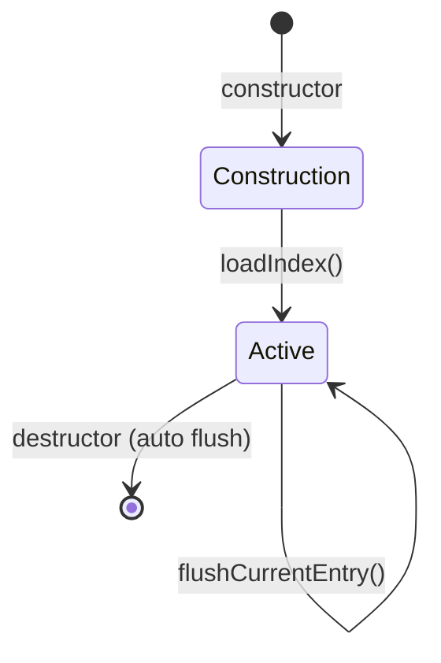
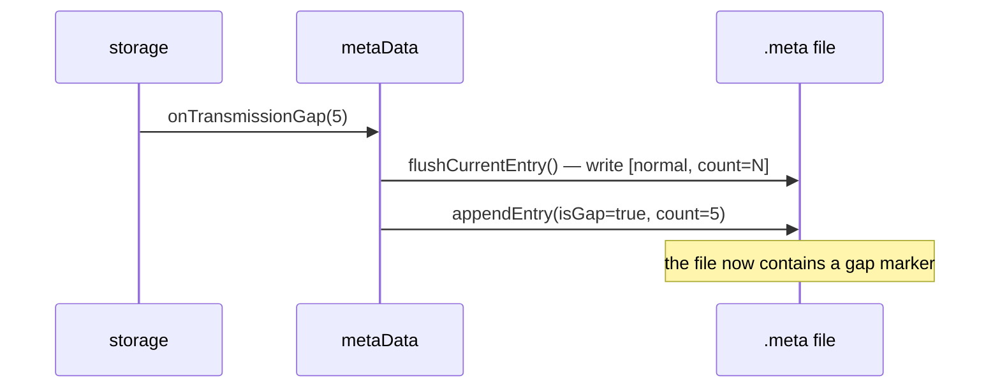
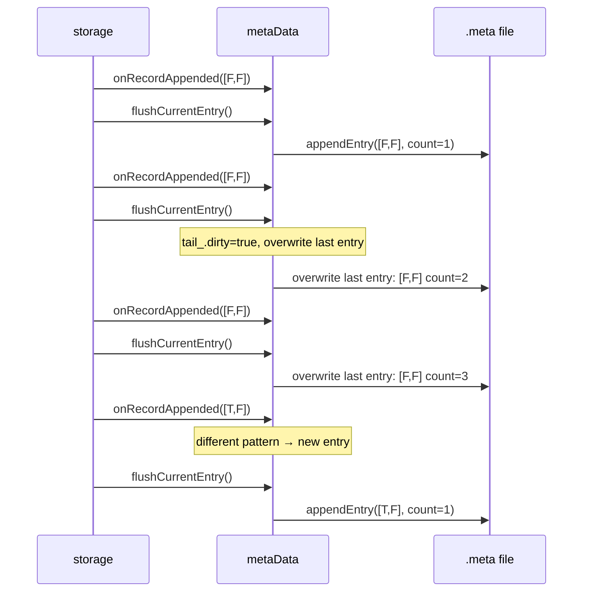
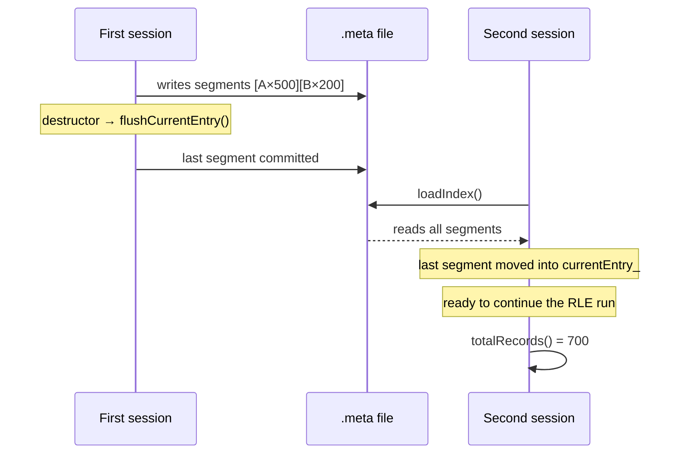
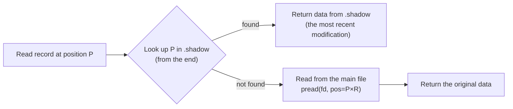
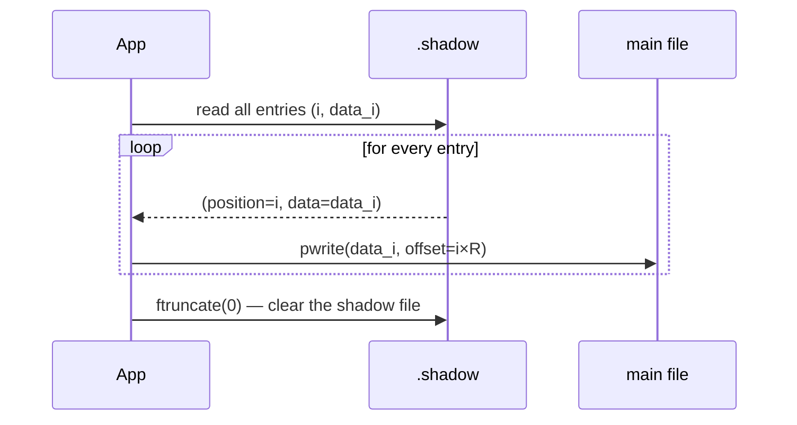
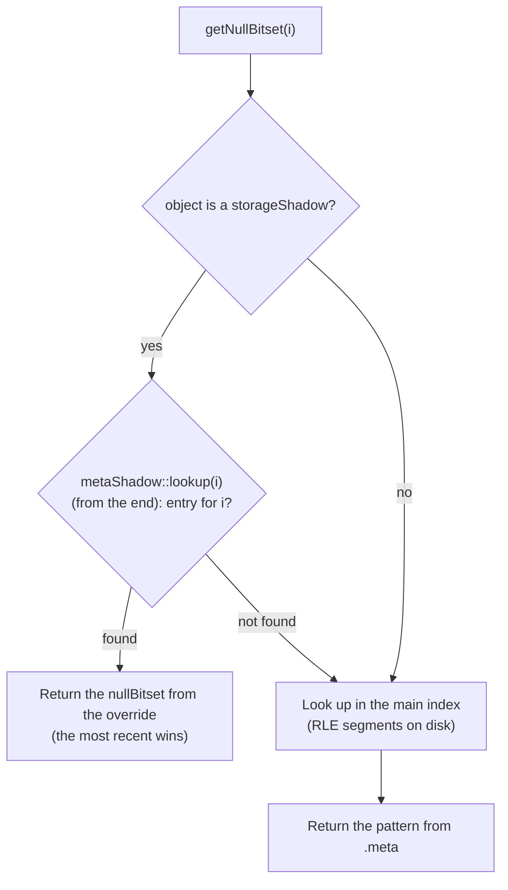
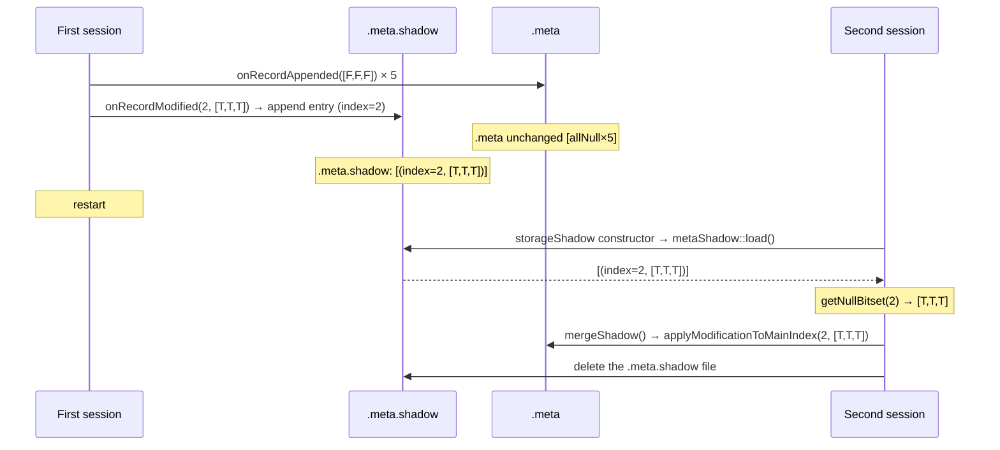
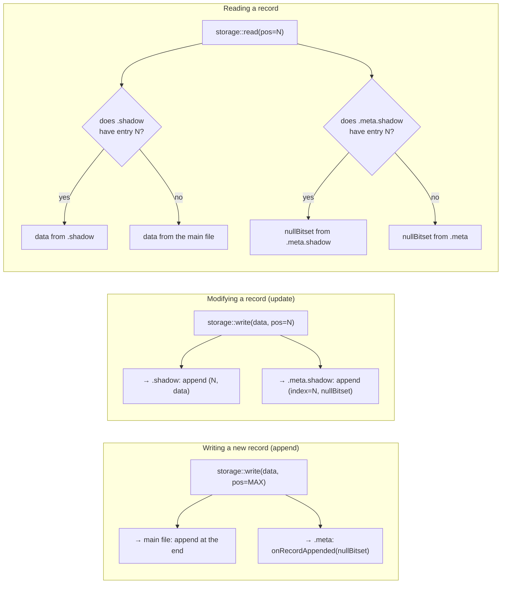

# Files

This chapter describes the five files that make up the complete file set of an artifact or substrate: the schema descriptor (`.desc`), the main binary data file, the metadata index (`.meta`), the data shadow file (`.shadow`), and the index shadow file (`.meta.shadow`). For each file, the binary format, field semantics, and read/write rules are presented. The chapter also covers the `metaData` class — the RLE compression mechanism, transmission-gap handling, the update interface, and persistence across restarts. The final section shows the relationships between all the files at the level of `append`, `update`, and `read` operations.

The scope of this chapter **does not include** the file-rotation mechanism between sessions (→ [Rotation](rotation.md)) or the `xtrdb -s` inspection tool (→ [Inspection Tool](inspection-tool.md)).

---

## The descriptor file (.desc)

The `.desc` file describes the record structure. It is parsed by an ANTLR4 grammar (`DESC.g4`) and can contain data fields, storage-type meta-information, and a retention policy.

### Syntax

```
{ <statement>* }
```

Each statement is one of the following:

```
BYTE     name [N]          # array of N bytes (default N=1)
INTEGER  name [N]          # 32-bit signed integers
UINT     name [N]          # 32-bit unsigned
FLOAT    name [N]          # 32-bit floating point (IEEE 754)
DOUBLE   name [N]          # 64-bit floating point
RATIONAL name [N]          # pair of int64: numerator and denominator
STRING   name [size]       # fixed-length string
REF      "path/file"       # reference to an external descriptor file
TYPE     identifier        # storage type (DEFAULT, MEMORY, POSIXSHD, …)
RETENTION capacity segment # cyclic on-disk retention
RETMEMORY capacity         # cyclic in-memory retention
```

### Example `.desc` files

**A default artifact** — two numeric fields, `DEFAULT` storage (data file + shadow file):

```
{
  INTEGER  ts
  FLOAT    value
  TYPE     DEFAULT
}
```

**An ephemeris** — an ephemeral, RAM-only stream:

```
{
  DOUBLE   x
  DOUBLE   y
  TYPE     MEMORY
}
```

**A substrate with retention** — a cyclic on-disk buffer of the last 1000 records (10 segments of 100):

```
{
  INTEGER  ts
  FLOAT    a
  FLOAT    b
  TYPE     DEFAULT
  RETENTION 1000 100
}
```

**A binary source declaration** (`DECLARE` in RQL generates this schema):

```
{
  INTEGER  a
  FLOAT    b
  TYPE     DEVICE
  REF      "sensor/data.bin"
}
```

### Field type sizes

| Type       | Size of a single value |
| ---------- | ---------------------------- |
| `BYTE`     | 1 B                          |
| `INTEGER`  | 4 B                          |
| `UINT`     | 4 B                          |
| `FLOAT`    | 4 B                          |
| `DOUBLE`   | 8 B                          |
| `RATIONAL` | 16 B (two int64)             |
| `STRING`   | N B (declared size)          |

For array fields `name[N]`, the total size = type_size × N. The `TYPE`, `REF`, `RETENTION`, and `RETMEMORY` fields take no space in the record — they are descriptor metadata.

Record size `R` = the sum of the sizes of all data fields.

### The TYPE field and storage strategy

The `TYPE` field in the descriptor directly determines which accessor (`FileInterface`) is used by `storage::initializeAccessor()`. The absence of a `TYPE` field is equivalent to `DEFAULT`. The value is case-insensitive (`MEMORY` = `memory`).

---

## The binary data file

The data file is a sequence of fixed-length records, written one after another with no header at all. The size of a single record `R` is determined by the descriptor as the sum of all field sizes in bytes.

| Offset in file | Content    | Size     |
| -------------- | ---------- | -------- |
| 0              | Record 0   | R bytes  |
| R              | Record 1   | R bytes  |
| 2R             | Record 2   | R bytes  |
| ...            | ...        | ...      |
| (N-1) × R      | Record N-1 | R bytes  |

Every record contains the packed field values in the order defined by the descriptor:

| Offset in record               | Field    | Size          |
| ------------------------------ | -------- | ------------- |
| 0                               | field\_0 | len\_0 bytes  |
| len\_0                          | field\_1 | len\_1 bytes  |
| len\_0 + len\_1                 | ...      | ...           |
| len\_0 + len\_1 + ... + len\_n  | field\_n | len\_n bytes  |

The **append** operation (adding a new record) writes data to the end of the file. The **update** operation (modifying an existing record) — if a shadow file exists — goes into the shadow file, not the main file.

### Example

```
DECLARE a INTEGER, b FLOAT STREAM str1, 0.1 FILE 'data.dat'
```

Record size: INTEGER (4 B) + FLOAT (4 B) = **8 bytes**. After 5 seconds of data arriving (10 Hz), the file `data.dat` is 5 × 10 × 8 = **400 bytes**.

---

## The metadata file (.meta)

The `.meta` file is an index of null values and transmission gaps. It stores information about which record fields have null values, and where gaps occurred — without duplicating the data itself.

### File format

| Position    | Content                                    | Size     |
| ---------- | ------------------------------------------ | -------- |
| Header     | `creationTimeNs` (int64)                   | 8 bytes  |
| RLE entry 0 | `gapFlag \| count \| bitsetSize \| bitset` | variable |
| RLE entry 1 | `gapFlag \| count \| bitsetSize \| bitset` | variable |
| ...        | ...                                        | ...      |
| RLE entry k | the current in-memory entry                | variable |

### RLE entry format

Each entry describes a run of consecutive records with an identical null pattern:

| Field         | Size          | Description                             |
| ------------- | ------------- | --------------------------------------- |
| `gapFlag`     | 1 B           | 0 = normal record, 1 = gap              |
| `recordCount` | 8 B (size\_t) | number of records in the run            |
| `bitsetSize`  | 8 B (size\_t) | number of fields (N)                    |
| `bitset`      | ⌈N/8⌉ B       | bit i = field i is null                 |

### RLE compression

Consecutive records with the same null pattern are merged into a single entry by incrementing `recordCount`. A new entry is only created once the pattern changes.

**10 records, 2 fields, no nulls:**

| Entry   | isGap | count | bitset |
| ------ | ----- | ----- | ------ |
| entry 0 | F     | 10    | \[F,F] |

**Field 1 becomes null starting at record 5:**

| Entry   | isGap | count | bitset |
| ------ | ----- | ----- | ------ |
| entry 0 | F     | 5     | \[F,F] |
| entry 1 | F     | 5     | \[F,T] |

**Transmission gap after record 3:**

| Entry   | isGap | count | bitset |
| ------ | ----- | ----- | ------ |
| entry 0 | F     | 3     | \[F,F] |
| entry 1 | T     | 7     | \[T,T] |
| entry 2 | F     | ...   | \[F,F] |

### The transmission-gap marker

A transmission gap (e.g. a system shutdown, a lost signal) is recorded as an entry with `isGap=true` and all null bits set to `true`. The `count` parameter stores the length of the gap in units of the stream's interval. The binary data file itself contains no additional records for the gap — that information lives solely in the `.meta` file.

> **_NOTE:_** The functionality described here is covered by the tests: `issue113_meta_internal`, `issue113_meta_autocreate`, described in the appendix [Integration Tests](../../appendices/integration-tests.md).

---

### The metaData class

The `.meta` file is managed by the `rdb::metaData` class. It acts as a coordinator: it keeps the RLE policy itself (lazy overwrite of the last entry, record numbering) and delegates the specialized parts to separate units:

| Unit | Header | Role |
| ---- | ------ | ---- |
| `IndexRecord` | `indexRecord.hpp` | format of a single entry and its (de)serialization |
| `MetaIndexStore` | `metaIndexStore.hpp` | raw `.meta` file I/O — header, committed entries, cache |
| `GapDetector` | `gapDetector.hpp` | gap-detection state machine (nullfill, absorption, pending gap) |
| `splitSegment()`, `sumNonGapRecords()` | `rleSegment.hpp` | RLE segment operations |
| `storageShadow` | `storageShadow.hpp` | variant that routes updates to the index shadow (`.meta.shadow`) |

`metaData` itself encapsulates three areas of responsibility:

1. **In-memory RLE aggregation** — it buffers the current segment (the most recent run of records with an identical null pattern) in the `currentEntry_` field, without writing it to the file on every record.
2. **Data persistence** — only completed segments (when the pattern changes, or on an explicit call to `flushCurrentEntry()`) are written to the file as committed entries.
3. **A query index** — it exposes an interface for querying the null pattern of any record and for detecting transmission gaps.

The class holds two states:

| State | Location | Description |
| ---- | ----------- | ---- |
| Committed segments | the `.meta` file on disk | all completed RLE runs |
| Current segment (`currentEntry_`) | working memory | the run currently being accumulated (not yet written, or subject to being overwritten) |

### Object lifecycle

The state diagram (Fig. 15) shows the transitions between phases of a `metaData` object:



_Fig. 15. Lifecycle of a metaData object_

**Constructor** (`metaData(descriptor, path)`):
- Initializes an empty `currentEntry_` based on the number of fields in the descriptor.
- Calls `loadIndex()` — if the file exists, it loads all committed segments, determines `committedRecordCount_`, and moves the last non-gap segment back into `currentEntry_` (allowing the RLE run to continue after a restart).
- If the file does not exist, it creates it and writes the header (the stream's creation timestamp).

**The destructor** automatically calls `flushCurrentEntry()`, guaranteeing that the current buffer reaches disk even when the program exits normally.

### The update interface

The class distinguishes three scenarios for changing metadata state:

#### `onRecordAppended(nullBitset)`

Called by `storage` after every new record is appended to the data file.

```
pattern identical to currentEntry_?
├─ YES → increment currentEntry_.recordCount (RLE accumulation, no I/O)
└─ NO  → flushCurrentEntry() (previous segment to disk)
          set currentEntry_ = {nullBitset, count=1}
```

I/O only happens **when the pattern changes** — for a run of identical records, the cost is a single in-memory counter increment.

#### `onRecordModified(index, nullBitset)`

Called by `storage` when updating an existing record. Behavior depends on the operating mode:

**Normal mode** (no data shadow file): it locates the record within the RLE segments and splits the segment into up to three parts: before the modified record, the record itself, and after it.

```
is the record in currentEntry_ (memory)?
├─ YES → splitSegment() in memory, new fragments appended to the file
└─ NO  → read the file, splitSegment(), rewrite the file (rewriteFile)
```

Example of splitting a segment `[allNull × 5]` when modifying record 2:

```
Before: [allNull × 5]
After:  [allNull × 2] [allPresent × 1] [allNull × 2]
```

**Shadow variant** (`storageShadow`, injected in place of the base `metaData` for stores that maintain a `.shadow` file): instead of modifying the main index, it appends a single null-pattern override to the `.meta.shadow` file. The main `.meta` index remains untouched and consistent with the main data file.

```
index object is a storageShadow?
├─ YES → metaShadow::appendOverride(index, nullBitset) → entry in .meta.shadow
└─ NO  → modify the main index → splitSegment()
```

#### `onTransmissionGap(duration)`

Records a transmission gap of the given length (in units of the stream's interval). It first commits the current segment (`flushCurrentEntry()`), then appends an entry with `isGap=true` to the file (Fig. 16).



_Fig. 16. Gap-recording sequence — onTransmissionGap_

### Safety mechanism: `flushCurrentEntry()` and overwriting (tail_.dirty)

The `storage` class calls `flushCurrentEntry()` after **every** call to `write()`, to guarantee survival of a process crash. A naive implementation would append a new entry to the file on every flush — causing file growth proportional to the number of records, even without any change in the null pattern.

The solution: a **lazy overwrite** mechanism flagged by `tail_.dirty`.

```
flushCurrentEntry() → write [pattern, count=2] to disk
onRecordAppended(the same pattern):
    currentEntry_.count = 2 (restored from disk)
    tail_.markDirty()        ← the next flush will overwrite, not append
    currentEntry_.count++    → count = 3
flushCurrentEntry() → seek to the last entry, overwrite [pattern, count=3]
    (file size unchanged)
```

The sequence diagram for `storage`'s typical pattern (append + flush after every record) is shown in Fig. 17:



_Fig. 17. The lazy-overwrite mechanism — overwriting the last .meta entry_

Thanks to this, the `.meta` file grows only when the **null pattern changes** — not on every record. With continuous, uniform data arrival, the file has a constant size regardless of the number of records.

### Persistence and state recovery

After the process restarts, a new `metaData` object loads the file via `loadIndex()` (sequence shown in Fig. 18):

1. It reads the header — the timestamp (`creationTimeNs`), stored as `int64` nanoseconds since the epoch.
2. It loads all committed entries from the file.
3. If the last entry **is not a gap**, it moves it back into `currentEntry_` and removes it from the file (allowing the RLE run to continue after a restart without duplication).
4. It computes `committedRecordCount_` as the sum of `recordCount` over all non-gap entries remaining in the file.



_Fig. 18. Persistence and state recovery after a restart_

### Query interface

| Method | Description  |
| ----   | ------------ |
| `getNullBitset(i)` | Returns the null pattern for record `i`. Virtual: in the `storageShadow` variant it first checks overrides in `metaShadow` (from the end — the most recent wins), and only falls back to the main index if there's no entry. |
| `nullBitsetFor(i)` | As above, but for a record outside the index range it returns an all-false pattern instead of throwing. Lets `storage::read()` apply null metadata without range checks. |
| `isGapBefore(i)` | Returns `true` if, in the RLE index, an entry with `isGap=true` sits immediately before record `i`. Record 0 never has a gap before it. |
| `segments()` | Returns all RLE segments: committed (from disk) plus the current one (from memory), if non-empty. Does not include overrides from `.meta.shadow`. Used for inspection and tests. |
| `totalRecords()` | The sum of records across all segments (committed + pending). |
| `isEmpty()` | Shorthand for `totalRecords() == 0`. |
| `rotate(percounter)` | Rotates the index file: renames the current `.meta` file to `.meta.old<N>`, creates a new empty file. Called by `storage::detectStartupState()` after detecting data-file rotation (data file empty, index non-empty). When `percounter < 0`, the file is not renamed — only an index reset is performed. |
| `reset()` | Clears the index in place: zeroes the counters, rewrites the file with only the header, without renaming it. Also calls `discardShadow()`. Called by `storage` when clearing without preserving history (e.g. after `purge()`). |

### The index-shadow interface

Methods of the `storageShadow` class — the index variant injected by `makeMetaIndex()` for stores that maintain a data shadow file. The base `metaData` does not have them, and there is no mode switch: the presence of a shadow is decided by the choice of class at store initialization.

| Method | Description  |
| ----   | ------------ |
| constructor | Loads existing overrides from the `.meta.shadow` file (`metaShadow::load()`), restoring the shadow state after a process restart. |
| `mergeShadow()` | Merges the shadow overrides into the main index (applying each override in write order — the last one wins), then deletes the `.meta.shadow` file. The counterpart to `merge()` for the data shadow file. |
| `discardShadow()` | Clears the in-memory list of overrides and deletes the `.meta.shadow` file. Called when discarding the data shadow (purge, reset, rotation). |
| `metaShadowFilePath(p)` | Static: returns the index shadow path corresponding to a given `.meta` file, without instantiating an object. Used by `storage` when cleaning up resources. |

### Usage example — a typical production scenario

```
storage.write(rec0)           → onRecordAppended([F,F,F]) + flushCurrentEntry()
storage.write(rec1)           → onRecordAppended([F,F,F]) + flushCurrentEntry()
storage.write(rec2_val_null)  → onRecordAppended([T,F,F]) + flushCurrentEntry()
storage.write(rec3)           → onRecordAppended([F,F,F]) + flushCurrentEntry()

The .meta file after the above operations (4 flushes, 2 segments):
  [isGap=F, count=2, bitset=[F,F,F]]   ← entry 0
  [isGap=F, count=1, bitset=[T,F,F]]   ← entry 1  (rec2)
  [isGap=F, count=1, bitset=[F,F,F]]   ← entry 2  (rec3, currently in memory)

getNullBitset(2) → [T,F,F]   (field 0 of record 2 is null)
isGapBefore(2)  → false
totalRecords()  → 4
```

---

## The shadow file (.shadow)

The shadow file allows modification of recorded records without destroying the original data. Deleting the `.shadow` file restores the original state of the data.

### Entry format

| Field      | Size          | Description                     |
| ---------- | ------------- | -------------------------------- |
| `position` | 8 B (size\_t) | the record's index in the main file |
| `data`     | R bytes       | the record's new values          |

Every modification appends a new entry to the end of the shadow file. With multiple modifications of the same record, the file may contain multiple entries for the same position — the most recent one is the current one.

### Read priority

Read priority is the rule for deciding which source the system should return a record's value from, when the same index could appear in both the main file and the shadow file at once. In RetractorDB, priority is defined deterministically: `.shadow` is checked first (from the end, to pick the most recent modification), and only if there's no entry is a read performed from the main file. This concept concerns the **consistency and read versioning** of data after modifications, not the physical record-storage format of the binary file itself.




_Fig. 19. Record read priority relative to the shadow file_

Fig. 19 shows the record-read logic: the system first checks for an entry in `.shadow`, and only reads the record from the main file if there is none.

### Merging (merge)

The `merge()` operation merges changes from the shadow file into the main file and clears the shadow file. After merging, the original data is irrecoverably overwritten.



_Fig. 20. Merging the shadow file into the main file_

Fig. 20 shows the flow of `merge()`: successive `(position, data)` entries from `.shadow` are written to the main file, and once finished, the shadow file is cleared.

### Example: modifying a record

```
# Stream str1: 2 INTEGER fields (4B each), recordSize = 8B
# Record 2 (original): [100, 200]
# Modification: field 0 → 999

# The .shadow file after the modification:
# offset 0: [position=2 (8B)][999, 200 (8B)]
```

Reading record 2 will return `[999, 200]`. Reading records 0 and 1 will return data from the main file (they have no entries in the shadow file).

---

## The index shadow file (.meta.shadow)

The `.meta.shadow` file is the counterpart of `.shadow` at the null-index level. It records overrides of null patterns for individual records without modifying the main `.meta` file, keeping the pairing consistent: `main file ↔ .meta` and `shadow file ↔ .meta.shadow`.

### When it's created

The `.meta.shadow` file is created automatically when two conditions are met:

1. The store is of type `DEFAULT` or `POSIXSHD` — i.e. one that keeps record modifications in a `.shadow` file (not in the main file).
2. At least one modification of an existing record (`storage::write()` at an index other than the maximum) is made during the given session.

Condition 1 is not a mode switch but a **choice of class**. At store initialization the `makeMetaIndex()` factory (`accessorFactory.hpp`) asks the accessor for `hasShadow()` and returns:

| Condition | Returned object | Behavior |
| --------- | --------------- | -------- |
| declared source (`DECLARE`) | `metaData` with an empty path | inert variant — the index works in memory, nothing reaches disk |
| accessor has a data shadow file | `storageShadow` | `onRecordModified()` routes overrides to `metaShadow` (`.meta.shadow`) |
| everything else | `metaData` | modifications rewrite the main `.meta` index |

`storageShadow` derives from `metaData` and overrides the virtual `onRecordModified()`, `getNullBitset()`, and `reset()`; the `.meta.shadow` file itself is managed by its `metaShadow` member. As a result, `storage` contains no branching on shadow mode.

### File format

The `.meta.shadow` file has no header. It is a sequence of entries in the same binary format as the entries in the `.meta` file, with the difference that the `recordCount` field stores the **absolute record index** (not the number of records in an RLE run):

| Field        | Size          | Meaning in `.meta.shadow`              |
| ------------ | ------------- | --------------------------------------- |
| `gapFlag`    | 1 B           | always 0 (overrides are never gaps)     |
| `recordCount`| 8 B (size\_t) | absolute index of the overridden record |
| `bitsetSize` | 8 B (size\_t) | number of descriptor fields (N)         |
| `bitset`     | ⌈N/8⌉ B       | the new null pattern for this record    |

Every call to `onRecordModified()` in shadow mode appends one entry to the end of the file. Multiple entries for the same position are allowed — the **last** entry governs (last-write-wins semantics, matching the `.shadow` file).

### Read priority

`storageShadow::getNullBitset(i)` scans the list of overrides from the end. If it finds an entry for index `i`, it returns that entry's null pattern without consulting the main index (Fig. 21):



_Fig. 21. Null-pattern read priority — main index vs. index shadow_

### Lifecycle

The `.meta.shadow` file is managed in parallel with the data shadow file:

| Event on the `.shadow` file | Action on `.meta.shadow` |
| ---------------------------- | ----------------------- |
| First record modification    | File creation; first entry appended |
| Subsequent modifications     | Further entries appended |
| `merge()` — merging the shadow into the main file | `mergeShadow()` — overrides applied to `.meta`; file deleted |
| `purge()` / `reset()` — discarding the shadow | `discardShadow()` — file deleted without merging |
| Process restart               | `storageShadow` constructor → `metaShadow::load()` — file read; overrides restored in memory |
| Removal of a temporary store (destructor) | `.meta.shadow` file deleted along with `.meta` |

### Persistence across restarts

After the process restarts, a new `storageShadow` object restores the shadow state already in its constructor, via `metaShadow::load()` (Fig. 22):

1. It reads all entries from `.meta.shadow` (no header — a direct format).
2. It loads them into the override list in write order.
3. `getNullBitset()` and subsequent calls to `onRecordModified()` behave exactly as they did before the restart.



_Fig. 22. Index shadow — restoring null patterns after a restart_

### Usage example — correcting a record while preserving consistency

```
# 5 records in stream str1, 3 FLOAT fields
# Record 2 has a null value in field 0: nullBitset=[T,F,F]
# The operator corrects field 0 of record 2 → pattern changes to [F,F,F]

# Operations:
storage.write(rec2_corrected, pos=2)
  → .shadow: append (position=2, data_corrected)
  → storageShadow.onRecordModified(2, [F,F,F])
    → .meta.shadow: append (index=2, [F,F,F])

# File state:
# .meta        — unchanged: [isGap=F, count=2, [F,F,F]], 
# >> [isGap=F, count=1, [T,F,F]], [isGap=F, count=2, [F,F,F]]
# .meta.shadow — new entry: [gapFlag=0, recordCount=2, bitset=[F,F,F]]

# Read:
getNullBitset(2) → [F,F,F]  (from .meta.shadow)
getNullBitset(1) → [F,F,F]  (from .meta)

# After merging:
storage.merge() → .shadow absorbed into the main file
storageShadow.mergeShadow() → .meta rebuilt, .meta.shadow deleted
# .meta after merge: [isGap=F, count=5, [F,F,F]]  (all records complete)
```

> **_NOTE:_** The `.meta.shadow` mechanism is covered by the unit tests `ut_metaShadow_usage` (shadow-file format and lifecycle) and `ut_storageShadow_usage` (integration with `metaData` and the accessor).

---

## The relationship between the files

In this section, the relationships between the files are shown at two levels. The structural level describes how the data file carries the records, the `.desc` descriptor defines their format, the `.meta` file stores information about null values and transmission gaps, `.shadow` collects data modifications without destroying the original, and `.meta.shadow` similarly collects overrides of null patterns. The operational level (Fig. 23) shows the read and write flow: reads check `.shadow` and `.meta.shadow` first, `merge()` moves corrections into the main file and the main index, and the `append`, `update`, and `read` operations keep the data and metadata consistent throughout the artifact's lifecycle.



_Fig. 23. The relationship between an artifact's write, modify, and read operations_

Fig. 23 shows the flow of `append`, `update`, and `read` operations through the `storage` layer, and their direct effect on the data file, `.meta`, `.shadow`, and `.meta.shadow`.

## Starting point — a binary file without metadata

The simplest possible way to record a time series is a sequence of raw values in a binary file: fixed record size, no header, no structure description. This approach has one advantage — minimal overhead — and a number of significant limitations:

- Interpreting the data requires knowledge external to the file (field names, types, order).
- No information about transmission gaps — continuity of the data is only apparent.
- Every modification of a historical record irreversibly destroys the original data.
- A change to the record structure invalidates the entire file.

RetractorDB records data from sensors operating in real time, where power interruptions, signal loss, and the need for retrospective data correction are normal operational occurrences, not exceptions. The four-file structure directly addresses each of these limitations.

## What each file contributes

**The descriptor (`.desc`) — self-description and independence from code**

A binary data file is useless without knowledge of the record structure. The descriptor stores that knowledge alongside the data, which means:

- Data can be read and interpreted without access to the source code or configuration — the `.desc` file is enough.
- The `xtrdb` tool can analyze any artifact without additional parameters.
- Changes to a stream's structure (adding a field, changing a type) are explicit and versionable.
- The `TYPE` field in the descriptor determines the storage strategy, allowing the same engine to handle durable artifacts, ephemeral ephemerides, and external data sources without changing the query logic.

**The metadata file (`.meta`) — trustworthiness of the time series**

A time series with gaps, treated as continuous, leads to incorrect time-window computations, incorrect aggregations, and false correlations. The `.meta` file provides:

- The ability to distinguish a record with a zero value from a record that is absent (null) — semantically completely different states.
- Recording of transmission gaps without inserting fake records into the data file — the binary file stays dense and positionally addressable.
- RLE compression — typical time series have long stretches without nulls, so the metadata cost is close to zero for good-quality data.
- The ability to reconstruct the exact recording schedule, including gap lengths, which is necessary when computing intervals in the stream algebra.

**The shadow file (`.shadow`) — non-destructive data correction**

In measurement systems, correcting faulty samples after the fact is a standard procedure. Overwriting the binary file is irreversible and destroys the evidence of the original measurement. The shadow file:

- Lets you correct any historical record without modifying the main file.
- Preserves the original measurement as the default — deleting the `.shadow` file fully restores the initial state.
- Allows merging (`merge`) corrections into the main file only when that is a deliberate decision by the operator, not a side effect of writing.
- Separates certified data (the main file) from working data (the shadow file), which matters in applications requiring auditability.

**The index shadow file (`.meta.shadow`) — metadata consistency during correction**

A correction to a record in the data shadow file must be reflected in the null index — otherwise `getNullBitset()` would return a stale pattern from the main `.meta`. The `.meta.shadow` file:

- Maintains consistency between the pairs: `main file ↔ .meta` and `.shadow ↔ .meta.shadow`.
- Lets `getNullBitset()` return the current null pattern for a corrected record without modifying the main index.
- Tracks the lifecycle of the data shadow file — merged and deleted exactly alongside `.shadow`.
- Enables full state recovery after a restart: overrides loaded from `.meta.shadow` are immediately available without re-scanning the data shadow file.
