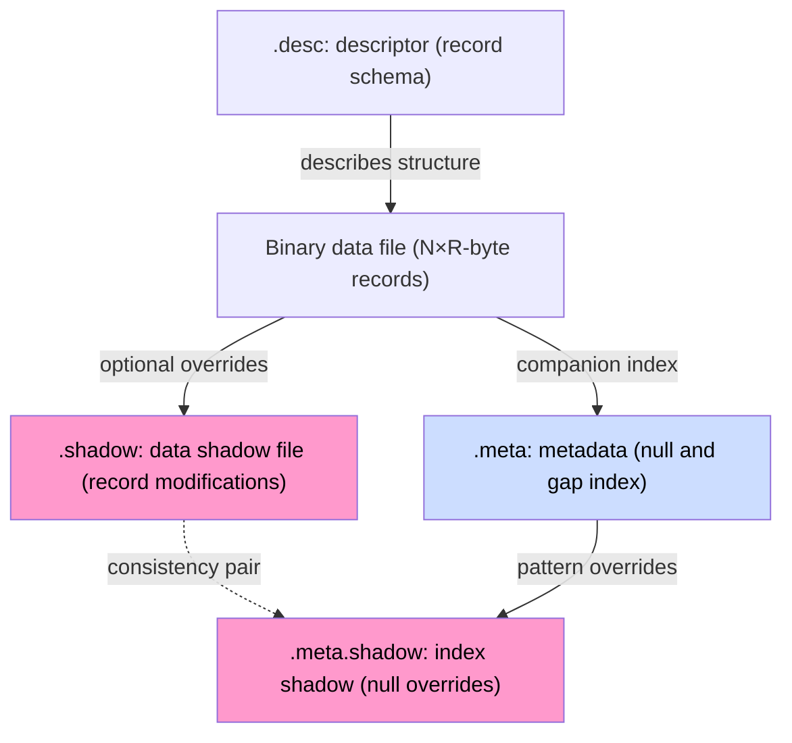

# Data Storage Format

The system processes time series in three forms: **artifacts**, **ephemerides**, and **substrates**. Each type has a different purpose and a different storage strategy.

Substrates and Artifacts are formally no different in the system. The only difference is that substrates were generated based on data-stream algebra equations and were not written directly in the sequence of commands given to the compiler. If we declare an Artifact stream that covers what would otherwise be a substrate, the substrate is eliminated. Ephemerides are streams created via the Declare command — they contain values that exist only briefly.

### Storage accessor types

> **_NOTE:_** The functionality described here is covered by the test: `txtsrc`, described in the appendix [Integration Tests](../../appendices/integration-tests.md).

The `TYPE` field in the descriptor (or the `STORAGE` directive in RQL) selects the `FileInterface` implementation:

| Type (`TYPE_PROFILE`) | Implementation class                    | Purpose                                                      |
| ---------------------- | ------------------------------------------------------- | -------------------------------------------- |
| `DEFAULT`             | `groupFile<posixBinaryFileWithShadow>` | Default artifacts — data file + shadow file, with retention |
| `DIRECT`              | `groupFile<posixBinaryFile>`           | Direct writes without shadow, with retention                |
| `POSIX`               | `posixBinaryFile`                      | Raw POSIX write, no shadow                                   |
| `POSIXSHD`            | `posixBinaryFileWithShadow`            | POSIX with a shadow file                                     |
| `MEMORY`              | `memoryFile`                           | RAM-only storage (ephemerides)                               |
| `GENERIC`             | `genericBinaryFile`                    | Generic binary accessor                                      |
| `DEVICE`              | `binaryDeviceRO`                       | External binary input-data device (read-only)                |
| `TEXTSOURCE`          | `textSourceRO`                         | Text input-data source (read-only)                           |

***

## The artifact and substrate file set

Artifacts and substrates written to disk can be associated with up to five files:

| File                  | Extension            | Purpose                                                    |
| ---------------------- | -------------------- | --------------------------------------------------------- |
| Binary data file       | _(stream name)_      | The main record stream — append-only                      |
| Descriptor file        | `.desc`               | Record schema (fields, types, sizes, storage type)         |
| Metadata file           | `.meta`               | Index of null values and transmission gaps (RLE)           |
| Data shadow file       | `.shadow`              | Record modifications without overwriting original data     |
| Index shadow file      | `.meta.shadow`         | Null-pattern overrides accompanying `.shadow`              |

_Fig. 14. The artifact file set and their relationships_

The diagram in Fig. 14 shows the static relationship between artifact files: `.desc` defines the record structure, `.meta` indexes nulls and gaps, `.shadow` stores optional record overrides, and `.meta.shadow` the null-pattern overrides that correspond to them. The two shadow files always go together.

The shadow files and the metadata file are optional. With continuous, gap-free, unmodified data arrival, the binary data file and the descriptor alone are enough.

Ephemerides **have no data file of their own** — their source is an external object (a text file, a device) that the system neither creates nor deletes. A `.desc` descriptor describing the read schema is created for them, however. No `.meta` index appears: declared sources get an inert metadata-index variant that works purely in memory.

***

## Chapters

* [Artifact Files](files.md) — descriptor, binary data, metadata, shadow file, and the relationships between them
* [File Rotation Mechanism](rotation.md) — the `ROTATION` directive, file lifecycle, session examples
* [Inspection Tool `xtrdb -s`](inspection-tool.md) — the storage map, report sections, examples
* [Summary](summary.md) — rationale for the chosen structure, comparison of approaches
