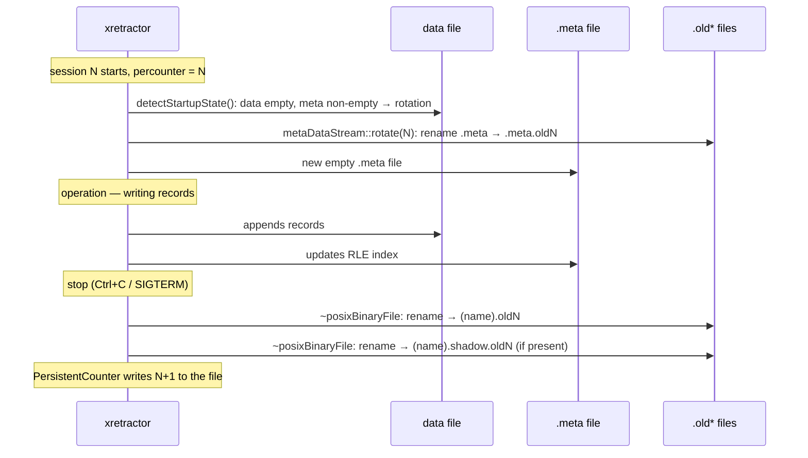

# File Rotation Mechanism

By file rotation we mean the controlled closing of the current set of data and metadata files and moving them to historical versions (`.old<N>`), so that a new session can begin writing from a clean state without losing earlier measurements. This is done in order to separate successive acquisition sessions, preserve a full audit trail, and make it easier to diagnose problems over time. The goal of rotation is both to maintain operational tidiness (a current working set plus a session archive) and to make it possible to recover and compare historical data.

> **_NOTE:_** The functionality described here is covered by the tests: `rotation_test`, `retention`, described in the appendix [Integration Tests](../../appendices/integration-tests.md).

## Default behavior (without the `ROTATION` directive)

Without the `ROTATION` directive in the RQL script, `xretractor` **deletes** artifact files (binary data, `.desc`, `.meta`) on every startup and begins recording from scratch. Declaration files (`DECLARE`) and ephemerides are not deleted — they have no files on disk.

## The `ROTATION` directive and the session counter

The `ROTATION` directive enables history-preservation mode. It takes the path to a file that stores a persistent session counter:

```
ROTATION rdb_counter
```

The `PersistentCounter` object reads the value `N` from the file at startup (`getCount()` = `N`) and writes `N+1` at shutdown. The counter increases monotonically with every `xretractor` session.

## Control flow during rotation

Here we want to show the full lifecycle of the files during one session and the transition to the next. The diagram (Fig. 24) is meant to explain the order of events: detecting rotation at startup, creating a new `.meta` index, normal data writes during operation, and archiving files at process shutdown. The key takeaway is that rotation is not a single operation, but a process spread out over time, spanning the start and stop of a session.




_Fig. 24. File rotation sequence — session start and stop_

Rotation of the `.meta` file happens **at the start** of session N — `detectStartupState()` detects the inconsistency (data file empty, index non-empty from an old session) and calls `metaDataStream::rotate(N)`. The binary data file is only renamed **at session shutdown**, by the `posixBinaryFile` destructor.

## What ends up in `.old<N>` files

| File | When it's created |
| ---- | -------------- |
| `<name>.oldN` | Session N shutdown — the `posixBinaryFile` destructor renames the data file |
| `<name>.shadow.oldN` | Session N shutdown — the `posixBinaryFileWithShadow` destructor renames the shadow file |
| `<name>.meta.oldN` | Session N startup — `detectStartupState()` detects rotation and renames the `.meta` left behind by session N−1 |

As a consequence of this ordering, there is an offset of 1: the file `.meta.oldN` contains the null metadata for the data from session `N−1`, while `.oldN` contains the data from session `N`. In the `ROTATED FILES` section of the `xtrdb -s` tool, files are grouped by their numeric suffix — so the `.oldN` and `.meta.oldN` pairs differ by 1 relative to the session they physically correspond to.

## Example: sequence of three sessions

After three completed sessions (0, 1, 2), and during a fourth (3):

```text
measurement.old0         ← data from session 0 (written during session 0,
                            renamed by session 0's destructor)
measurement.meta.old1    ← metadata from session 0 (renamed at the start of session 1)
measurement.old1         ← data from session 1
measurement.meta.old2    ← metadata from session 1 (renamed at the start of session 2)
measurement.old2         ← data from session 2
measurement.meta.old3    ← metadata from session 2 (renamed at the start of session 3)
measurement              ← current data (session 3)
measurement.meta         ← current metadata (session 3)
```

The `xtrdb -s` view during session 3:

```bash
$ xtrdb -s measurement
...
├──────────────────────────────────────────────────────────────┤
│  ROTATED FILES                                               │
│  [3] measurement.meta.old3                              26 B │
│  [2] measurement.old2                                   800 B │
│      measurement.meta.old2                               26 B │
│  [1] measurement.old1                                   800 B │
│      measurement.meta.old1                               26 B │
│  [0] measurement.old0                                   400 B │
└──────────────────────────────────────────────────────────────┘
```

The file `measurement.meta.old3` stands alone in group `[3]` — the corresponding file `measurement.old3` will only be created once the current session is closed.

## Opening a rotated file in `xtrdb`

Rotated files can be examined with the `open` command in `xtrdb`'s interactive mode. The `open` command automatically strips the base name (removes `.old<N>`) and looks for the descriptor `<base_name>.desc`:

```
$ xtrdb
. open measurement.old1
ok
. print
...
```
