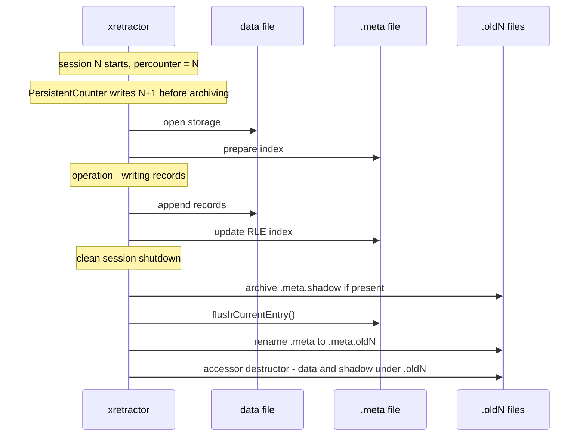

# File Rotation Mechanism

By file rotation we mean the controlled closing of the current set of data and metadata files and moving them to historical versions (`.old<N>`), so that a new session can begin writing from a clean state without losing earlier measurements. This is done in order to separate successive acquisition sessions, preserve a full audit trail, and make it easier to diagnose problems over time. The goal of rotation is both to maintain operational tidiness (a current working set plus a session archive) and to make it possible to recover and compare historical data.

> **_NOTE:_** The functionality described here is covered by the tests: `rotation_test`, `retention`, described in the appendix [Integration Tests](../../appendices/integration-tests.md). The `it_rotation_null` and `ut_rdb` tests additionally check values and `NULL` bits in archives from successive sessions.

## Default behavior (without the `ROTATION` directive)

Without the `ROTATION` directive in the RQL script, `xretractor` **deletes** artifact files (binary data, `.desc`, `.meta`) on every startup and begins recording from scratch.

Rotation and deletion do not apply to ephemerides (`DECLARE`). That does not mean an ephemeride has no file at all: its data source (a text file, a device) is external to the system and untouchable, and next to it a `.desc` descriptor describing the read schema is created - `storage::attachDescriptor()` writes one for every stream, declared ones included. What an ephemeride does not get is a `.meta` index: for declared sources the `makeMetaIndex()` factory injects an **inert** variant (`metaData` with an empty file path) that keeps null patterns in memory and performs no I/O. It is therefore an absence of metadata persistence, not an absence of the index object itself.

## The `ROTATION` directive and the session counter

The `ROTATION` directive enables history-preservation mode. It takes the path to a file that stores a persistent session counter:

```rql
ROTATION 'rdb_counter'
```

The `PersistentCounter` object reads the value `N` from the file and writes `N+1` in its constructor, reserving the next session number before archiving begins. `getCount()` still returns `N`, used in the current session's suffixes. A missing file means first use and number 0; an existing empty or unreadable file, or one that does not contain a valid nonnegative integer, stops startup. A process crash can consume a number without creating a complete archive set, so gaps in the numbering are allowed. The counter value does not prove that the preceding rotation completed.

The counter is written through a temporary file: its contents are synchronized with `fsync`, and `rename` then replaces the destination file. Failure before that replacement completes stops startup. After replacement, the engine attempts to `fsync` the directory; failure is reported at ERROR level, but neither rolls back the reservation nor stops startup. The `ut_persistentCounter::PersistentCounterTest.construction_reserves_next_value` test checks the saved value while the object is still alive.

## Control flow during rotation

At a clean shutdown of session N, the data file, metadata index, and existing shadow files receive the same `.oldN` suffix. The diagram shows the archival order for disk storage; `MEMORY` stores and `DECLARE` sources do not participate in this rotation.


```mermaid
%% pdf-width: 100%
sequenceDiagram
    participant RQL as xretractor
    participant D as data file
    participant M as .meta file
    participant Old as .oldN files

    Note over RQL: session N starts, percounter = N
    Note over RQL: PersistentCounter writes N+1 before archiving
    RQL->>D: open storage
    RQL->>M: prepare index
    Note over RQL: operation - writing records
    RQL->>D: append records
    RQL->>M: update RLE index
    Note over RQL: clean session shutdown
    RQL->>Old: archive .meta.shadow if present
    RQL->>M: flushCurrentEntry()
    RQL->>Old: rename .meta to .meta.oldN
    RQL->>Old: accessor destructor - data and shadow under .oldN
```

_Fig. 25. File rotation sequence - session start and stop_

`storage::~storage()` calls `metaData::rotate(N, false)`: it flushes the pending RLE entry, archives the index, and detaches it from the file without creating a new active `.meta`. The `storageShadow` variant first archives an existing `.meta.shadow`. The accessor destructor then rotates the data and its shadow. Files with the same number belong to the same session and allow its values and `NULL` bits to be reconstructed.

If startup finds empty data but a nonempty index left by an older engine, `detectStartupState()` resets the orphaned index. It does not assign it the current session number. This also happens when gap detection is disabled. Shutdown archiving is not a transaction over the entire file family; interrupting the process during renames can leave an incomplete set.

## Rotation failures and archive durability

Data, data-shadow, metadata, and metadata-shadow renames use `rotateStorageFile`. After a successful `rename`, the engine calls `fsync` on the containing directory; if the source and destination directories differ, it attempts to synchronize both. Failure to inspect a path, rename a file, open a directory, call `fsync`, or close the descriptor is reported at ERROR level, including in Release, with the path and cause. Overwriting an existing archive also produces an ERROR message, but is not blocked: its previous contents are lost.

Directory synchronization persists file-name entries. It does not replace `fsync` of the archived file's contents or provide a transaction over the complete data and metadata set. If the rename succeeds but subsequent directory synchronization fails, the engine does not undo the rename. After a failure, check archive completeness and rotation diagnostics independently of the counter value.

Failed metadata rotation does not reset the unarchived index. With `reopen=true`, which prepares for further writing, it throws an exception instead of creating an apparently valid empty index. Storage shutdown uses `reopen=false`: it detaches persistence without throwing. If the metadata shadow stayed under its active name after a failed rotation, the main index also stays under its active name; if the shadow was renamed and only directory synchronization failed, the main index can be archived. Destructor errors do not by themselves change the process exit code, so a successful exit code does not confirm complete rotation. The `ut_storageRotation` test checks operation order, diagnostics, and failure paths.

## What ends up in `.old<N>` files

| File | When it is created |
| ---- | -------------- |
| `<name>.oldN` | Session N shutdown - the accessor renames the data file |
| `<name>.shadow.oldN` | Session N shutdown - the shadow accessor renames the existing data shadow file |
| `<name>.meta.oldN` | Session N shutdown - the index flushes its pending entry and renames the metadata file |
| `<name>.meta.shadow.oldN` | Session N shutdown - `storageShadow` archives the existing metadata shadow |

The `ROTATED FILES` section of `xtrdb -s` groups files by their suffix number. For archives produced after fix #322, the `.oldN` and `.meta.oldN` pair belongs to the same session. Older archives are not automatically renumbered: they may retain the former one-session mismatch and require a provenance check before analysis.

## Example: sequence of three sessions

After three completed sessions (0, 1, 2), and after writing begins in a fourth (3), an example set without shadow files looks like this:

```text
measurement.old0         - data from session 0
measurement.meta.old0    - metadata from session 0
measurement.old1         - data from session 1
measurement.meta.old1    - metadata from session 1
measurement.old2         - data from session 2
measurement.meta.old2    - metadata from session 2
measurement              - current data (session 3)
measurement.meta         - current metadata (session 3)
```

`xtrdb -s measurement` groups the archives under `[0]`, `[1]`, and `[2]`. Group `[3]` appears only when the current session closes. This example illustrates names and their meaning without assuming fixed file sizes.

## Opening a rotated file in `xtrdb`

Rotated files can be examined with the `open` command in `xtrdb`'s interactive mode. The `open` command automatically strips the base name (removes `.old<N>`) and looks for the descriptor `<base_name>.desc`:

```
$ xtrdb
. open measurement.old1
ok
. print
...
```
