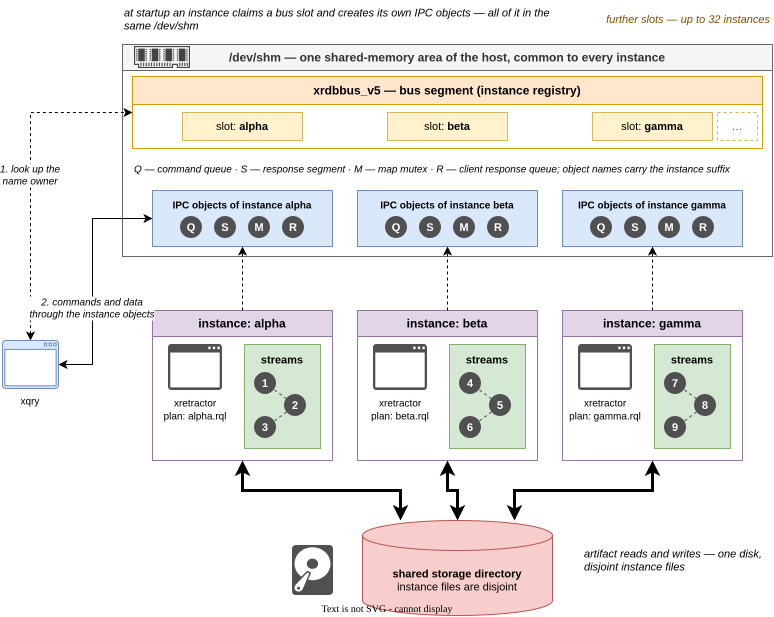

# Multiple Instances and the Bus

Several `xretractor` processes can run concurrently on one host. Each instance has its
own name, lock, IPC area, plan, and clients. The shared `xrdbbus` bus registers live
instances, lets `xqry` discover them, and ensures that two plans do not claim resources
that cannot be shared safely.

<figure><figcaption><p>Fig. 13. Concurrent instances and the shared xrdbbus bus</p></figcaption></figure>

In Fig. 13 every instance compiles its own plan and claims its own set of stream names in
a bus slot; numbered nodes stand in for the names there, because all that matters is that
they never repeat across instances. What is disjoint are the object names, not the memory
area: the bus segment and the IPC objects of every instance live in the same `/dev/shm` and
differ only by the instance-name suffix - for instance `alpha` these are the command queue
`RetractorQueryQueue.alpha`, the response segment `RetractorShmemMap.alpha`, the map mutex
`RetractorMapMutex.alpha`, and the client response queue `brcdbr.alpha.<pid>`. The storage
directory is shared as well, with the files of the individual instances kept disjoint.

Service mode is the exception: exactly one instance may be marked as the service in the
host's default namespace. By default it receives the stable name `service`, so scripts
can address `--server service` without first inspecting the bus.

## Instance identity

An instance can be identified in three ways:

| Mechanism | Meaning |
| --- | --- |
| `xretractor --name measurements plan.rql` | A stable name supplied by the operator. |
| `xretractor --autoname plan.rql` | A random, container-style name printed at startup. |
| `server.autoname = true` | Automatic naming from the TOML file, unless `--name` was given. |

An explicit `--name` takes precedence over configuration. A name must match
`[a-z][a-z0-9_-]*` and may contain at most 32 characters. `--name` and `--autoname` are
mutually exclusive.

Omitting the name preserves the historical identity: IPC object names and the lock file
have no suffix. This instance is also published on the bus, as `(unnamed)`, and takes
part in collision checks.

The `RDB_NAMESPACE` environment variable creates a separate namespace for instances,
the bus, and IPC. If neither `--name` nor `--autoname` is given, it also becomes the
default server name and `xqry` target. It is used primarily by parallel integration
tests. Explicit `--name`, `--autoname`, and `--server` options still take precedence.
The one-service limit is also enforced separately in each namespace.

## Private and shared resources

Named instances have separate Boost.Interprocess objects. The base names of the command
queue, response segment, and mutex receive the instance suffix; a subscriber queue also
contains the client PID. Stopping one instance removes only its IPC and terminates only
its subscriptions.

The bus is shared by the host or `RDB_NAMESPACE`. Every live server publishes its name,
PID, operating modes, plan file, and stream names. A slot is considered live only when
both the PID and process start time match `/proc`; a zombie process does not retain
resources.

Before starting or replacing a plan, the bus checks that the following do not overlap:

- all stream names, including compiler-generated and ad hoc streams;
- normalized paths of storage files being written;
- the counter file of the `:ROTATION` directive.

Resources are claimed before old artifacts are removed and before IPC is created. A
losing instance therefore cannot delete data belonging to a live owner. The rejection
message identifies the conflicting resource, instance name, and PID.

For `xqry --reset`, the new plan's resources are reserved first. Only after the new epoch
has been built successfully does that reservation atomically replace the active set. A
parse error, compilation error, limit error, or collision leaves the current plan and
its claims unchanged.

> **⚠️ Warning**
>
> An unavailable or corrupted bus does not stop an individual server. Startup is allowed
> with a warning, but global collision protection is then not enforced. This is an
> emergency mode, not a valid multi-server configuration.

## Routing `xqry` commands

`xqry` resolves its target from a single bus snapshot, without probing servers in turn
or waiting for their timeouts.

| Situation | Result |
| --- | --- |
| `--server name` was given | The named instance is used without automatic routing. |
| Exactly one instance is live | The client selects it automatically. |
| Several instances, `--select` or `--detail` | The stream owner is selected. |
| Several instances, ad hoc `SELECT` | All sources must belong to one instance. |
| Several instances, ad hoc `RULE` | The owner of the stream in the `ON` clause is selected. |
| Several instances, ad hoc `DECLARE` | `--server` is required because the declaration has no input owner. |
| Several instances, instance-wide command | `--hello`, `--dir`, `--kill`, and `--reset` require `--server`. |

An ad hoc query cannot combine sources from different instances. RetractorDB does not
transfer streams between servers; the plans remain independent execution graphs.

## Inspecting the bus

`xqry --bus` does not contact any server. It shows the name, PID, mode, query file, and
streams of every live instance. The `--yaml` modifier produces an `apiVersion: xqry/v1`
document suitable for scripts.

The `MODE` column can contain several letters:

| Letter | Mode |
| --- | --- |
| `N` | normal clock-paced execution |
| `R` | `--realtime` |
| `F` | `--no-clock` |
| `U` | `--until-eof` |
| `M` | `--llimitqry` is set |
| `X` | `--xqrywait` |
| `S` | service mode or a systemd unit |

Example session:

```bash
xretractor alpha.rql --name alpha --noanykey &
xretractor beta.rql --name beta --noanykey &

xqry --bus
xqry --select temperature         # routed by stream owner
xqry --server alpha --dir         # explicit instance-wide command
xqry --server beta --kill         # stops only the beta instance
```
