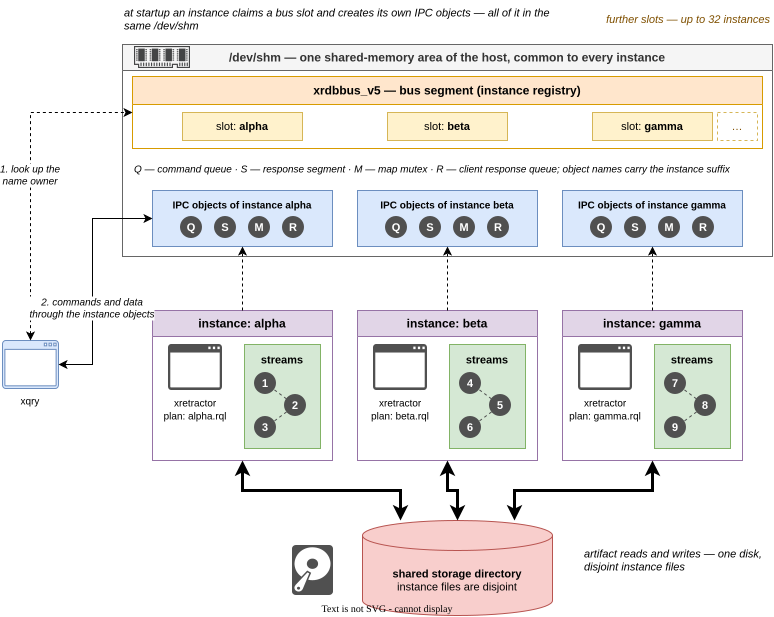

# Multiple Instances and the Bus

Several `xretractor` processes can run concurrently on one host. Each instance has its own name, lock, IPC area, plan, and clients. The shared `xrdbbus` bus registers live instances, lets `xqry` discover them, and ensures that two plans do not claim resources that cannot be shared safely.

<figure><figcaption><p>Fig. 13. Concurrent instances and the shared xrdbbus bus</p></figcaption></figure>

In Fig. 13 every instance compiles its own plan and claims its own set of stream names in a bus slot; numbered nodes stand in for the names there, because all that matters is that they never repeat across instances. What is disjoint are the object names, not the memory area: on Linux the bus segment and the IPC objects of every instance live in the same `/dev/shm` and differ only by the instance-name suffix - for instance `alpha` these are the command queue `RetractorQueryQueue.alpha`, the response segment `RetractorReply_v1.alpha`, and the client subscription queue `brcdbr.alpha.<pid>`. The response segment has fixed slots and atomic states; it does not use a separate named map mutex. The storage directory is shared as well, with the files of the individual instances kept disjoint.

Service mode is the exception: exactly one instance may be marked as the service in the host's default namespace. By default it receives the stable name `service`, so scripts can address `--server service` without first inspecting the bus.

## Instance identity

An instance can be identified in three ways:

| Mechanism | Meaning |
| --- | --- |
| `xretractor --name measurements plan.rql` | A stable name supplied by the operator. |
| `xretractor --autoname plan.rql` | A random, container-style name printed at startup. |
| `server.autoname = true` | Automatic naming from the TOML file, unless `--name` was given. |

An explicit `--name` takes precedence over configuration. A name must match `[a-z][a-z0-9_-]*` and may contain at most 32 characters. `--name` and `--autoname` are mutually exclusive.

Omitting the name preserves the historical identity: IPC object names and the lock file have no suffix. This instance is also published on the bus, as `(unnamed)`, and takes part in collision checks.

The `RDB_NAMESPACE` environment variable selects a separate bus segment and, when neither `--name` nor `--autoname` is given, becomes the default server name and `xqry` target. It is used primarily by parallel integration tests. Explicit `--name`, `--autoname`, and `--server` options still take precedence. The one-service limit is enforced separately in each bus namespace. Different `RDB_NAMESPACE` values with the same explicit server name do not separate IPC objects: their names follow the selected instance identity.

Before startup, an instance acquires its file lock in `paths.lock_dir` (the temporary directory by default) and an additional IPC identity lock at `/tmp/xretractor_ipc.<command-queue-name>.lock`. The latter location is fixed, independently of `TMPDIR` and `paths.lock_dir`. A held IPC identity blocks startup before artifacts are removed or IPC is created, even if the bus is unavailable. Changing the lock directory or bus namespace does not allow taking over a live server's objects.

## Private and shared resources

Named instances have separate Boost.Interprocess objects. The base names of the command queue and response segment receive the instance suffix; a subscriber queue also contains the client PID. Stopping an instance ends only its subscriptions and removes its IPC; it may also clean up resources abandoned by dead processes. Live instances remain protected.

New IPC objects created by the server receive an explicit `0600` mode, which restricts access to the server account without relying on the process umask. This applies to the command queue, subscription queues, response segment, and bus segment. Separate names keep the resources of cooperating instances apart, and locks coordinate their creation and cleanup.

The fix for [#465](https://github.com/michalwidera/retractordb/issues/465) creates command queues, subscription queues, and the response segment through `create_only`. A name collision does not lead to adopting an existing object. When opening a queue or segment, the server and client require its owner to match their own effective UID (`geteuid()`) and its mode to be exactly `0600`. The expected UID comes from the process credentials, not from the metadata of the object being opened. Before mapping, the checks also cover object type, a single link, agreement between the name and the opened object, and directory protection against entry substitution by another account.

At startup or restart, the server may remove leftovers owned by its own account after acquiring the IPC identity lock; older, broader permissions on such an object do not prevent cleanup. Resubscription removes the previous queue belonging to that account and creates a new one with the requested capacity. Cleanup refuses to remove an object owned by a different UID, including when performed by root. Abandoned locks belonging to other accounts are skipped, and identity and presence locks continue to protect live instances. The abandoned-resource sweeper does not enumerate all subscription queues left after SIGKILL.

A refusal is logged at ERROR level, including in Release, with the object name, reason, and owner UID when it can be determined. A foreign command queue or response segment refuses startup; a foreign subscription queue refuses that subscription. The bus may open an existing segment only after the same verification, and a rejected segment remains untouched. Its unavailability retains the single-server fallback described below.

> **⚠️ Warning**
>
> `xqry` must run with the same effective UID as the server. This also applies to administrators: running the client as root alone does not allow it to open IPC owned by another service account. For a service running as `retractor`, use, for example, `sudo -u retractor xqry --server service --dir`. Sharing the bus requires the same UID; an instance name or `RDB_NAMESPACE` does not replace owner verification. Allowing `SYSTEM` rules in a replacement plan still depends on `service.unrestricted` (see [xqry](../appendices/command-line-options/xqry.md#the-do-system-rule-does-not-pass-through-this-channel)).

The bus is shared by the host or `RDB_NAMESPACE`. Every live server publishes its name, PID, operating modes, plan file, and stream names. When the process entry is readable, a slot remains live if its PID and nonzero start time match; a zombie process does not retain resources. On Linux the engine reads `/proc/<pid>/task/<pid>/stat`, while on macOS it uses the platform adapter.

An unreadable process entry means the engine cannot decide, rather than confirming that the owner is dead. On Linux a failed read confirms absence only when `kill(pid, 0)` returns `ESRCH`; success or `EPERM` leaves the result uncertain. `bus::isProcessAlive()` then keeps the slot and its claims, including when it cannot compare start times. This protects an owner hidden by `hidepid` or `ProtectProc`, but may retain stale claims after PID reuse. Lack of access to an entry alone therefore does not authorize releasing resources. The rule is checked by `ut_bus::BusFixture.UnreadableOwnerKeepsSlot`.

The current layout uses the `xrdbbus_v7` segment, or `xrdbbus_v7_<RDB_NAMESPACE>` when `RDB_NAMESPACE` is set. Each namespace has its own registry and collision checks. Segment users hold a presence lock through `flock`; the last one leaving can remove the unused segment. Layout versions have separate registries: concurrently running binaries using v6 and v7 does not provide collision checks between their streams and storage paths. Stop older instances before upgrading.

Shared presence-lock acquisition retries nonblocking `flock` calls for up to 500 ms. A transient exclusive holder may release its lock within that period; if it still holds it, the bus remains unavailable instead of blocking attachment indefinitely. This deadline applies to waiting for `flock`, not to the entire file-opening procedure.

Before starting or replacing a plan, the bus checks that the following do not overlap:

- all stream names, including compiler-generated and ad hoc streams;
- normalized paths of storage files being written;
- the counter file of the `:ROTATION` directive.

Resources are claimed before old artifacts are removed and before IPC is created. A losing instance therefore cannot delete data belonging to a live owner. The rejection message identifies the conflicting resource, instance name, and PID.

For `xqry --reset`, the new plan's resources are reserved first. Only after the new epoch has been built successfully does that reservation atomically replace the active set. A parse error, compilation error, limit error, or collision leaves the current plan and its claims unchanged.

An unrecoverable bus-mutex error, `ENOTRECOVERABLE`, is reported at ERROR level, including in Release, once per `Bus` object. The message identifies the `/dev/shm` segment to remove after all instances mapping it have stopped. Removing a segment still used by a live instance can split the resource registry. Startup and ad hoc import retain the emergency mode described below; plan replacement is rejected when an attached bus has an unusable mutex.

> **⚠️ Warning**
>
> An unavailable or corrupted bus does not stop an individual server if it can acquire its instance and IPC identity locks. Startup is allowed with a warning, but global stream-name and storage-path protection is then not enforced. The IPC identity lock still applies. This is an emergency mode, not a valid multi-server configuration.

## Routing `xqry` commands

`xqry` resolves its target from a single snapshot of the bus in the current `RDB_NAMESPACE`, without probing servers in turn or waiting for their timeouts. The combined `--bus` listing does not expand the routing scope of other commands.

| Situation | Result |
| --- | --- |
| `--server name` was given | The named instance is used without automatic routing. |
| Exactly one instance is live | The client selects it automatically. |
| Several instances, `--select` or `--detail` | The stream owner is selected. |
| Several instances, ad hoc `SELECT` | All sources must belong to one instance. |
| Several instances, ad hoc `RULE` | The owner of the stream in the `ON` clause is selected. |
| Several instances, ad hoc `DECLARE` | `--server` is required because the declaration has no input owner. |
| Several instances, instance-wide command | `--hello`, `--dir`, `--kill`, and `--reset` require `--server`. |

An ad hoc query cannot combine sources from different instances. RetractorDB does not transfer streams between servers; the plans remain independent execution graphs.

## Inspecting the bus

`xqry --bus` does not contact any server. Without setting `RDB_NAMESPACE`, it discovers every bus of the current version that is accessible to the current account and has live instances. Each bus gets a separate `NAMESPACE:` section with instance names, PIDs, modes, query files, and streams; `(default)` denotes the bus without a namespace. The `--yaml` modifier produces one `apiVersion: xqry/v1` document with a `servers` list. Every entry has a `namespace` field: `null` for the default bus or a quoted namespace name. With no live instances, table output is empty and YAML contains `servers: []`.

The `MODE` column can contain several letters:

| Letter | Mode |
| --- | --- |
| `N` | normal clock-paced execution |
| `R` | `--realtime` |
| `F` | `--no-clock` |
| `U` | `--until-eof` |
| `M` | `--llimitqry` is set |
| `X` | `--xqrywait` |
| `S` | service mode or a systemd unit |

Example session:

```bash
xretractor alpha.rql --name alpha --noanykey &
xretractor beta.rql --name beta --noanykey &

xqry --bus
xqry --select temperature         # routed by stream owner
xqry --server alpha --dir         # explicit instance-wide command
xqry --server beta --kill         # stops only the beta instance
```
