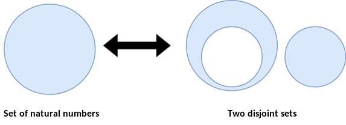

# Mathematical Foundations

## Mathematical Foundations

> **ℹ️ Info**
>
> Do you know what the Fields Medal is? It is an award given exclusively to outstanding mathematicians under the age of 40. It is called the mathematical Nobel Prize. Interestingly, no mathematician will ever receive the actual Nobel Prize — as per the founder's wishes. John Charles Fields himself (1863-1932) was a Canadian mathematician. John Charles Fields had one doctoral student — Samuel Beatty (1881-1970).

In 1926, Samuel Beatty published the following theorem [\[1\]](../references.md#1):

If p, q are positive irrational numbers satisfying the relation

\\[
\frac{1}{p}+\frac{1}{q}=1
\\]

then the sequences

\\[
\left\\{
\left\lfloor np\right\rfloor \right\\} _{n=1}^{\infty }=\left\lfloor
p\right\rfloor ,\left\lfloor 2p\right\rfloor ,\left\lfloor 3p\right\rfloor
,\ldots
\\]

and

\\[
\left\\{ \left\lfloor nq\right\rfloor \right\\}
_{n=1}^{\infty }=\left\lfloor q\right\rfloor ,\left\lfloor 2q\right\rfloor
,\left\lfloor 3q\right\rfloor ,\ldots
\\]

partition the set of positive integers.

<figure><figcaption>
Fig. 1. Graphical representation of the concept of disjoint sets
</figcaption></figure>

These two sequences partition the set of natural numbers. This means that given two irrational numbers satisfying the relation stated in the theorem, we can split the entire set of natural numbers into two disjoint sets (Fig. 1).

The Beatty theorem is a fascinating observation in its own right — but in computer systems we run into a problem with irrational numbers. Real numbers — despite the fact that some programming languages use the words Real or Float for the real-number type — have little in common with actual real numbers. The fundamental problem is that we don't have them, and presumably never will.

And here our journey would have abruptly ended, were it not for another theorem. The situation changed dramatically thanks to a mathematician — Aviezri Siegmund Fraenkel (1926), who specializes in combinatorial aspects of game theory.

In 1969 he presented the following theorem [\[2\]](../references.md#2). The starting point is a parameterized Beatty sequence:

\\[
\mathcal{B}(\alpha ,\alpha ^{\prime }):=
\left( \left\lfloor \frac{n-\alpha^{\prime }}{\alpha }\right\rfloor \right) _{n=1}^{\infty }
\\]

This single definition generates an entire family of sequences. The theorem always concerns a **pair** of its instances with different parameters: the sequence

\\[
\mathcal{B}(\alpha ,\alpha ^{\prime })
\quad\text{and}\quad
\mathcal{B}(\beta ,\beta ^{\prime }):=
\left( \left\lfloor \frac{n-\beta^{\prime }}{\beta }\right\rfloor \right) _{n=1}^{\infty }
\\]

These sequences partition the set ℕ if and only if the following five conditions are satisfied:

1\.

\\[
0<\alpha<1
\\]

2\.

\\[
\alpha+\beta=1
\\]

3\.

\\[
0\leq \alpha +\alpha ^{\prime }\leq 1
\\]

4. If α is an irrational number, then:

\\[
\alpha ^{\prime }+\beta ^{\prime }=0
\\]

and

\\[
k\alpha +\alpha ^{\prime }\not\in \mathbb{Z}
\\]

for

\\[
2\leq k\in \mathbb{N}
\\]

5. If α is a rational number (let q∈N be the smallest number such that qα∈N), then

\\[
\frac{1}{q}\leq \alpha +\alpha ^{\prime }
\\]

and

\\[
\left\lceil q\alpha ^{\prime }\right\rceil +\left\lceil q\beta ^{\prime}\right\rceil =1
\\]

And that is exactly what we need! We don't have irrational numbers, but rational numbers understood as the ratio of two natural numbers are something a computer can handle just fine.

In our case, I first built prototype equations in Python, and then started looking for mathematical foundations that looked similar and could serve as well-documented equations backed by formal proofs. Proofs, of course, carried out by more experienced mathematicians. Modest as my skills were, they were enough to identify these two publications as relevant to my ideas.

This document does not include formal proofs. That is why I present here only the equations and theorems actually used in the system. For the formal proofs, I refer the reader to my scientific publications [\[3\]](../references.md#3).
