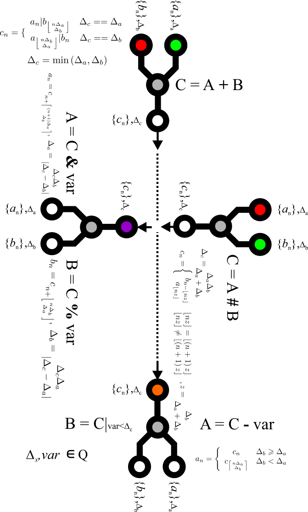

# Graphical Representation

Fig. 2 shows, schematically, the relationships between the developed time-series algebra operators. In the figure, I have combined the relationships between the developed operators, their symbolic notation used in the query language, and the directions of data processing.

The figure shown is also a graphical summary of the content presented in this chapter. I hope this graphical form of representation makes it easier to absorb the rules governing the introduced operators. For clarity, the aggregation/serialization and time-shift operators have been omitted. Be aware that the diagram is incomplete without them.

<figure><figcaption>
Fig. 2. Relationships between the algebra operators
</figcaption></figure>
