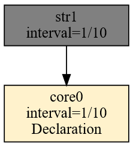
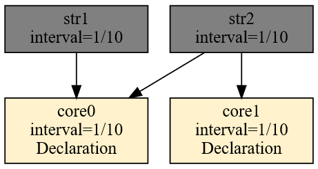
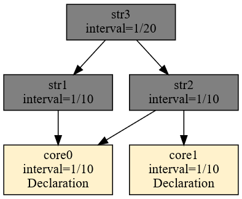
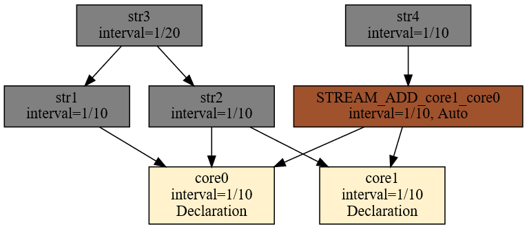

# Dependency Tree Construction

The dependency tree is the query execution plan in the form of a directed graph. It is a data structure built during compilation and modified when Ad Hoc queries are added. The roots of this graph are ephemeris declarations — declarations of every kind that create external objects, so-called data sources. Inside the graph lie artifacts and substrates. At the end of the processing chain sit the artifacts — as the chain's final results.

Such a construction is a directed graph — a graph with multiple roots and multiple terminal vertices. Inside the graph there are connecting nodes. Every node lies on a path from a root to a terminal vertex. This is best visualized with an example.

Let's start by considering the following trivial query:

```
DECLARE a UINT STREAM core0, 0.1 FILE 'datafile1.txt'
SELECT str1[0] STREAM str1 FROM core0
```

We can obtain a graph highlighting the dependencies between the individual objects as follows (Fig. 32):

```
$ xretractor -c query5.rql -d > out.dot && dot -Tsvg out.dot -o out.svg
```

For a full description of the `-d -f -s` flags and how to interpret the output — see [Compilation Debugging](compilation-debugging.md).

<figure><figcaption><p>Fig. 32. Ephemeris–artifact dependency</p></figcaption></figure>

Let's make this graph a bit more complex by adding two ephemeris declarations and an additional artifact.

```
DECLARE a UINT STREAM core0, 0.1 FILE 'datafile1.txt'
DECLARE a UINT STREAM core1, 0.1 FILE 'datafile2.txt'
SELECT str1[0] STREAM str1 FROM core0
SELECT str2[0] STREAM str2 FROM core0 + core1
```

The dependency graph for the set of queries above looks as follows (Fig. 33):

<figure><figcaption><p>Fig. 33. Ephemerides–artifacts dependency</p></figcaption></figure>

Let's build an additional node that depends on artifacts. The simplest way is to add the following query at the end:

```
SELECT str3[0] STREAM str3 FROM str1#str2
```

The graph changes shape:

<figure><figcaption><p>Fig. 34. Ephemerides–artifacts–artifacts dependency</p></figcaption></figure>

As shown in Fig. 34, the str3 stream is not directly dependent on the data supplied by the core0 and core1 streams. Queries form a dependency graph, and the order in which they are invoked is well-defined. The interval value of streams grows toward the roots. This growth toward the roots follows from the interval-determination equations of the developed algebra.

Note that queries in the rql file are processed sequentially. Attempting to reference, in a query, an object that is not yet defined results in a compilation error.

Attaching the following query to the dependency tree produces an additional substrate.

```
SELECT str4[0] STREAM str4 FROM (core1+core0)>2
```

A query attached this way will modify the dependency tree as shown in Fig. 35.

<figure><figcaption><p>Fig. 35. Dependency with a substrate</p></figcaption></figure>

The substrate is marked with a different color and an "Auto" label next to the time interval.

The dependency graph must be a directed acyclic graph (DAG). Attempting to define a stream that refers to its own results creates a cycle and results in a compilation error. The detection mechanism is described in the chapter [Loop Detection in Compilation](loop-detection.md).

> **_NOTE:_** The functionality described here is covered by the test: `subquery`, described in the appendix [Integration Tests](../appendices/integration-tests.md).

