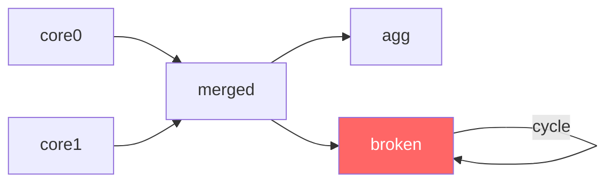

# Loop Detection in Compilation

The query dependency graph must be a directed acyclic graph (DAG). If a query refers — directly or indirectly — to its own results, a cycle is created. The compiler detects this situation and aborts compilation with an error.

> **_NOTE:_** The functionality described here is covered by the test: `issue95_loopInCompile`, described in the appendix [Integration Tests](../appendices/integration-tests.md).

## Example of a loop

```
DECLARE a BYTE, b INTEGER \
STREAM core0, 0.1 \
FILE 'sensor_a.txt'

DECLARE c INTEGER, d FLOAT \
STREAM core1, 0.2 \
FILE 'sensor_b.txt'

SELECT merged[0]*10, merged[2]+10 STREAM merged FROM core0 + core1
SELECT agg[0] STREAM agg FROM merged.max
SELECT * STREAM broken FROM merged + broken
```

The last query defines `broken` as the result of the operation `merged + broken` — the stream depends on itself. The dependency graph contains a cycle (Fig. 40):



_Fig. 40. A cycle in the query dependency graph_

## Compilation result

Attempting to compile such a file ends with an error:

```
$ xretractor brokenQuery.rql -c 2>out.txt
$ echo $?
1
$ cat out.txt
[error] Circular dependency: stream interval resolution stalled with 1 
>> unresolved streams
```

The message `"Circular dependency in stream definitions"` appears when the `resolveStreamIntervals` stage detects that the number of unresolved streams has stopped decreasing. For how to run compilation and read error messages, see [Compilation Debugging](compilation-debugging.md).

## Detection mechanism

On every iteration round, the `resolveStreamIntervals` stage counts the streams for which an interval could not yet be determined (`unresolvedCount`). In a valid, acyclic graph, this number decreases every round — at least one stream always gets its delta determined. In a graph with a cycle, streams depend on each other mutually and none can obtain a value — `unresolvedCount` stalls.

```cpp
if (unresolvedCount >= prevUnresolved) {
    SPDLOG_ERROR("Circular dependency: stream interval resolution stalled with
>> {} unresolved streams",
                 unresolvedCount);
    return std::string("Circular dependency in stream definitions");
}
prevUnresolved = unresolvedCount;
```

The `>=` condition (rather than `>`) guards against false positives: if the count doesn't decrease by even one, progress is impossible.

## How to fix it

Remove the stream's reference to itself, or to a stream that depends on it. In the example above, the query:

```
SELECT * STREAM broken FROM merged + broken
```

should be replaced with a reference to a stream that exists independently of `broken`:

```
SELECT * STREAM broken FROM merged + core0
```
