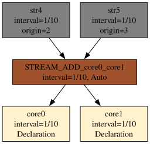
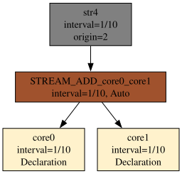
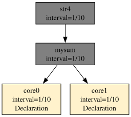

# Substrates

I mentioned substrates, ephemerides, and artifacts in the chapter on system architecture. Here I'll present an example.

First I'd like to draw attention to a certain property of the algebraic expressions introduced. In practice we can write any expression, compile it, and produce a formula for operations on individual elements of the time series that yields the desired result.

In practice, the system carries out only one- or two-argument operations. Examples of one-argument operations are the time shift or the Agse operation — there, the argument is a single data stream. The rest of the operations act on two data streams. During compilation, all algebraic expressions are broken down into ones with two arguments.

The parser accepts both the parenthesized form and unparenthesized chains, e.g. `s1+s2+s3`, `s1#s2#s3`, and `s1+s2+s3+s4`. Such notation is then reduced to a sequence of two-argument operations with automatic intermediate substrates.

The example uses the canonical declarations from the whole chapter — three streams with different types and intervals:

```
DECLARE a BYTE, b INTEGER \
STREAM core0, 0.1 \
FILE 'sensor_a.txt'

DECLARE c INTEGER, d FLOAT \
STREAM core1, 0.2 \
FILE 'sensor_b.txt'

DECLARE e INTEGER \
STREAM core2, 0.3 \
FILE 'sensor_c.txt'

SELECT merged[0] \
STREAM merged \
FROM (core0 # core1) + core2
```

Compilation:

```
$ xretractor -c query.rql
STREAM_HASH_core0_core1(1/15)
        :- PUSH_STREAM(core0)
        :- PUSH_STREAM(core1)
        :- STREAM_HASH
        a: BYTE
                PUSH_ID(STREAM_HASH_core0_core1[0])
        b: INTEGER
                PUSH_ID(STREAM_HASH_core0_core1[1])
        c: INTEGER
                PUSH_ID(STREAM_HASH_core0_core1[2])
        d: FLOAT
                PUSH_ID(STREAM_HASH_core0_core1[3])
merged(1/15)
        :- PUSH_STREAM(STREAM_HASH_core0_core1)
        :- PUSH_STREAM(core2)
        :- STREAM_ADD
        merged_0: BYTE
                PUSH_ID(merged[0])
core0(1/10)     sensor_a.txt
        a: BYTE
        b: INTEGER
core1(1/5)      sensor_b.txt
        c: INTEGER
        d: FLOAT
core2(3/10)     sensor_c.txt
        e: INTEGER
```

An unannounced stream, `STREAM_HASH_core0_core1`, appeared — this is exactly a substrate. The compiler broke `(core0 # core1) + core2` into two two-argument operations and inserted an intermediate stream. The substrate's delta: Δ = (1/10 · 1/5) / (1/10 + 1/5) = 1/15.

What happens once we attach the query:

```
SELECT merged2[0] STREAM merged2 FROM (core0 # core1) > 2
```

Only one new query gets attached to the plan:

```
merged2(1/15)
        :- PUSH_STREAM(STREAM_HASH_core0_core1)
        :- STREAM_TIMEMOVE(2)
        merged2_0: BYTE
                PUSH_ID(merged2[0])
```

You're probably wondering why only one, and not two again? The answer is optimization. We're reusing the intermediate results from before. This is one of the unexpected benefits of using RetractorDB.

There's one more important thing worth mentioning here. There is a SUBSTRAT directive, whose argument is a string in quotes. You can use the following types: 'memory', 'default', 'direct', 'posix', 'posixshd', 'generic', 'device', 'textsource'. A full description of each type can be found in the chapter [Storage Types](../query-language-construction/select-command/storage-types.md). The default type, 'default', causes substrates to materialize entirely on disk. That's not the desired behavior in a production system, but it is desired during development and debugging. A useful type is 'memory'. Substrates of this type live only in memory. Their data never lands on disk — everything happens in memory, and there's only as much data as is needed to execute the queries. The remaining types are currently untested and in development.

Adding a query with the same operations but a different name can trigger substrate deduplication. If the program, delta, and schema are equivalent, the compiler redirects the `PUSH_STREAM` references to the existing stream and removes the duplicate.

> **_NOTE:_** The functionality described here is covered by the tests: `issue96_no_substrat_reduction`, `issue96_substrat_reference`, described in the appendix [Integration Tests](../appendices/integration-tests.md).

## Substrate reduction

The compiler carries out an optimization called **substrate reduction** (the `deduplicateSubstrats` function). It works as follows: if the user has defined a query structurally identical to a generated substrate, the substrate is removed from the plan and its references are replaced with the user query's name.

### Conditions for reduction

Reduction of a substrate into a user query happens if and only if three conditions are simultaneously satisfied:

1. **The same schema** — the output field types and names are identical.
2. **The same delta** — the streams' sampling rate is the same.
3. **The same processing operations** — the sequence of `PUSH_STREAM` / `STREAM_TIMEMOVE` / `STREAM_HASH`, etc. instructions is identical.

### Reduction example

Consider a query with the canonical declarations:

```
DECLARE a BYTE, b INTEGER   STREAM core0, 0.1 FILE 'sensor_a.txt'
DECLARE c INTEGER, d FLOAT  STREAM core1, 0.2 FILE 'sensor_b.txt'

SELECT merged[0] STREAM merged FROM (core0 > 2) + core1
SELECT shifted[0] STREAM shifted FROM core0 > 2
```

Without reduction, the compiler would generate three streams: the substrate `STREAM_TIMEMOVE_core0`, `merged`, and `shifted`. The substrate and `shifted` have an identical structure — the same source stream `core0` and the same `>2` operation. After reduction, the substrate is removed, and the reference `PUSH_STREAM(STREAM_TIMEMOVE_core0)` inside `merged` is replaced with `PUSH_STREAM(shifted)`:

```
merged(1/10)
        :- PUSH_STREAM(shifted)
        :- PUSH_STREAM(core1)
        :- STREAM_ADD
        merged_0: BYTE
                PUSH_ID(merged[0])
shifted(1/10)
        :- PUSH_STREAM(core0)
        :- STREAM_TIMEMOVE(2)
        shifted_0: BYTE
                PUSH_ID(shifted[0])
core0(1/10)     sensor_a.txt
        a: BYTE
        b: INTEGER
core1(1/5)      sensor_b.txt
        c: INTEGER
        d: FLOAT
```

### An important restriction: only substrates are reduced

Reduction applies exclusively to substrates generated by the compiler (`isSubstrat = true`). Queries explicitly defined by the user are **never** reduced, even if two of them have an identical structure.

Example — two user queries with the same operation:

```
DECLARE a BYTE, b INTEGER   STREAM core0, 0.1 FILE 'sensor_a.txt'

SELECT shifted1[0] STREAM shifted1 FROM core0 > 2
SELECT shifted2[0] STREAM shifted2 FROM core0 > 2
```

The compilation result keeps both streams, with no reduction at all:

```
shifted1(1/10)
        :- PUSH_STREAM(core0)
        :- STREAM_TIMEMOVE(2)
        shifted1_0: BYTE
                PUSH_ID(shifted1[0])
shifted2(1/10)
        :- PUSH_STREAM(core0)
        :- STREAM_TIMEMOVE(2)
        shifted2_0: BYTE
                PUSH_ID(shifted2[0])
core0(1/10)     sensor_a.txt
        a: BYTE
        b: INTEGER
```

This semantic decision is deliberate: the user declared two separate output streams, and both are entitled to exist independently in the execution plan.

## Elimination of duplicate substrates

When several queries use the same stream operation — e.g. `core0 + core1` — the substrate-extraction phase (`extractIntermediateStreams`) creates a separate substrate for each of them. Without a subsequent repair phase, the graph would end up with parallel, identical intermediate nodes computing exactly the same value.

### When a substrate is created

A substrate is generated for every query whose program contains more than one stream operator. This applies to the operators: `STREAM_ADD`, `STREAM_SUBTRACT`, `STREAM_HASH`, `STREAM_DEHASH_DIV`, `STREAM_DEHASH_MOD`, `STREAM_TIMEMOVE`, `STREAM_AGSE`. The condition is checked by the `query::isReductionRequired()` function.

The newly created substrate is given a name built from the operation symbol and the operand names, e.g. `STREAM_ADD_core1_core0` (the `composeStreamName` function in `compiler.cpp`). In the parent query's program, the operator token is replaced with a `PUSH_STREAM` token pointing at this substrate.

### Matched interleave-shift factorization

After extracting substrates and resolving their intervals, the compiler applies the algebraic rewrite:

\\[
(A > i) \mathbin{\\#} (B > k) \longrightarrow (A \mathbin{\\#} B) > (i+k),
\qquad i\Delta_{a}=k\Delta_{b}
\\]

The condition \\(i\Delta_{a}=k\Delta_{b}\\) means that both interleave arguments are shifted by the same physical time. Without this condition the transformation is not equivalent, so the compiler keeps the original plan.

Before optimization the plan contains two substrates:

```
STREAM_TIMEMOVE_A = A > i
STREAM_TIMEMOVE_B = B > k
result = STREAM_TIMEMOVE_A # STREAM_TIMEMOVE_B
```

After optimization only one remains:

```
STREAM_HASH_A_B = A # B
result = STREAM_HASH_A_B > (i + k)
```

The `factorMatchedHashTimeMoves()` pass does not remove explicit user streams or substrates used by other consumers. It runs before deduplication so that the exposed `A # B` substrate can subsequently be shared with another equivalent plan.

The `issue202_hash_shift_e2e` test executes both sides of the identity over independent copies of file-backed input streams. It compares the `matched` and `CC` artifacts byte for byte, compares their metadata after excluding the creation timestamp, and checks the complete sequence against a reference derived from the `B,A,A` interleave period. Because the resulting `>3` operator addresses history slot 3 (slot 0 is the current record), `computeRequiredCapacities()` allocates four records—generally `N+1` for a `>N` shift.

### The deduplication algorithm

After extracting substrates and determining time intervals, the compiler runs the `deduplicateSubstrats()` step. The algorithm works iteratively — a `while(changed)` loop repeats the search until no more duplicate pairs are found.

On every pass, for each pair of substrates `(it, it2)`, five equivalence conditions are checked in turn:

1. **Time interval** – `it->rInterval == it2->rInterval`
2. **Program length** – the number of tokens in `lProgram` must be identical
3. **Schema length** – the number of fields in `lSchema` must be identical
4. **Program content** – every token is compared by instruction type (`getCommandID()`) and parameter value (`getVT()`)
5. **Schema content** – every field is compared by type (`rtype`), size in bytes (`rlen`), and cardinality (`rarray`)

If all conditions hold, substrate `it` is considered a duplicate of substrate `it2`. The compiler walks through the entire `coreInstance` and, in every `PUSH_STREAM` token referring to the old name (`it->id`), substitutes the new name (`it2->id`). The duplicate is then removed from the query list (`coreInstance.erase(it)`), and the loop starts over.

### Position in the compilation pipeline

Deduplication is the fifth step of the pipeline (the `compiler::compile()` function):

```
1. extractIntermediateStreams   – substrate extraction
2. expandSchemaWildcards        – expansion of wildcard symbols in schemas
3. resolveStreamIntervals       – time-interval computation
4. factorMatchedHashTimeMoves   – matched interleave-shift factorization
5. deduplicateSubstrats         – duplicate elimination  ← this step
6. resolveFieldReferences       – field-reference resolution
7. expandIndexWildcards         – expansion of wildcard indices
8. localizeFieldOffsets         – field-offset computation
9. computeRequiredCapacities    – required-history computation
10. validateConstraints         – operator-constraint validation
11. applyCapacitiesToStreams    – capacity application
```

Matched interleave-shift factorization and deduplication must happen after step 3 because both operations compare intervals. Deduplication follows the algebraic rewrite so that it can merge interleave substrates exposed by that rewrite.

### Effect on the dependency graph

Consider the queries:

```
DECLARE a UINT STREAM core0, 0.1 FILE 'datafile1.txt'
DECLARE a UINT STREAM core1, 0.1 FILE 'datafile2.txt'
SELECT str4[0] STREAM str4 FROM (core0+core1)>2
SELECT str5[0] STREAM str5 FROM (core0+core1)>3
```

Both queries require the sum `core0+core1` to be computed first.

The `extractIntermediateStreams` phase creates a separate substrate for each query, producing two identical intermediate nodes in the graph (Fig. 36):

<figure><figcaption><p>Fig. 36. Graph before deduplication — two identical STREAM_ADD_core0_core1 substrates</p></figcaption></figure>

Once `deduplicateSubstrats()` runs, one of the duplicates is removed and every `PUSH_STREAM` reference is repointed to the surviving node. A single shared substrate remains in the graph (Fig. 37):

<figure><figcaption><p>Fig. 37. Graph after deduplication — one shared substrate, generated with: xretractor dedup_after.rql -c -d</p></figcaption></figure>

The graph after deduplication is exactly what `xretractor -c -d` returns — the compiler always presents the result after all optimization phases.

## Absorption of a substrate by an explicit stream

The inner loop in `deduplicateSubstrats()` does not check the `isSubstrat` flag for candidate `it2` — that check exists only in the outer loop. This means an automatic substrate can be absorbed not only by another substrate, but by **any stream with an identical program and schema** — including a stream explicitly defined by the user.

Consider a query containing only a compound expression:

```
DECLARE a UINT STREAM core0, 0.1 FILE 'datafile1.txt'
DECLARE a UINT STREAM core1, 0.1 FILE 'datafile2.txt'
SELECT str4[0] STREAM str4 FROM (core0+core1)>2
```

Here, `extractIntermediateStreams` extracts a substrate `STREAM_ADD_core0_core1` for the expression `core0+core1`. Artifact `str4` depends on it (Fig. 38):

<figure><figcaption><p>Fig. 38. Graph with the automatic substrate STREAM_ADD_core0_core1</p></figcaption></figure>

When the user adds an explicit stream declaration that is exactly the same sum:

```
SELECT * STREAM mysum FROM core0+core1
```

the substrate `STREAM_ADD_core0_core1` satisfies every equivalence condition relative to `mysum` — identical interval, identical token program, identical field schema. The `deduplicateSubstrats()` phase removes the substrate and repoints every `PUSH_STREAM` reference to `mysum`. The substrate disappears from the graph entirely (Fig. 39):

<figure><figcaption><p>Fig. 39. Graph after adding SELECT * STREAM mysum FROM core0+core1 — the substrate replaced by an explicit stream</p></figcaption></figure>

A side effect: `mysum` becomes a shared node — it serves both its own consumers and those that previously used the automatic substrate. In exchange, the user gains an explicit name for the intermediate results and can query them via `xqry`.

## Schema update after absorption

Simply repointing the `PUSH_STREAM` tokens is not enough. Every stream stores, in `lSchema`, a sequence of instructions describing how to build the output value of every field — including `PUSH_ID(stream_name, N)` tokens, which say: "take the N-th field from the input buffer named `stream_name`." When a substrate is absorbed, these tokens still refer to the old, removed substrate name. The `localizeFieldOffsets()` step builds an offset map based on the `PUSH_STREAM` tokens in the program — if a `PUSH_ID` key doesn't match any entry in the map, it defaults to offset 0.

### Error scenario with a non-zero offset

Consider the query:

```
DECLARE a INTEGER STREAM s1, 1 FILE 'data1.dat'
DECLARE b INTEGER STREAM s2, 1 FILE 'data2.dat'
DECLARE c INTEGER STREAM s3, 1 FILE 'data3.dat'

SELECT * STREAM mysum  FROM s1+s2
SELECT * STREAM merged FROM s3+(s1+s2)
```

The compiler creates a substrate `STREAM_ADD_s1_s2`. Stream `merged` has two sources: `s3` (offset 0) and the substrate `STREAM_ADD_s1_s2` (offset 1, because s3 occupies position 0). The `buildOutputSchema` function writes the following tokens into `merged.lSchema`:

```
PUSH_ID(STREAM_ADD_s1_s2, 0)   ← field a from the source at offset 1
PUSH_ID(STREAM_ADD_s1_s2, 1)   ← field b from the source at offset 1
```

After absorption, `deduplicateSubstrats()` repoints `PUSH_STREAM` from `STREAM_ADD_s1_s2` to `mysum`. But without updating `lSchema`, the `PUSH_ID` tokens still carry the old name. When `localizeFieldOffsets()` fails to find `STREAM_ADD_s1_s2` in the offset map, it defaults to offset 0 — colliding with `s3`'s fields. Effect: fields `a` and `b` from `mysum` were being read from offset 0 (s3's position) instead of offset 1 (mysum's position).

### The fix: updating lSchema in deduplicateSubstrats

To avoid this discrepancy, after updating the `PUSH_STREAM` tokens, `deduplicateSubstrats()` performs an additional pass over the `lSchema` of every query and rewrites:

- `PUSH_ID(old_name, N)` tokens into `PUSH_ID(new_name, N)` — this covers the fields from `buildOutputSchema` for `STREAM_ADD`,
- `PUSH_ID2("old_name[N]")` tokens into `PUSH_ID2("new_name[N]")` — this covers the symbolic names created by `buildOutputSchema` for `STREAM_TIMEMOVE`, `STREAM_HASH`, `STREAM_SUBTRACT`.

After the fix, the compiler's output for the example above looks correct:

```
merged(1/1)
        :- PUSH_STREAM(mysum)
        :- PUSH_STREAM(s3)
        :- STREAM_ADD
        a: INTEGER
                PUSH_ID(merged[1])
        b: INTEGER
                PUSH_ID(merged[2])
```

Fields `a` and `b` from `mysum` have offset 1 (`merged[1]`, `merged[2]`), which matches `mysum`'s actual position in `merged`'s buffer — after field `c` from stream `s3`.

### Cascaded absorption

> **_NOTE:_** The functionality described here is covered by the tests: `issue167_dedup_cascaded`, `issue167_dedup_field_names`, `issue167_dedup_nonzero_offset`, `issue167_dedup_positive`, `issue167_triarg`, described in the appendix [Integration Tests](../appendices/integration-tests.md).

`deduplicateSubstrats()` runs iteratively (`while(changed)`), which allows for multi-step absorption. In the example:

```
SELECT * STREAM mysum   FROM s1+s2
SELECT * STREAM shifted FROM (s1+s2)>1
SELECT * STREAM merged  FROM s3+((s1+s2)>1)
```

in the first round, `mysum` absorbs `STREAM_ADD_s1_s2` and rewrites its names — including in the schema of the intermediate substrate `STREAM_TIMEMOVE_STREAM_ADD_s1_s2`. As a result, in the second round `shifted` can absorb this substrate (the program condition is now satisfied, because both point to `mysum`). After two rounds, no automatic substrate remains in the plan, and `merged` uses `s3` and `shifted` directly.
