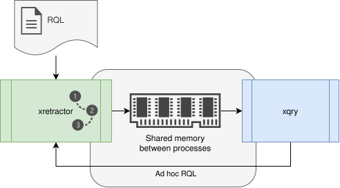

# Ad Hoc Queries

By Ad Hoc queries we mean queries directed at a running system. In the typical scenario originally envisioned during system development, the initial working assumption was that a system user would know all the queries and data sources needed to obtain the processed time series.

During development, however, additional scenarios emerged, assuming that the system's operation should not be interrupted, and that additional queries should be attached to the query execution plan. We call this kind of functionality Ad Hoc queries - attached to the system while it is running, without interrupting its operation.

<figure><figcaption><p>Fig. 48. Control flow for Ad Hoc queries</p></figcaption></figure>

Fig. 48 shows the control flow described above. A file with queries and directives is first directed to the xretractor process. Then, through shared memory, the xqry process pulls data from xretractor. Using that same process, we can send a command to the xretractor process. In this command we include the text of the additional query that xretractor should attach to the tree being processed.

### What can be attached at run time

The ad hoc channel accepts **exactly one `SELECT`, `DECLARE`, or `RULE` statement**. Compiler directives and programs containing multiple statements are rejected without changing the active plan.

A new source can be declared without stopping a running engine:

```
$ xqry -a "DECLARE a BYTE STREAM C, 1 FILE 'data3.txt'"
```

Exit code `0` with no message means that the declaration was accepted. The declaration receives its logical-index base in its first due slot. If a query attached later needs a window or a time shift, emission waits until the source has accumulated the complete required history. `HOLD` is not required; it remains an optional directive that delays the physical read. Repeating `DECLARE` for an existing name is rejected rather than treated as a configuration update.

With multiple live instances, `DECLARE` alone cannot identify an owner because it has no `FROM` clause. The target must then be selected explicitly:

```
$ xqry --server measurements -a "DECLARE a BYTE STREAM C, 1 FILE 'data3.txt'"
```

Attaching the first declaration to a server started with an empty plan is not yet supported; the ad hoc channel requires an active data model.

A rule attached at run time may execute only `DO DUMP`. `DO SYSTEM` remains available only in the plan file the instance starts from, because exposing it through IPC would let a client run arbitrary shell commands as the server account. The same boundary holds on the `xqry --reset` channel, which also carries a complete plan but carries no authorship either: a plan with a `DO SYSTEM` rule is refused there as a whole, unless the operator deliberately sets `service.unrestricted = true` (→ [xqry](../appendices/command-line-options/xqry.md#the-do-system-rule-does-not-pass-through-this-channel)). The ad-hoc channel refuses unconditionally and does not read that key. The `ON` target must be an existing stream created by `SELECT`. The rule starts only after its complete required history has accumulated since attachment; if the in-memory stream retains too little history, the request is rejected.

```bash
xqry --server measurements -a \
  "RULE alarm ON temperature WHEN temperature[0] > 80 DO DUMP -10 TO 5"
```

With multiple instances, the client routes a `SELECT` according to the owners of streams in `FROM`, and a `RULE` according to the stream in `ON`. A query combining sources from several servers is rejected. New stream names and storage files are claimed on the bus before the active plan is changed, so ad hoc commands cannot overwrite another instance's resource.

Ad hoc commands extend the current plan. Use `xqry --reset file.rql` to replace it fully and atomically, including on an idle instance.

### Where an ad hoc stream begins

A plan built from the start of system operation numbers records from the logical origin computed by the compiler. A query attached ad hoc has no such history - its first record is **the first slot in which the runtime saw it**, not slot zero of the plan. The import is atomic: the compiled tree and its stream instances are published under a common lock, and the execution loop rebuilds the timeline without rewinding, even when the new query introduces a new rate to the system.

> **_NOTE:_** This behavior is covered by the `issue227_join_alignment` test (the `adhoc-origin` case).

### Example

We'll start the example by preparing a simple query:

```rql
DECLARE a BYTE STREAM A, 1 FILE 'data1.txt'
DECLARE a BYTE STREAM B, 2 FILE 'data2.txt'
SELECT * STREAM str1 FROM A+B
```

We'll save the query file under the name qplan1.rql. For the query to run correctly, we also need to prepare the files data1.txt and data2.txt. I suggest filling data1.txt with consecutive numbers from 1 to 6, each on a new line, and filling data2.txt with numbers from 10 to 15. In a directory prepared this way, we run the command:

```
$ xretractor qplan1.rql
```

If we previously performed some operations in this directory and created a str1 stream with a different schema, we'll get an error titled "Error in data descriptor file". It will also show information about the differences between the two descriptors. In that case, the files str1 and str1.desc should be deleted and the command run again.

The xretractor process will begin processing data. At this point, open another terminal and issue the command:

```
$ xqry -d
name | duration | size | count | location  | cap
-----+----------+------+-------+-----------+----
str1 | 1        | 48   | 24    |           | 0
A    | 1        | -1   | 3     | data1.txt | 1
B    | 2        | -1   | 2     | data2.txt | 1
```

This will display, in tabular form, what's currently being processed in the system - how many bytes have already arrived, which files the data is being read from, and how much data has already been processed. If a more descriptive format is desired, we can issue the following command:

```
$ xqry -d -y
---
apiVersion: xqry/v1
streams:
  - name: str1
    delta: 1
    size: 214
    count: 107
  - name: A
    delta: 1
    count: 86
    location: data1.txt
  - name: B
    delta: 2
    count: 43
    location: data2.txt
```

The response is given in YAML form.

To add another query to the system, we need to issue the command:

```
$ xqry -a "SELECT * STREAM str2 FROM A#B"
```

A command in this form sends a new query to the xretractor process. No message and exit code `0` mean that it was accepted. The system compiles it and merges it into the query plan tree; on rejection, `xqry` returns a non-zero code and writes the diagnostic reason.

If we check the system's state again, we'll see the following picture:

```
$ xqry -d
name | duration | size | count | location  | cap
-----+----------+------+-------+-----------+----
str2 | 2/3      | 10   | 10    |           | 0
A    | 1        | -1   | 23    | data1.txt | 1
str1 | 1        | 312  | 156   |           | 0
B    | 2        | -1   | 12    | data2.txt | 1
```

Or like this:

```
$ xqry -d -y
---
apiVersion: xqry/v1
streams:
  - name: str2
    delta: 2/3
    size: 7
    count: 7
  - name: A
    delta: 1
    count: 16
    location: data1.txt
  - name: str1
    delta: 1
    size: 298
    count: 149
  - name: B
    delta: 2
    count: 8
    location: data2.txt
```

Taking a closer look at the queries via the xqry command, we'll see the following system response for the str1 query:

```
$ xqry -t str1 -y
---
apiVersion: xqry/v1
stream:
  name: str1
  delta: 1
query: SELECT * STREAM str1 FROM A+B
fields:
  str1.A_0:
    type: BYTE
  str1.B_1:
    type: BYTE
```

and for the str2 query:

```
$ xqry -t str2 -y
---
apiVersion: xqry/v1
stream:
  name: str2
  delta: 2/3
query: SELECT * STREAM str2 FROM A#B
fields:
  str2.a:
    type: BYTE
```

As you can see, the additional query str2 was correctly merged into the existing query execution plan. You can also see that far less data has accumulated compared to str1.

> **_NOTE:_** The functionality described here is covered by the test: `issue6_adhoc`, described in the appendix [Integration Tests](../appendices/integration-tests.md).
