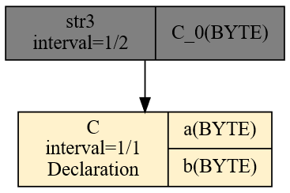
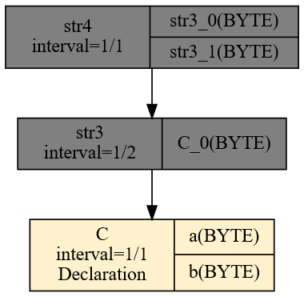

# Serialization Example

Let's start by creating a file qplan3.rql with the following content:

```
DECLARE a BYTE, b BYTE STREAM A, 1 FILE 'data3.txt'
SELECT * STREAM str3 FROM A@(1,1)
```

And let's prepare a file data3.txt with the following content:

```
$ seq 0 9 | paste - -
```

```
0       1
2       3
4       5
6       7
8       9


```

The last, empty line matters and is significant. After running xretractor qplan3.rql, and in a second window xqry -s str3, we'll see something like this:

```
$ xqry -s str3
7
8
9
0
1
2
3
4
5
6
```

What we're seeing is an example of serialization. An interesting aspect of the Agse operator, in this case, is also visible in the query execution plan. We can look at it with the command:

```
$ xretractor -c qplan3.rql -f -p -d > out.dot && dot -Tsvg out.dot -o out.svg
```

In the out.svg file we'll see the following query execution plan (Fig. 52):

<figure><figcaption><p>Fig. 52. Query execution plan after AGSE compilation</p></figcaption></figure>

From a source stream, where data containing two bytes arrives every second, a data stream is created in which one byte appears every half second.

Now that we have a str3 data stream in the system, returning sequential numbers, we can use it for further transformations. Let's add the following query to the qplan3.rql file:

```
SELECT * STREAM str4 FROM str3@(2,2)
```

After running it, though, we won't see the expected original form of the data3.txt file. Instead, we'll see something like this:

```
$ xqry -s str4
2 1
4 3
6 5
8 7
0 9
2 1
4 3
6 5
```

Along the difficult path of stream processing, there are traps. This is one of them. Only once the reader looks closely will they notice that the data is mirror-flipped. Please change this query to the following form:

```
SELECT * STREAM str4 FROM str3@(2,-2)
```

Only a stream built this way will show the original form visible in the data3.txt file:

```
$ xqry -s str4
3 4
5 6
7 8
9 0
1 2
3 4
```

That minus sign in the window-width specification is the mirror flip. The window size is two, but the field sequence is built in reverse order.

Generating an image of the query plan that carries out serialization first and then deserialization, we'll see the following relationship (Fig. 53):

<figure><figcaption><p>Fig. 53. SErialization and DEserialization</p></figcaption></figure>

What's shown here is the most basic example of using the sliding-data-window operator. If we start experimenting with the hop and window size, we'll notice that we're able to create an arbitrary sliding window over the data stream, or skip some elements by building a hop larger than the window width.

<div class="no-print">

A recording of the experiment (Animation) looks as follows:

<figure><figcaption><p>Animation. Session recording of the AGSE serializer experiment</p></figcaption></figure>

</div>

> **_NOTE:_** The functionality described here is covered by the tests: `agse1`, `agse2`, `agse3`, `Pattern6`, described in the appendix [Integration Tests](../../appendices/integration-tests.md).

