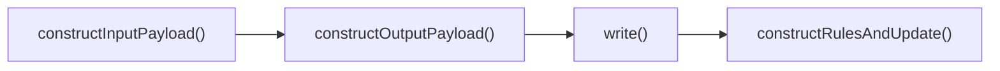
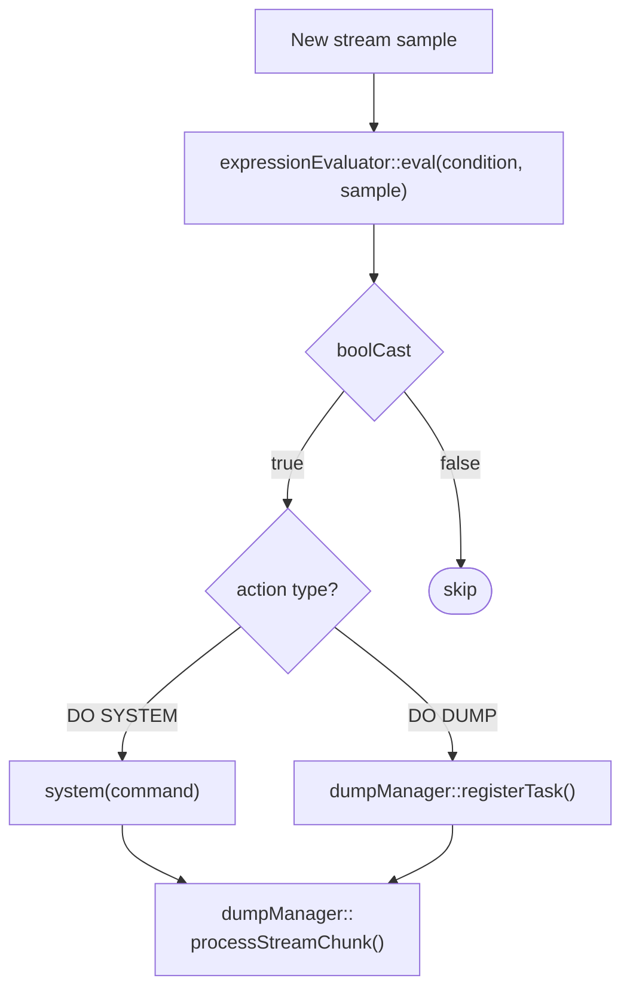
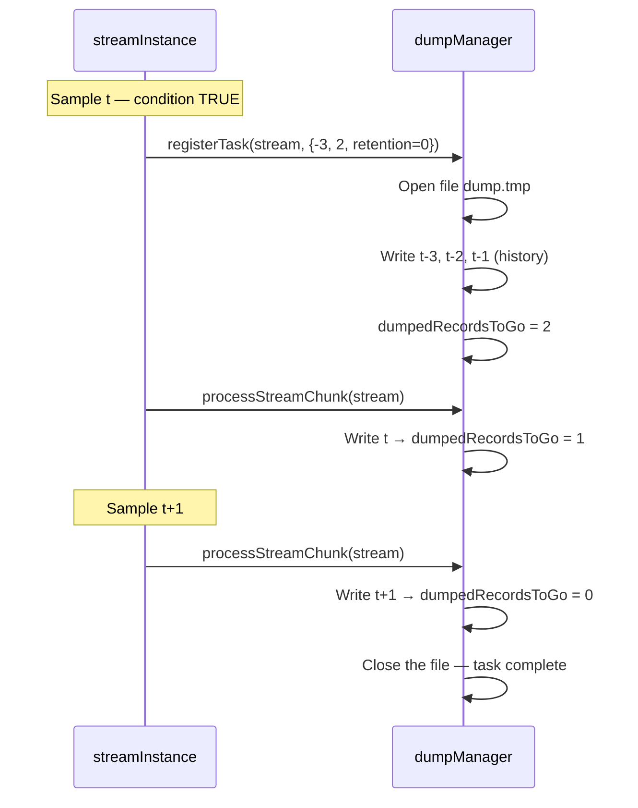
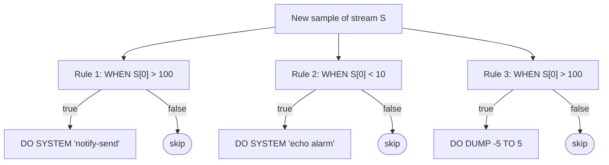

# Alerting Implementation

The alerting mechanism (the `RULE` directive) is an integral part of the main processing loop. It is not a separate background process — rules are evaluated **synchronously**, in the same time-grid iteration as the `SELECT` computations. This guarantees that an alert always refers to data that was just computed, not to the previous cycle.

***

## Where RULE sits in the processing cycle

Recall the `processRows()` function outlined in the chapter [Query Tree Traversal Algorithm](query-tree-traversal-algorithm.md). For every non-declaration query, four steps are carried out in sequence (Fig. 48):



_Fig. 48. The order of processing steps for a single query_

The fourth step — `constructRulesAndUpdate()` — is exactly where all rules attached to the current query are executed. It is called after the `SELECT` results have been written to disk, which means a rule always evaluates against a **complete, just-computed sample** of the stream.

***

## Evaluating the WHEN condition

Every rule contains a list of tokens describing a logical expression (the `condition` field of the `rule` struct). At the moment of evaluation, the system:

1. Fetches the current query's `outputPayload` — the current sample of the stream.
2. Passes the condition to the `expressionEvaluator::eval()` engine — **the same engine** that computes `SELECT` expressions.
3. Casts the result to a boolean (`boolCast`): any non-zero numeric value is `true`, zero is `false`.

If the condition is satisfied, the action associated with the rule is executed (`DO SYSTEM` or `DO DUMP`). If not, the rule is skipped with no side effects at all. The full flow is shown in Fig. 49.



_Fig. 49. Rule evaluation flow_

***

## The DO SYSTEM action

The `DO SYSTEM` invocation is the simplest: the system calls `::system(command)` directly on the processing thread. The call is **synchronous** — xretractor waits for the process to finish before moving on to the next rule.

The command's exit code is checked:
- `0` — success, no log entry.
- `≠ 0` — xretractor logs an error via spdlog with the exit code.
- A `system()` failure (e.g. no shell available) — logged as a critical error.

> **⚠️ Warning**
>
> The command is executed synchronously. Long-running scripts (e.g. sending large files, network calls with a timeout) will delay the entire processing cycle. In such cases, it is recommended to launch the process in the background: `DO SYSTEM 'my_script &'`.


***

## The DO DUMP action — detailed algorithm

`DO DUMP` is more complex, since it requires gathering data **from the past** (moments before the event) and **from the future** (moments after the event). This is handled by the `dumpManager` class.

### Phase 1: historical data (when the task is registered)

At the moment the rule fires — right after the condition is found to be true — `dumpManager::registerTask()`:

1. Creates the destination file on disk (POSIX `open()` with the `O_CREAT | O_TRUNC` flags).
2. If `step_back < 0`, reads `|step_back|` samples from the stream's historical buffer.  
   Historical data exists because every stream keeps a window of previous samples needed for AGSE window computations.
3. Writes the historical samples to the file **from oldest to newest** (i.e. from `step_back` to `–1`).
4. Computes how many future samples still need to be collected (`dumpedRecordsToGo = |step_forward - step_back| - |step_back|`).
5. If `step_back ≥ 0` (a delayed start), it sets `delayDumpRecordsToGo = step_back`.

```
Example: DUMP -3 TO 2
  At registration: write samples t-3, t-2, t-1  (history)
  Still to collect from the future: 2 samples (t, t+1)
  dumpedRecordsToGo = 2
```

### Phase 2: future data (subsequent loop iterations)

After registration, the task goes into the `bookOfTasks[streamName]` queue. On every subsequent iteration of the time grid (when the stream produces a new sample), `dumpManager::processStreamChunk()` is called:

1. For every active task in the queue (`dumpedRecordsToGo > 0`):
   - If `delayDumpRecordsToGo > 0` — decrement and skip (start delay).
   - Otherwise — write the current sample to the file and decrement `dumpedRecordsToGo`.
2. Once `dumpedRecordsToGo` reaches 0 — close the file descriptor and remove the task from the queue.

The full sequence for `DUMP -3 TO 2` is shown in Fig. 50.



_Fig. 50. Data-collection sequence for DO DUMP –3 TO 2_

### The delayed-start case (step\_back ≥ 0)

When `step_back` is non-negative, the dump does not start at the moment of the event, but `step_back` samples **after** it:

```
Example: DUMP 2 TO 5
  At registration: delayDumpRecordsToGo = 2
  Sample t   → skip (delay=2→1)
  Sample t+1 → skip (delay=1→0)
  Sample t+2 → write (dumpedRecordsToGo = 3→2)
  Sample t+3 → write (dumpedRecordsToGo = 2→1)
  Sample t+4 → write (dumpedRecordsToGo = 1→0) — done
```

***

## Retention (RETENTION N)

Without a `RETENTION` clause, every trigger of a rule overwrites a single file `<stream>_<rule>_dump.tmp`. The `bookOfTasks` queue's capacity is then 1 — a new task evicts the old one (and closes its descriptor).

With a `RETENTION N` clause:
- The `bookOfTasks` queue's capacity is set to `N`.
- The file number rotates modulo `N`: `_dump_0.tmp`, `_dump_1.tmp`, …, `_dump_(N-1).tmp`.
- When the `N`-th task enters the queue, the oldest (still-unfinished) one is **removed** — the `dumpTask` destructor closes its open descriptor.

This means that, with frequent events and a small `N`, an unfinished dump can get interrupted. `N` should be chosen so that the time to collect a single dump (`|step_back| + step_forward` cycles) is shorter than the interval between events multiplied by `N`.

***

## Dump file format

The file contains raw binary records with no header at all — every record has the size determined by the descriptor (`descriptor.getSizeInBytes()`). The format is identical to the format used by stream artifacts, which lets you read it with the `xtrdb` tool after manually specifying the schema:

```
$ xtrdb
> storage <path>
> open <stream>_<rule>_dump { <type> <field> }
> list
> quit
```

***

## Multiple rules — evaluation order

Multiple rules can be attached to a single stream. All of them are evaluated in a single `constructRulesAndUpdate()` iteration, in the order they were declared in the `.rql` file. Every rule is independent — one being satisfied does not affect the evaluation of the others (Fig. 51).



_Fig. 51. Independent evaluation of multiple rules on the same stream_

***

## Practical limitations and notes

| Situation | Behavior |
|---|---|
| Condition satisfied twice in a row (e.g. a measurement staying above the threshold) | Every sample registers a new DUMP task — files overlap when RETENTION is absent |
| A `DECLARE` input stream used as an `ON` target | Compilation error — rules can only be attached to `SELECT` streams |
| Insufficient history (buffer shorter than `|step_back|`) | The dump contains as many samples as are available; no error |
| Destination file unavailable (missing STORAGE directory) | Critical `FatalError` — xretractor exits |
| DO SYSTEM returns a non-zero code | Error logged via spdlog; processing continues |
