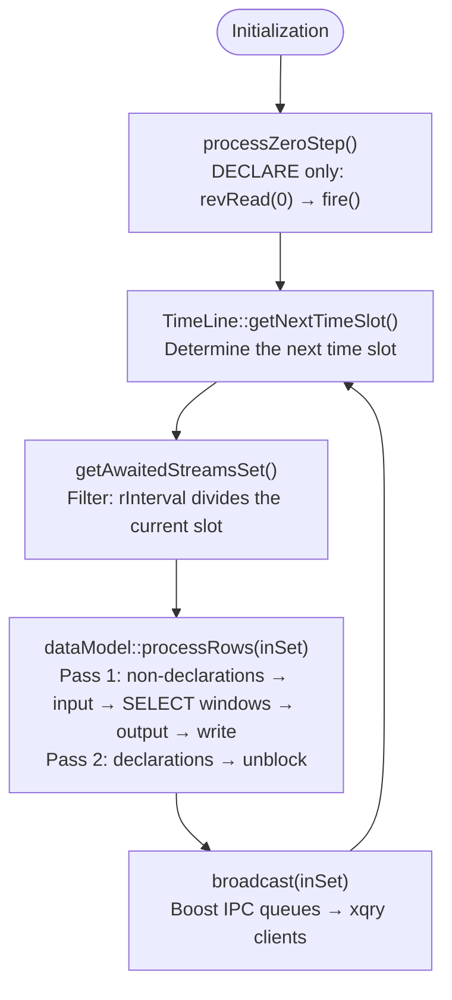
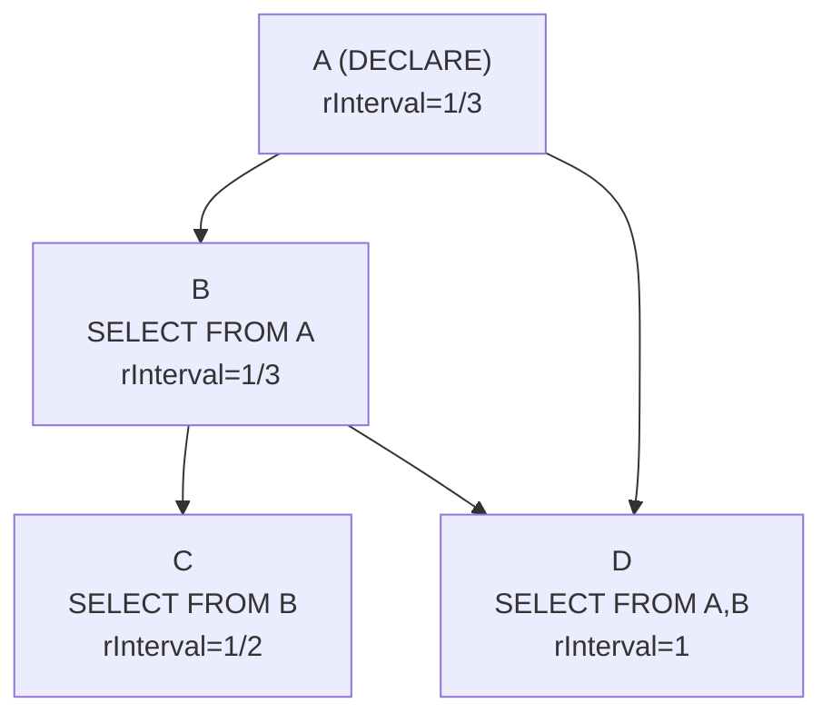
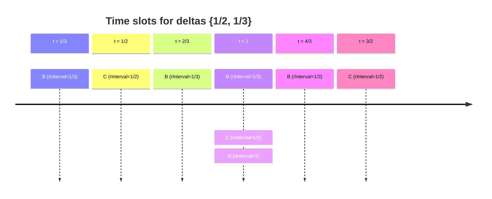
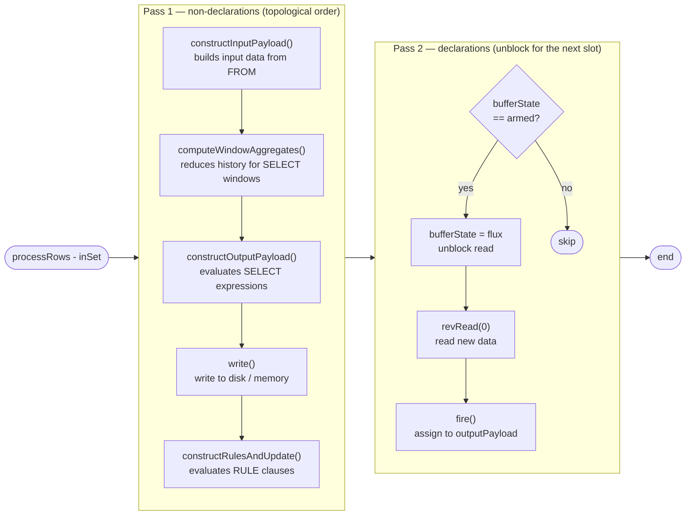
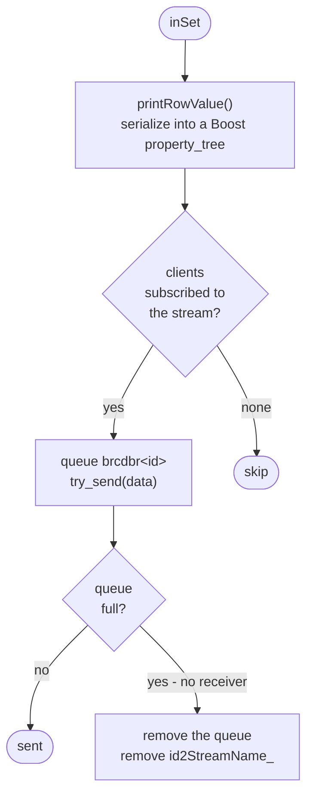
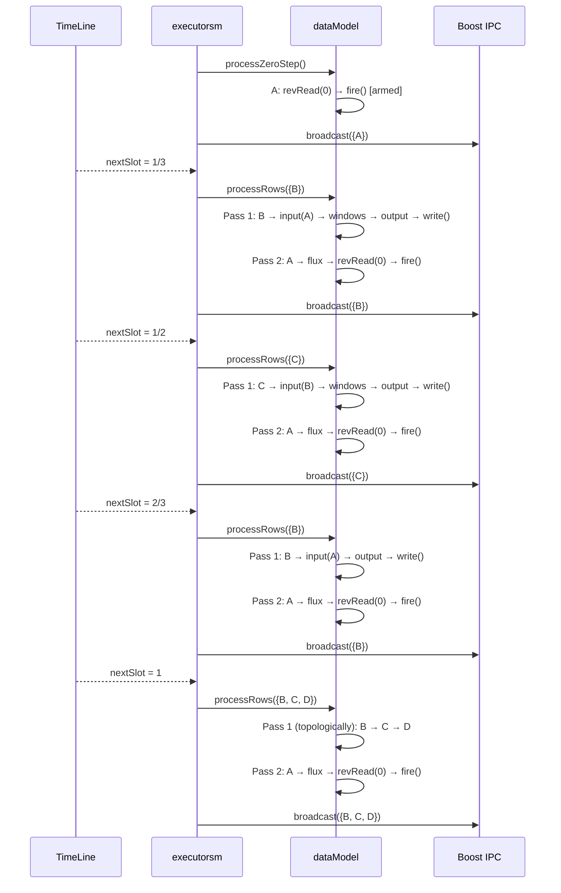

# Query Tree Traversal Algorithm

## General overview

The query-tree traversal algorithm is carried out by two cooperating components: `dataModel` (processing logic) and `executorsm` (the time loop and IPC). Before entering the main loop, the system performs a **zero step**, after which it iterates cyclically over the minimal set of time intervals (Fig. 41).



_Fig. 41. The query tree traversal algorithm – general overview_

***

## Data structure: qTree

`qTree` (`src/retractor/lib/qTree.cpp`) extends `std::vector<query>` and is a **vector of topologically sorted queries**. Sorting is done via DFS over the dependency graph built from `query.getDepStream()` (Fig. 42).



_Fig. 42. Example dependency graph for qTree_

After the topological sort, the order in the vector is: `[A, B, C, D]`. Query C, which depends on B, always ends up after B in iteration — this guarantees correctness of the computations.

The `getAvailableTimeIntervals()` method extracts the unique `rInterval` values from all queries (excluding compiler directives and zero values) — the result is the input to the `TimeLine` constructor.

***

## The minimal time grid: TimeLine / CRSMath

`TimeLine` (`src/retractor/lib/CRSMath.cpp`) manages rational time intervals. The constructor reduces the set of intervals — removing multiples and keeping only the coprime ones:

```
Input: {1/2, 1, 4}  →  Output: {1/2}
(1 = 2 × 1/2, so redundant; 4 = 8 × 1/2, so redundant)

Input: {1/2, 1/3}  →  Output: {1/2, 1/3}
(neither is a multiple of the other)
```

`getNextTimeSlot()` determines the next slot as `min(delta × counter[delta])` over all deltas. The diagram below illustrates the slots for deltas `{1/2, 1/3}` and the active queries in each of them (Fig. 43):



_Fig. 43. The minimal time grid for deltas {1/2, 1/3}_

The check `isThisDeltaAwaitCurrentTimeSlot(inDelta)` returns `true` when `ctSlot_ / inDelta` has a denominator equal to 1 (the slot is an integer multiple of the query's delta).

***

## The zero step: `processZeroStep()`

Before entering the `executorsm::run()` loop, `processZeroStep()` is called (`dataModel.cpp`, line \~85). It processes **declarations only** (`DECLARE` input streams):

```cpp
for (auto &q : coreInstance_) {
    if (!q.isDeclaration()) continue;
    qSet[q.id]->bufferState = flux;   // unblock physical read
    qSet[q.id]->revRead(0);           // read from index 0
    qSet[q.id]->fire();               // copy chamber_ → outputPayload
    assert(qSet[q.id]->bufferState == armed);
}
```

After this step, every declaration has `bufferState = armed` — the data from the physical source is in `outputPayload`.

***

## The main loop: filtering and processing

### Query filtering: `getAwaitedStreamsSet()`

For the current slot `tl` (`executorsm.cpp`, line \~88):

```cpp
std::set<std::string> retVal;
for (auto &q : *coreInstancePtr)
    if (TimeLine::isThisDeltaAwaitCurrentTimeSlot(q.rInterval))
        retVal.insert(q.id);
return retVal;
```

The result `inSet` is the set of query identifiers active in this slot — a subset of all queries.

### Processing: `processRows(inSet)`

The function performs **two passes** over `inSet` (`dataModel.cpp`, line \~98), shown in Fig. 44:



_Fig. 44. The processRows algorithm – two processing passes_

Declarations are only unblocked once every dependent query has consumed their `outputPayload` in pass 1.

### Record-history windows in the SELECT list

If a query contains `MIN`/`MAX`/`AVG`/`SUMC(expression : W)`,
`computeWindowAggregates()` runs after the `FROM` payload has been built but before output
fields are evaluated. For logical index `n`, it reads records `n-(W-1)` through `n` from the
named source. A bare field takes the direct flat-slot path; a general expression is evaluated
separately against each historical payload.

NULL values are skipped, and a window with no present value stores NULL for all four
statistics. Groups with the same source, expression program, and width share one history
scan. Their results go to `streamInstance::windowValues` and become ordinary operands of
`constructOutputPayload()`, so expressions such as `2*MIN(a : 5)+1` and
`null2zero(AVG(a+b : 5))` are valid.

***

## Broadcasting results: `broadcast()`

After every `processRows()`, `broadcast(inSet)` is called (`executorsm.cpp`, line \~449) — the algorithm is shown in Fig. 45:



_Fig. 45. The broadcast algorithm – distributing results via Boost IPC_

`printRowValue()` builds a structure with the stream name, field count, values, and a null bitmap, serializes it in Boost info format, and sends it via a `boost::interprocess::message_queue`.

***

## Full example: queries A, B, C, D for deltas {1/2, 1/3}

Fig. 46 shows the complete call sequence for four queries A, B, C, D laid out on a time grid with deltas {1/2, 1/3}.



_Fig. 46. Full execution example for queries A, B, C, D with deltas {1/2, 1/3}_

The dependency tree determines the order of pass 1. Time intervals from the Beatty algebra determine which nodes of the tree are active in a given slot.

***

## Algebraic realization — tying the code to the equations

Every key part of the algorithm described on this page is a direct realization of equations from [the algebra of regular time series](../mathematical-foundations/algebra-of-regular-time-series.md) and [the formal proofs](../mathematical-foundations/formal-foundations-and-proofs.md).

### Algebraic operators in `SOperations.hpp`

The file `src/include/SOperations.hpp` encodes the algebra operators directly as functions on rational numbers:

| Operator | Symbol | Function in code |
|---|---|---|
| Interleaving | φ | `Hash(Δa, Δb, i, retPos)` |
| Left-hand de-interleaving | Θ | `Div(Δa, Δb, i)` |
| Right-hand de-interleaving | ∼Θ | `Mod(Δa, Δb, i)` |
| Difference | δ | `Subtract(Δa, Δb, i)` |
| Aggregation and serialization | Ψ | `agse(offset, step)` |

Each of these functions is a literal translation of the formula from the algebra. `Div` implements left-hand de-interleaving:

```cpp
return i + ceilR((i + 1) * deltaA / deltaB);
```

\\[
a_{n} = c_{n+\left\lceil \frac{(n+1)\Delta_{a}}{\Delta_{b}} \right\rceil}
\\]

`Mod` implements right-hand de-interleaving:

```cpp
return i + floorR(i * deltaB / deltaA);
```

\\[
b_{n} = c_{n+\left\lfloor \frac{n\Delta_{b}}{\Delta_{a}} \right\rfloor}
\\]

`Hash` implements the test from the definition of interleaving — the condition \\(\left\lfloor iz \right\rfloor = \left\lfloor (i+1)z \right\rfloor\\) with \\(z = \Delta_{b}/(\Delta_{a}+\Delta_{b})\\) — and returns the corresponding offset into stream A or B.

The helper functions `floorR()` and `ceilR()` operate exclusively on `boost::rational<int>`, never passing through `double`. This is a direct realization of the requirement from [Theorem 2](../mathematical-foundations/formal-foundations-and-proofs.md): an implicit cast to `float` breaks the assumptions of Fraenkel's theorem — materialization into floating-point form must be deferred until the floor or ceiling operation is explicitly applied.

### `TimeLine` as the minimal basis of a covering system

The `TimeLine` constructor determines the **primitive set of intervals** — removing every delta that is an integer multiple of another delta in the set. An interval is primitive when no smaller interval in the set divides it with a natural quotient. This is the computation of the minimal covering system in the sense of Fraenkel's theorem: only primitive deltas generate independent Beatty sequences, and only they are needed to determine the complete time grid.

The `getNextTimeSlot()` method — marked with the comment `// MAGIC Warning` in the source — generates successive grid points as:

\\[
t_{k} = \min_{\delta \in \mathrm{sr}} \left(\delta \cdot \mathrm{counter}[\delta]\right)
\\]

where `sr` is the primitive set of intervals, and \\(\mathrm{counter}[\delta]\\) counts the "hits" recorded so far for each delta. The two-phase loop — first determining the minimum, then incrementing the counters separately — guarantees correct handling of collisions: several deltas can determine the same slot at once.

> **ℹ️ Info**
>
> The `// MAGIC Warning` comment in `CRSMath.cpp`'s source means the algorithm is correct for a non-obvious reason. Intuition alone is not enough — correctness is guaranteed by Fraenkel's theorem. Because `sr` contains only primitive intervals (none a multiple of another), the counters for the individual deltas never "get ahead of each other" in a way that would skip or duplicate a slot. A collision — when two deltas point to the same slot — is a legitimate case, handled by the second loop. The "magic" is that the simple formula `min(δ·counter[δ])`, with automatic incrementing, is equivalent to a full Beatty-sequence generator for the entire covering system.

### `isThisDeltaAwaitCurrentTimeSlot()` as a Beatty-sequence membership test

```cpp
boost::rational<int> value = ctSlot_ / inDelta;
return (value.denominator() == 1);
```

The test checks whether \\(t_{\mathrm{slot}} / \Delta \in \mathbb{N}\\) — whether the current slot is an integer multiple of the query's delta. In the language of Beatty-sequence theory: a point \\(t\\) belongs to the sequence of density \\(\Delta\\) if and only if \\(t/\Delta\\) is a natural number. The condition on the denominator equaling 1 follows from `boost::rational` arithmetic — the fraction is always in reduced form, so a denominator of 1 means exactly an integer, with no rounding involved.
