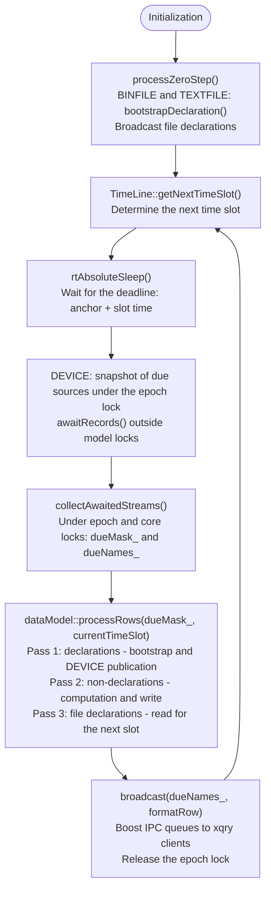
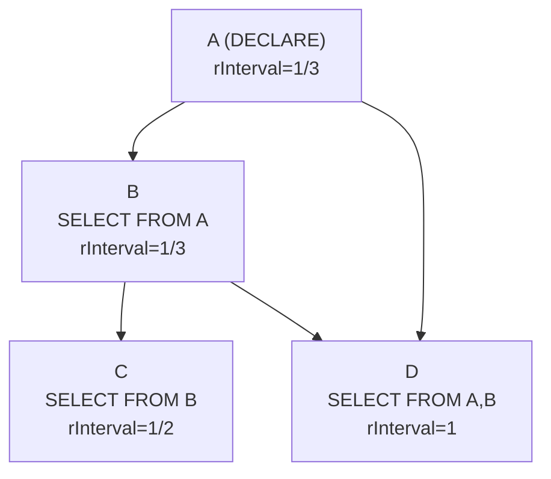
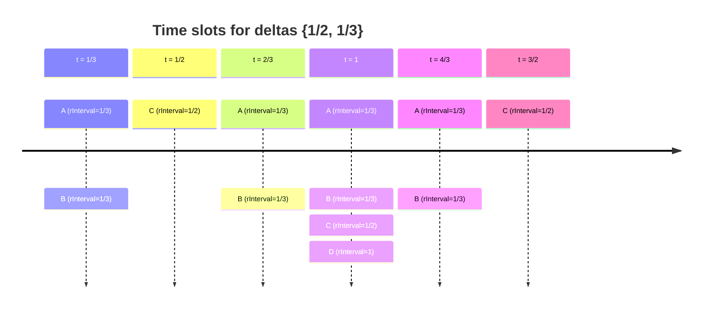
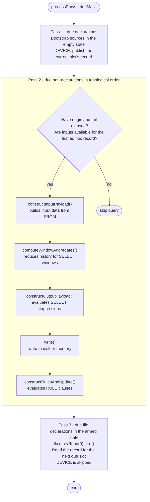
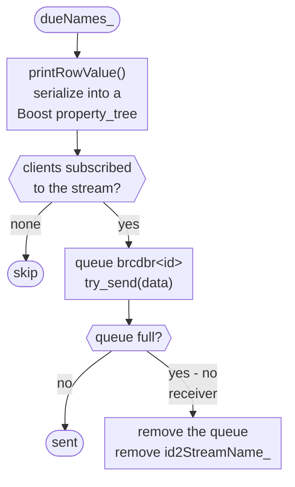
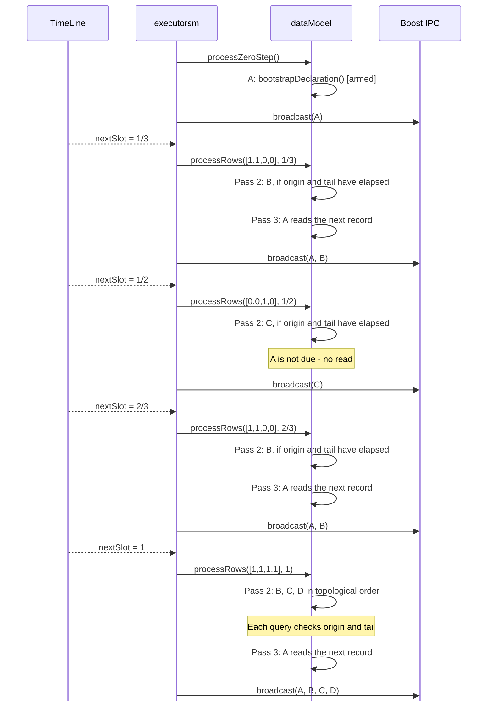

# Query Tree Traversal Algorithm

## General overview

The query-tree traversal algorithm is carried out by two cooperating components: `dataModel` (processing logic) and `executorsm` (the time loop and IPC). Before entering the main loop, the system performs a **zero step**, after which it iterates cyclically over the minimal set of time intervals (Fig. 42).


```mermaid
%% pdf-height: 55%
%%{init: {"markdownAutoWrap": false}}%%
flowchart TD
    A([Initialization]) --> B
    B["processZeroStep()<br/>BINFILE and TEXTFILE: bootstrapDeclaration()<br/>Broadcast file declarations"] --> C
    C["TimeLine::getNextTimeSlot()<br/>Determine the next time slot"] --> W
    W["rtAbsoluteSleep()<br/>Wait for the deadline: anchor + slot time"] --> V
    V["DEVICE: snapshot of due sources under the epoch lock<br/>awaitRecords() outside model locks"] --> D
    D["collectAwaitedStreams()<br/>Under epoch and core locks: dueMask_ and dueNames_"] --> E
    E["dataModel::processRows(dueMask_, currentTimeSlot)<br/>Pass 1: declarations - bootstrap and DEVICE publication<br/>Pass 2: non-declarations - computation and write<br/>Pass 3: file declarations - read for the next slot"] --> F
    F["broadcast(dueNames_, formatRow)<br/>Boost IPC queues to xqry clients<br/>Release the epoch lock"] --> C
```

_Fig. 42. The query tree traversal algorithm – general overview_

***

## Data structure: qTree

`qTree` (`src/retractor/lib/qTree.cpp`) extends `std::vector<query>` and is a **vector of topologically sorted queries**. Sorting is done via DFS over the dependency graph built from `query.getDepStream()` (Fig. 43).


```mermaid
%%{init: {"markdownAutoWrap": false}}%%
graph TD
    A["A (DECLARE)<br/>rInterval=1/3"] --> B["B<br/>SELECT FROM A<br/>rInterval=1/3"]
    A --> D["D<br/>SELECT FROM A,B<br/>rInterval=1"]
    B --> C["C<br/>SELECT FROM B<br/>rInterval=1/2"]
    B --> D
```

_Fig. 43. Example dependency graph for qTree_

After the topological sort, the order in the vector is: `[A, B, C, D]`. Query C, which depends on B, always ends up after B in iteration - this guarantees correctness of the computations.

The `getAvailableTimeIntervals()` method extracts the unique `rInterval` values from all queries (excluding compiler directives and zero values) - the result is the input to the `TimeLine` constructor.

***

## The minimal time grid: TimeLine / CRSMath

`TimeLine` (`src/retractor/lib/CRSMath.cpp`) manages rational time intervals. The constructor reduces the set of intervals - removing multiples and keeping only the coprime ones:

```
Input: {1/2, 1, 4}  →  Output: {1/2}
(1 = 2 × 1/2, so redundant; 4 = 8 × 1/2, so redundant)

Input: {1/2, 1/3}  →  Output: {1/2, 1/3}
(neither is a multiple of the other)
```

`getNextTimeSlot()` determines the next slot as `min(delta × counter[delta])` over all deltas. The diagram below illustrates the slots for deltas `{1/2, 1/3}` and the active queries in each of them (Fig. 44):


```mermaid
%% pdf-width: 100%
timeline
    title Time slots for deltas {1/2, 1/3}
    section t = 1/3
        A (rInterval=1/3) : B (rInterval=1/3)
    section t = 1/2
        C (rInterval=1/2)
    section t = 2/3
        A (rInterval=1/3) : B (rInterval=1/3)
    section t = 1
        A (rInterval=1/3) : B (rInterval=1/3) : C (rInterval=1/2) : D (rInterval=1)
    section t = 4/3
        A (rInterval=1/3) : B (rInterval=1/3)
    section t = 3/2
        C (rInterval=1/2)
```

_Fig. 44. The minimal time grid for deltas {1/2, 1/3}_

The check `isThisDeltaAwaitCurrentTimeSlot(inDelta)` returns `true` when `ctSlot_ / inDelta` has a denominator equal to 1 (the slot is an integer multiple of the query's delta).

***

## The zero step: `processZeroStep()`

Before entering the `executorsm::run()` loop, `dataModel::processZeroStep()` is called. It processes **file declarations only** (`BINFILE` and `TEXTFILE`):

```cpp
for (const auto &q : coreInstance_)
    if (q.isDeclaration() && q.kind != sourceKind::device)
        bootstrapDeclaration(q);
```

`bootstrapDeclaration()` switches the buffer from `empty` to `flux`, calls `revRead(0)` and `fire()`, then checks the `armed` state. After the zero step, the file declaration's record is in `outputPayload`, ready for consumers. File declarations are broadcast under the same epoch lock.

`DEVICE` has no zero step or broadcast in this phase. Its first record enters the model only at the start of its first due slot, before dependent queries are computed. A file declaration added ad hoc is initialized before consumers in its first due slot, since it did not participate in the zero step.

***

## The main loop: filtering and processing

### Slot schedule

Before processing a slot, the loop waits for its deadline \\(T_k = T_0 + t_k\\). \\(T_0\\) is the epoch anchor, read from the monotonic clock (`CLOCK_MONOTONIC`) just before the first slot, and \\(t_k\\) is the logical time of the slot returned by `TimeLine::getNextTimeSlot()`. The loop sleeps only for the time remaining until the deadline (`rtAbsoluteSleep()`), in every clocked mode - with the `--realtime` option and without it. The deadline is derived anew from the rational axis of the plan with millisecond precision: the fraction of a millisecond is truncated in each deadline separately, so the rounding error does not add up.

- **The work time of a slot does not shift the schedule.** Computation, rules, and waiting for a `DEVICE` source use part of the period. As long as they fit in the period, the next slot starts at its deadline and the delay does not grow.
- **A temporary delay is made up.** If a slot ends after the deadline of the next one (e.g. a long wait for a `DEVICE` or a `DO SYSTEM` rule), the overdue slots are processed in order and without sleeping until execution catches up with the schedule. The loop then sleeps again until the deadlines of the original grid. No slot or record is skipped, and the processing order does not change.
- **Sustained overload is not hidden.** When the average work time of a slot exceeds its period, the backlog grows without bound: all slots are still computed, in the same order, but later and later relative to their deadlines. The anchor is never moved, so the delay stays visible (e.g. in the `wake_lag_ns` probe). Execution catches up only once the work of the slots again fits in the period with a margin.
- **Suspending the process leaves a backlog.** A process resumed after `SIGSTOP` immediately processes the overdue slots in bursts. On Linux `CLOCK_MONOTONIC` does not advance while the system is suspended; on macOS it does, so there a machine sleep also leaves a backlog to make up.

The anchor belongs to the plan epoch. Accepting a new plan (`xqry --reset`) builds a new time axis and reads a new anchor, so the new epoch does not inherit the backlog of the previous one. An ad hoc import does not rewind the axis: new intervals join the current axis from their first occurrence after the current slot, and their deadlines count from the same anchor.

The `TIMEOUT` deadline of a `DEVICE` source counts from the actual wake-up of the slot, not from its deadline. In `--no-clock` mode the loop does not sleep at all. The `--realtime` option does not change the schedule; it only adds `SCHED_FIFO` scheduling, memory page locking, and CPU affinity (see *Command-Line Options - xretractor*).

A stop signal (`SIGINT`, `SIGTERM`, `SIGHUP`) that interrupts the loop's sleep ends the run before the slot whose deadline has not yet come. A sleep interrupted in any other way is resumed until the same deadline, without determining a new period. On Linux a signal sent to the process interrupts the loop's sleep; on macOS it may reach the communication thread, and then, as with `xqry -k`, the run ends only after the current period.

> **_NOTE:_** The slot schedule is covered by the `slot_schedule` integration test and by the `ut_executor_rt` unit test.

### Query filtering: `collectAwaitedStreams()`

For the current slot, `executorsm::collectAwaitedStreams()` builds two parallel representations of the due queries:

```cpp
dueMask_.assign(coreInstancePtr->size(), 0);
dueNames_.clear();
std::size_t position = 0;
for (const auto &q : *coreInstancePtr) {
    if (tl.isThisDeltaAwaitCurrentTimeSlot(q.rInterval)) {
        dueMask_[position] = 1;
        dueNames_.emplace_back(q.id);
    }
    ++position;
}
```

`dueMask_` is a vector of `char` with the length of the entire plan: an element equal to 1 marks the due query at the same position in `qTree`. `dueNames_` is a vector of `std::string_view` containing the names of those queries, used for broadcasting. Both vectors retain their capacity between slots.

The mask must describe **the same plan layout** that `processRows()` will process. It is therefore built under locks acquired in the order `plan_epoch_mutex`, then `core_mutex`; the epoch lock remains held through slot computation and broadcasting. An ad hoc import can change the plan's topological order, so building the mask before acquiring the epoch lock would violate this invariant. Epoch protection also preserves the lifetime of the name views.

### Processing: `processRows(dueMask, currentTimeSlot)`

`dataModel::processRows(std::span<const char> dueMask, currentTimeSlot)` acquires `core_mutex`, checks the mask length, and refreshes the instance-handle table when `qTree::planRevision()` changes. The handles correspond to positions in the plan, eliminating repeated name lookups during slot computation. Instances are stored in `qSet` through `std::unique_ptr`, so changes to the map layout preserve their addresses.

Before calling `processRows()`, the executor takes a snapshot of due `DEVICE` sources under a short epoch lock, then calls `rdb::awaitRecords()` **outside model locks**. Waiting fills the accessors' private buffers; data is published to the model only in `processRows()`.

The function performs **three passes** over the plan, considering only positions marked in the mask (Fig. 45):


```mermaid
%%{init: {"markdownAutoWrap": false}}%%
flowchart TB
    S([processRows - dueMask]) --> P1
    P1["Pass 1 - due declarations<br/>Bootstrap sources in the empty state<br/>DEVICE: publish the current slot's record"] --> P2

    subgraph P2["Pass 2 - due non-declarations in topological order"]
        direction TB
        X0{"Have origin and tail elapsed?<br/>Are inputs available for the first ad hoc record?"} -->|yes| X1
        X0 -->|no| X5([skip query])
        X1["constructInputPayload()<br/>builds input data from FROM"] --> XW
        XW["computeWindowAggregates()<br/>reduces history for SELECT windows"] --> X2
        X2["constructOutputPayload()<br/>evaluates SELECT expressions"] --> X3
        X3["write()<br/>write to disk or memory"] --> X4
        X4["constructRulesAndUpdate()<br/>evaluates RULE clauses"]
    end

    P2 --> P3
    P3["Pass 3 - due file declarations in the armed state<br/>flux, revRead(0), fire()<br/>Read the record for the next due slot<br/>DEVICE is skipped"] --> E([end])
```

_Fig. 45. The processRows algorithm - three processing passes_

`DEVICE` records are published before the current slot's consumers. File declarations advance to the next record only after consumers, and only in slots due for that source. A query marked in the mask may still emit no result because of its tail or logical origin (`origin`).

### Record-history windows in the SELECT list

If a query contains `MIN`/`MAX`/`AVG`/`SUMC(expression : W)`, `computeWindowAggregates()` runs after the `FROM` payload has been built but before output fields are evaluated. For logical index `n`, it reads records `n-(W-1)` through `n` from the named source. A bare field takes the direct flat-slot path; a general expression is evaluated separately against each historical payload.

NULL values are skipped, and a window with no present value stores NULL for all four statistics. Groups with the same source, expression program, and width share one history scan. Their results go to `streamInstance::windowValues` and become ordinary operands of `constructOutputPayload()`, so expressions such as `2*MIN(a : 5)+1` and `null2zero(AVG(a+b : 5))` are valid.

***

## Broadcasting results: `broadcast()`

After every `processRows()`, `broadcast(dueNames_, formatRow)` is called while the epoch lock is still held - the algorithm is shown in Fig. 46:


```mermaid
%% pdf-width: 85%
%% pdf-height: 60%
%%{init: {"markdownAutoWrap": false, "flowchart": {"nodeSpacing": 25, "rankSpacing": 30, "padding": 6}}}%%
flowchart TB
    A([dueNames_]) --> B["printRowValue()<br/>serialize into a<br/>Boost property_tree"]
    B --> C{{"clients subscribed<br/>to the stream?"}}
    C -->|none| H([skip])
    C -->|yes| D["queue brcdbr&lt;id&gt;<br/>try_send(data)"]
    D --> E{{"queue full?"}}
    E -->|no| F([sent])
    E -->|"yes - no<br/>receiver"| G["remove the queue<br/>remove id2StreamName_"]
```

_Fig. 46. The broadcast algorithm – distributing results via Boost IPC_

`printRowValue()` builds a structure with the stream name, field count, values, and a null bitmap, serializes it in Boost info format, and sends it via a `boost::interprocess::message_queue`.

***

## Full example: queries A, B, C, D for deltas {1/2, 1/3}

Fig. 47 shows the selection of due queries and the phase order for the plan `[A, B, C, D]` from the graph in Fig. 43. A is a file source with interval `1/3`. The diagram describes the schedule; actual result emission also depends on the query's tail and logical origin.


```mermaid
%% pdf-width: 85%
%% pdf-height: 65%
%%{init: {"markdownAutoWrap": false, "sequence": {"mirrorActors": false, "messageMargin": 22, "boxMargin": 6}}}%%
sequenceDiagram
    participant TL as TimeLine
    participant ES as executorsm
    participant DM as dataModel
    participant IPC as Boost IPC

    ES->>DM: processZeroStep()
    DM->>DM: A: bootstrapDeclaration() [armed]
    ES->>IPC: broadcast(A)

    TL-->>ES: nextSlot = 1/3
    ES->>DM: processRows([1,1,0,0], 1/3)
    DM->>DM: Pass 2: B, if origin and tail have elapsed
    DM->>DM: Pass 3: A reads the next record
    ES->>IPC: broadcast(A, B)

    TL-->>ES: nextSlot = 1/2
    ES->>DM: processRows([0,0,1,0], 1/2)
    DM->>DM: Pass 2: C, if origin and tail have elapsed
    Note over DM: A is not due - no read
    ES->>IPC: broadcast(C)

    TL-->>ES: nextSlot = 2/3
    ES->>DM: processRows([1,1,0,0], 2/3)
    DM->>DM: Pass 2: B, if origin and tail have elapsed
    DM->>DM: Pass 3: A reads the next record
    ES->>IPC: broadcast(A, B)

    TL-->>ES: nextSlot = 1
    ES->>DM: processRows([1,1,1,1], 1)
    DM->>DM: Pass 2: B, C, D in topological order
    Note over DM: Each query checks origin and tail
    DM->>DM: Pass 3: A reads the next record
    ES->>IPC: broadcast(A, B, C, D)
```

_Fig. 47. Processing schedule for queries A, B, C, D with deltas {1/2, 1/3}_

The names next to `broadcast` denote its `dueNames_` argument, rather than a guarantee that each query sends a record. The dependency tree determines computation order in pass 2, and the intervals determine the mask of active nodes. When A is a `DEVICE` source, it skips the zero step, waits for data before computation of a due slot, and publishes the record in pass 1; pass 3 then skips it.

***

## Algebraic realization - tying the code to the equations

Every key part of the algorithm described on this page is a direct realization of equations from [the algebra of regular time series](../mathematical-foundations/algebra-of-regular-time-series.md) and [the formal proofs](../mathematical-foundations/formal-foundations-and-proofs.md).

### Algebraic operators in `SOperations.hpp`

The file `src/include/SOperations.hpp` encodes the algebra operators directly as functions on rational numbers:

| Operator | Symbol | Function in code |
|---|---|---|
| Interleaving | φ | `Hash(Δa, Δb, i, retPos)` |
| Left-hand de-interleaving | Θ | `Div(Δa, Δb, i)` |
| Right-hand de-interleaving | ∼Θ | `Mod(Δa, Δb, i)` |
| Difference | δ | `Subtract(Δa, Δb, i)` |
| Aggregation and serialization | Ψ | `agse(offset, step)` |

Each of these functions is a literal translation of the formula from the algebra. `Div` implements left-hand de-interleaving:

```cpp
return i + ceilR((i + 1) * deltaA / deltaB);
```

\\[
a_{n} = c_{n+\left\lceil \frac{(n+1)\Delta_{a}}{\Delta_{b}} \right\rceil}
\\]

`Mod` implements right-hand de-interleaving:

```cpp
return i + floorR(i * deltaB / deltaA);
```

\\[
b_{n} = c_{n+\left\lfloor \frac{n\Delta_{b}}{\Delta_{a}} \right\rfloor}
\\]

`Hash` implements the test from the definition of interleaving - the condition \\(\left\lfloor iz \right\rfloor = \left\lfloor (i+1)z \right\rfloor\\) with \\(z = \Delta_{b}/(\Delta_{a}+\Delta_{b})\\) - and returns the corresponding offset into stream A or B.

The helper functions `floorR()` and `ceilR()` operate exclusively on `boost::rational<int>`, never passing through `double`. This is a direct realization of the requirement from [Theorem 2](../mathematical-foundations/formal-foundations-and-proofs.md): an implicit cast to `float` breaks the assumptions of Fraenkel's theorem - materialization into floating-point form must be deferred until the floor or ceiling operation is explicitly applied.

### `TimeLine` as the minimal basis of a covering system

The `TimeLine` constructor determines the **primitive set of intervals** - removing every delta that is an integer multiple of another delta in the set. An interval is primitive when no smaller interval in the set divides it with a natural quotient. This is the computation of the minimal covering system in the sense of Fraenkel's theorem: only primitive deltas generate independent Beatty sequences, and only they are needed to determine the complete time grid.

The `getNextTimeSlot()` method - marked with the comment `// MAGIC Warning` in the source - generates successive grid points as:

\\[
t_{k} = \min_{\delta \in \mathrm{sr}} \left(\delta \cdot \mathrm{counter}[\delta]\right)
\\]

where `sr` is the primitive set of intervals, and \\(\mathrm{counter}[\delta]\\) counts the "hits" recorded so far for each delta. The two-phase loop - first determining the minimum, then incrementing the counters separately - guarantees correct handling of collisions: several deltas can determine the same slot at once.

> **ℹ️ Info**
>
> The `// MAGIC Warning` comment in `CRSMath.cpp`'s source means the algorithm is correct for a non-obvious reason. Intuition alone is not enough - correctness is guaranteed by Fraenkel's theorem. Because `sr` contains only primitive intervals (none a multiple of another), the counters for the individual deltas never "get ahead of each other" in a way that would skip or duplicate a slot. A collision - when two deltas point to the same slot - is a legitimate case, handled by the second loop. The "magic" is that the simple formula `min(δ·counter[δ])`, with automatic incrementing, is equivalent to a full Beatty-sequence generator for the entire covering system.

### `isThisDeltaAwaitCurrentTimeSlot()` as a Beatty-sequence membership test

```cpp
boost::rational<int> value = ctSlot_ / inDelta;
return (value.denominator() == 1);
```

The test checks whether \\(t_{\mathrm{slot}} / \Delta \in \mathbb{N}\\) - whether the current slot is an integer multiple of the query's delta. In the language of Beatty-sequence theory: a point \\(t\\) belongs to the sequence of density \\(\Delta\\) if and only if \\(t/\Delta\\) is a natural number. The condition on the denominator equaling 1 follows from `boost::rational` arithmetic - the fraction is always in reduced form, so a denominator of 1 means exactly an integer, with no rounding involved.
