# Stream Playback

We very often think of time series as data marked with timestamps. Data stored, for example, in a file, can be processed however we like — preserving its order based on the recorded time relationships. RetractorDB has been given the ability to re-emit such a stream, preserving the recorded time relationships, as if the data were actually arriving again.

To demonstrate this, let's prepare a text file filled with data, e.g. from 30 to 45.

```
$ seq 30 45 > data.txt
```

We'll play back a file prepared this way in RetractorDB.

Next, let's create the following file filled with queries for the system — query.rql, containing only a single declaration ending in HOLD.

```
DECLARE a INTEGER STREAM core, 1 FILE 'data.txt' HOLD
```

In one window, we run the command:

```
$ xretractor query.rql
```

In another, we issue the command:

```
$ xqry -s core
0
0
0
…
```

We'll see a sequence of zeros …

In another window we issue the following command:

```
$ xqry -a "SELECT * STREAM ping FROM core VOLATILE”
snd: adhoc SELECT * STREAM ping FROM core VOLATILE
rcv: db OK
```

At this point, in the window showing the values from the core stream, the core values will appear:

```
$ xqry -s core
0
0
0
…
0
0
0
30
31
32
33
…
```

A recorded example below (Fig. 54):

<figure><figcaption><p>Fig. 54. Recorded example of stream playback</p></figcaption></figure>
