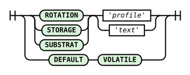

# Configuration Directives

Four configuration directives are available:

* STORAGE
* SUBSTRAT
* ROTATION
* DEFAULT VOLATILE

`STORAGE`, `SUBSTRAT`, and `ROTATION` take a text argument in single quotes.
`DEFAULT VOLATILE` takes no string. Example directives with arguments:

```rql
STORAGE 'temp_folder'
SUBSTRAT 'memory'
ROTATION 'rotation_counter.txt'
```



_Fig. 11. Configuration directive syntax diagram_

The railroad diagram in Fig. 11 was generated from the `compiler_option` and `default_statement` rules in the system's ANTLR4 grammar (`RQL.g4`). The three upper branches (the `compiler_option` rule) have an identical structure: one of the keywords STORAGE, SUBSTRAT, or ROTATION (rounded green boxes), followed by a value enclosed in single quotes - arbitrary text (a directory path for STORAGE, a counter-file name for ROTATION), or the name of one of the predefined memory profiles (for SUBSTRAT). The bottom branch (the `default_statement` rule) is the keyword pair DEFAULT VOLATILE with no value.

Storage is used to indicate the system directory in which all output files should be created. Without this directive, files created by the system are placed, by default, in the current directory from which the main RetractorDB process was started.

Substrates are queries and their effects that arise from the compiler decomposing system commands based on time-series algebra expressions. These are queries visible in the query execution plan but not specified directly in the .rql file. They arise from the implementation of the query-execution-plan construction process.

Without `DEFAULT VOLATILE` or explicit `SUBSTRAT`, such queries materialize data on disk in the form of unbounded files. This behavior can be desirable during software development, but once the system is deployed in a production environment it is better to keep substrates in temporary memory areas.

The possible options for the SUBSTRAT command are: memory, default, direct, posix, posixshd, generic, device, textsource. A full description of each type - the C++ class, retention handling, and shadow support - can be found in the chapter [Storage Types](select-command/storage-types.md).

The last directive - Rotation - indicates an alternative shutdown mode for the system. By default, after compilation, all files produced by the system remain in whatever state the system left the recorded data. On the next invocation of the system command, all artifact and substrate files are deleted. Using the Rotation directive in an rql file containing query declarations makes the system create the file named in the directive's parameter and store there a counter incremented on every system startup. Artifact and substrate files are renamed at the end of every system run - they get an `.old` extension plus a number derived from the increasing counter. This process is called artifact rotation.

## DEFAULT VOLATILE

```rql
DEFAULT VOLATILE
```

This directive (the `default_statement` rule) selects default in-memory storage
for both named `SELECT` results and compiler-generated substrates. It may appear
once in the header, before `DECLARE`, `SELECT`, and `RULE`. Explicit `SUBSTRAT`
takes precedence for substrates; `PERSISTENT` or explicit `STORAGE` on a `SELECT`
overrides the default for its result. `DECLARE` sources remain unchanged.
For examples and the complete rules, see [VOLATILE and PERSISTENT](select-command/volatile-clause.md).
