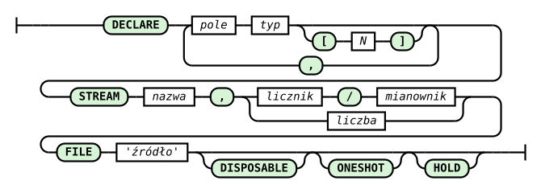

# DECLARE Command

The DECLARE command is used to declare a data source.

Its syntax is described as follows:

```
DECLARE field type[N] [, field type[N]]
STREAM name, rate
FILE source
[DISPOSABLE]
[ONESHOT]
[HOLD]
```



_Fig. 3. DECLARE command syntax diagram_

The railroad diagram in Fig. 3 was generated from the `declare_statement` rule in the system's ANTLR4 grammar (`RQL.g4`). The diagram is read by following the lines from left to right: rounded green boxes are keywords and symbols entered literally, rectangles are values supplied by the user. A loop looping back through a comma means multiple field declarations are possible; the branch at the rate shows it can be written as a fraction (numerator/denominator) or as a single number; tracks bypassing DISPOSABLE, ONESHOT, and HOLD mean each of these directives is optional.

## Field types

Every field has a name and a type. Available types:

| Type      | Size | Description                        |
| --------- | ---- | ----------------------------------- |
| `BYTE`    | 1 B  | unsigned 8-bit integer               |
| `INTEGER` | 4 B  | signed 32-bit integer                |
| `UINT`    | 4 B  | unsigned 32-bit integer              |
| `FLOAT`   | 4 B  | 32-bit floating-point number         |
| `DOUBLE`  | 8 B  | 64-bit floating-point number         |
| `STRING`  | N B  | fixed-length byte string of length N |

### Field arrays (`type[N]`)

Any field can be given an array multiplier `[N]` — the field then occupies `N × type_size` bytes and creates `N` consecutive positions in the record schema:

```
DECLARE coef INTEGER[25] \
STREAM filter, 1 \
FILE 'coefficients.txt'
```

The field `coef INTEGER[25]` creates a record of size 25 × 4 = 100 bytes and gives access to indices `filter[0]` … `filter[24]`. This is the standard way of passing coefficient arrays (e.g. FIR filters) into the system.

Multiple fields of different types can be combined in a single record:

```
DECLARE id UINT, value FLOAT, name STRING[16] \
STREAM measurement, 0.1 \
FILE 'sensor.dat'
```

Record size: 4 + 4 + 16 = 24 bytes.

RetractorDB, running under Linux, reads and writes data to files. On Linux, access to most resources is carried out through access to various kinds of files. This approach unifies the way data is accessed.

An example of a command that creates an object in RetractorDB returning random values from the /dev/random stream 10 times per second, with values of type int, looks as follows:

```
DECLARE random_field INTEGER \
STREAM random_stream, 0.1 \
FILE '/dev/random'
```

The source mentioned in the command, if declared as a text file with the .txt extension, will be interpreted by the system as a continuous, unbounded data file read line by line. Upon reaching the end of the file, reading resumes from the beginning. This functionality is built into RetractorDB. Basic support for the format is provided — if we specify two integer fields in the declaration, and the file contains two integer values separated by a space, those values will be read as consecutive elements of the record.

```
DECLARE field_1 INTEGER \
STREAM cyclic_stream, 0.1 \
FILE 'file.txt'
```

For the parsing of the file to happen automatically, the file must have the .txt extension. At present this behavior is hard-coded and not configurable. I plan to change this in the future.

> **_NOTE:_** The functionality described here is covered by the test: `Pattern7`, described in the appendix [Integration Tests](../appendices/integration-tests.md).

If the input data file has the .dat extension, it will be treated as a binary file, and reading from it will likewise loop. Looping means that after the last value in the source file has been read, the read position is moved back to the beginning. Data from such a file is read in an infinite loop, returning to the start once it finishes.

The three optional directives (`ONESHOT`, `DISPOSABLE`, `HOLD`) control the data source's lifecycle — a detailed description and comparison table can be found in the chapter [Read Options](declare-command-read-options.md).

> **ℹ️ Info**
>
> Support for NULL values (per field) is implemented in RetractorDB. Null metadata is stored in the `.meta` file alongside the binary data, managed by the `metaDataStream` class.

