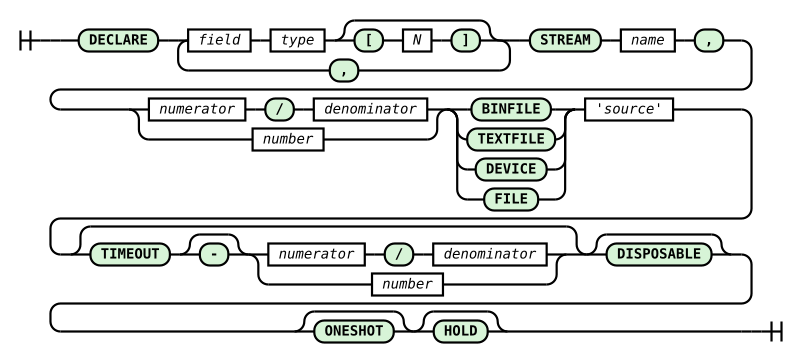

# DECLARE Command

The DECLARE command is used to declare a data source.

Its syntax is described as follows:

```rql
DECLARE field type[N] [, field type[N]]
STREAM name, rate
BINFILE | TEXTFILE | DEVICE source
[DISPOSABLE]
[ONESHOT]
[HOLD]
```



_Fig. 3. DECLARE command syntax diagram_

The railroad diagram in Fig. 3 was generated from the `declare_statement` rule in the system's ANTLR4 grammar (`RQL.g4`). The diagram is read by following the lines from left to right: rounded green boxes are keywords and symbols entered literally, rectangles are values supplied by the user. A loop looping back through a comma means multiple field declarations are possible; the branch at the rate shows it can be written as a fraction (numerator/denominator) or as a single number; the branch before the source is the choice of the source kind (`BINFILE`, `TEXTFILE`, `DEVICE` or the deprecated `FILE`); tracks bypassing DISPOSABLE, ONESHOT, and HOLD mean each of these directives is optional.

## Source kinds

The data format follows from the keyword, never from the name or extension of the path:

| Keyword    | What it reads                                                                                   | File kind at the path              | After the end of data                                  |
| ---------- | ----------------------------------------------------------------------------------------------- | ---------------------------------- | ------------------------------------------------------ |
| `BINFILE`  | raw binary records whose size follows from the fields                                           | regular file only                  | back to the beginning (loop), with `ONESHOT` end of source |
| `TEXTFILE` | text: values separated by whitespace, the `NULL` token marks a missing value                    | regular file only                  | as `BINFILE`                                           |
| `DEVICE`   | raw binary records from a live source; it interprets neither text nor the `NULL` token, a zero byte is zero | character device or FIFO           | -                                                      |

```rql
DECLARE MLII INTEGER, V1 INTEGER STREAM ecg, 1/360 BINFILE 'rec205'
DECLARE bp_coef INTEGER[25] STREAM bpf, 1 TEXTFILE 'bp_coef.txt'
DECLARE sample BYTE STREAM sensor, 0.02 DEVICE '/dev/urandom'
```

The extension selects nothing: `BINFILE 'bytes.txt'` reads raw bytes, and `TEXTFILE 'values.dat'` parses text.

`DEVICE` is a live source, so it takes neither `DISPOSABLE`, `ONESHOT` nor `HOLD` - these directives apply to replayed files (`BINFILE`, `TEXTFILE`), see [Read Options](declare-command-read-options.md). Opening a FIFO declared as `DEVICE` waits for a writer, so the writer must appear before the plan starts.

The words `BINFILE`, `TEXTFILE` and `DEVICE` are reserved - no stream may be named that way (in lowercase either).

### File kind check

Before the plan starts - also on a plan reload (`xqry --reset`) and on an ad hoc import (`xqry -a`) - the system checks the kind of file at the path of every declaration, without opening it. A path of the wrong kind (a directory, a block device, a socket, a FIFO for `BINFILE`/`TEXTFILE`, a regular file for `DEVICE`) refuses the plan with the stream name and the path, e.g.:

```
xretractor: stream 'src': BINFILE 'feed.fifo' is a FIFO, not a regular file
```

A path that does not exist is not a refusal: the stream then yields `NULL` records and the log gets a warning. Compilation with `-c` does not perform this check - it does not have to run on the machine with the data.

## Field types

Every field has a name and a type. Available types:

| Type      | Size | Description                        |
| --------- | ---- | ----------------------------------- |
| `BYTE`    | 1 B  | unsigned 8-bit integer               |
| `INTEGER` | 4 B  | signed 32-bit integer                |
| `UINT`    | 4 B  | unsigned 32-bit integer              |
| `FLOAT`   | 4 B  | 32-bit floating-point number         |
| `DOUBLE`  | 8 B  | 64-bit floating-point number         |
| `STRING`  | N B  | fixed-length byte string of length N |

### Field arrays (`type[N]`)

Any field can be given an array multiplier `[N]` - the field then occupies `N × type_size` bytes and creates `N` consecutive positions in the record schema:

```rql
DECLARE coef INTEGER[25] STREAM filter, 1 TEXTFILE 'coefficients.txt'
```

The field `coef INTEGER[25]` creates a record of size 25 × 4 = 100 bytes and gives access to indices `filter[0]` … `filter[24]`. This is the standard way of passing coefficient arrays (e.g. FIR filters) into the system.

Multiple fields of different types can be combined in a single record:

```rql
DECLARE id UINT, value FLOAT, name STRING[16] \
STREAM measurement, 0.1 \
BINFILE 'sensor.dat'
```

Record size: 4 + 4 + 16 = 24 bytes.

RetractorDB, running under Linux, reads and writes data to files. On Linux, access to most resources is carried out through access to various kinds of files. This approach unifies the way data is accessed.

An example of a command that creates an object in RetractorDB returning random values from the /dev/random stream 10 times per second, with values of type int, looks as follows:

```rql
DECLARE random_field INTEGER STREAM random_stream, 0.1 DEVICE '/dev/random'
```

A file declared as `TEXTFILE` is interpreted as a continuous, unbounded data file read line by line. Upon reaching the end of the file, reading resumes from the beginning. Basic support for the format is provided - if we specify two integer fields in the declaration, and the file contains two integer values separated by a space, those values will be read as consecutive elements of the record.

```rql
DECLARE field_1 INTEGER STREAM cyclic_stream, 0.1 TEXTFILE 'file.txt'
```

> **_NOTE:_** The functionality described here is covered by the test: `Pattern7`, described in the appendix [Integration Tests](../appendices/integration-tests.md).

A file declared as `BINFILE` is read as a sequence of raw records, also in a loop: after the last record has been read, the read position moves back to the beginning of the file.

The three optional directives (`ONESHOT`, `DISPOSABLE`, `HOLD`) control the lifecycle of file sources - a detailed description and comparison table can be found in the chapter [Read Options](declare-command-read-options.md).

## Deprecated `FILE` form

`DECLARE ... FILE 'path'` is still accepted for backward compatibility. The source kind is then chosen by a fixed rule from the path - the same rule the system applied before the explicit keywords existed. The rows of the table are checked in order:

| Path in `FILE`                                                                         | Kind after translation |
| -------------------------------------------------------------------------------------- | ---------------------- |
| contains `.txt` anywhere, regardless of case (`data.txt`, `X.TXT`, `/x.txt.d/rec`)     | `TEXTFILE`             |
| starts with `/dev/`                                                                    | `DEVICE`               |
| any other                                                                              | `BINFILE`              |

After translation the rules of the chosen kind apply, including the file kind check. A `FILE` pointing at a FIFO outside `/dev` is refused with a hint of the right keyword:

```
xretractor: stream 'src': BINFILE 'feed.fifo' is a FIFO, not a regular file (deprecated FILE resolved this path as BINFILE; declare it with DEVICE)
```

A `FILE` declaration resolved as `DEVICE` takes `ONESHOT`, but neither `DISPOSABLE` nor `HOLD`. New plans should use the explicit keywords - the `FILE` form will be removed from the language in the future. `FILE` in the `SELECT` command still only names the result file and is not a deprecated form.

The warning about the deprecated form is silent by default, so existing plans do not change the program output. With `--verbose` (`-v`) `xretractor` prints one warning per declaration to stderr - at startup and in `-c` mode:

```
xretractor: warning: line 3: DECLARE core: FILE 'data.txt' is deprecated, resolved as TEXTFILE
```

On an ad hoc import (`xqry -a`) and on a plan reload (`xqry --reset`) the server's `--verbose` decides, and the warning goes to the server's stderr.

## Source descriptor

The system writes the descriptor of every declaration in the storage directory as `<stream_name>.desc`: the fields, the path (`REF`) and the type (`TYPE BINFILE`, `TYPE TEXTSOURCE` or `TYPE DEVICE`). The descriptor stays between runs and on the next start it must match the plan also in type and path. Changing the source kind or the path while the descriptor is kept refuses the plan with the stream name:

```
xretractor: stream 'src': temp/src.desc was written for source 'v.txt' and the plan reads 'w.txt'; remove temp/src.desc to start the stream afresh
```

The exception is a descriptor written by earlier versions of the system for a regular binary file: it had `TYPE DEVICE`. If apart from the type it matches the plan, the start replaces it with a descriptor carrying `TYPE BINFILE`.

> **_NOTE:_** Source kinds, the file kind check, the deprecated form and the descriptor are covered by the test `source_kinds`.

> **ℹ️ Info**
>
> Support for NULL values (per field) is implemented in RetractorDB. Null metadata is stored in the `.meta` file alongside the binary data, managed by the `metaData` class.
