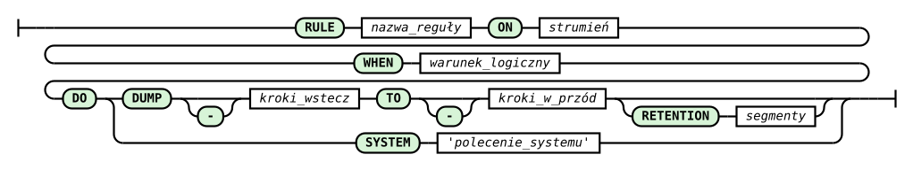

# RULE Command

This command is one of the most recent extensions I have developed for the system. It extends the system's functionality with an alerting mechanism.

> **_NOTE:_** The functionality described here is covered by the tests: `issue42_rule`, described in the appendix [Integration Tests](../appendices/integration-tests.md).

The syntax of the RULE command is as follows:

```
RULE rule_name
ON data_stream_name
WHEN logical_condition
DO DUMP steps_back TO steps_forward [RETENTION segments]
```

Or like this:

```
RULE rule_name
ON data_stream_name
WHEN logical_condition
DO SYSTEM system_command
```



_Fig. 8. RULE command syntax diagram_

The railroad diagram in Fig. 8 was generated from the `rule_statement` rule in the system's ANTLR4 grammar (`RQL.g4`) and covers both forms of the command shown above in a single track: the branch after the word DO leads either to the DUMP variant (with a data-window dump and optional retention), or to the SYSTEM variant (with a system command in quotes). Rounded green boxes are keywords and symbols entered literally, rectangles are values supplied by the user; tracks bypassing the minus sign and the RETENTION clause mean they are optional.

Events defined this way attach to defined data streams. The rule name should be unique. The data stream must be defined before the rule-creation command appears in the rql file.

In both versions of the RULE command, a rule name, a logical condition, and the name of the stream to which the process launched by the DO command is attached are created. The logical condition should refer to variables available in the schema of the data stream following the ON clause.

In the first version of the command, which includes the DO DUMP clause, we define a process that allows collecting data that will arrive in the future. If we omit the RETENTION clause, the dump goes directly to a file named after the rule, prefixed with the stream name. If we add the RETENTION clause, the files will be subject to retention within the range defined by the 'segments' parameter. Sequential numbers will be appended to the end of each dump. Dumps are binary and preserve the schema of all fields of the source data stream. It is worth noting here that the command creates a process in the system which, once the logical condition becomes true, pulls data from the past and also expects its arrival and registration in the future. Nothing prevents us, however, from collecting data only from the past or only from the future. If the step\_\* values are negative, they refer to the past (i.e. to data that is historical relative to the moment the event described by the logical condition occurred).

The DO SYSTEM clause allows a system event to be triggered once the logical condition based on recorded data is met. This way, an arbitrary system command can be invoked.

Examples of rule declarations in RQL:

```
RULE testrule1 \
ON str1 \
WHEN str1[0] > 11 \
DO DUMP -5 TO 5 RETENTION 100

RULE testrule2 \
ON str1 \
WHEN str1[0] = 13 OR str1[0] = 11 \
DO SYSTEM 'echo "systemcall"'
```

Assume that a stream str1 has previously been defined, whose data — integer values — arrives once per second. In this case, the first rule, attached to this stream, waits for data whose value exceeds 11. Should such an event occur, a dump of the data is made, covering the range from 5 seconds before to 5 seconds after the event described by the logical condition.

The second rule, with a slightly different logical condition, prints the text "systemcall" to the screen from which the RetractorDB process was started.

## RULE Command Syntax

The full syntax of the RULE command is:

```
RULE <name>
ON <stream>
WHEN <condition>
DO <action>
```

Where `<action>` can take one of two forms:

```
SYSTEM '<system_command>'
DUMP [-]<step_back> TO [-]<step_forward> [RETENTION <n>]
```

### Restriction

A rule can only be attached to a stream declared with a `SELECT` command (an artifact or substrate). Attaching it to a `DECLARE` input stream is a compilation error:

```
# INVALID — core0 is a declaration, a rule cannot be attached to it
RULE r1 ON core0 WHEN core0[0] > 10 DO SYSTEM 'echo alarm'
```

### The WHEN condition

The condition is a logical expression evaluated to true/false after every new sample of the stream.

Comparison operators: `=`, `!=`, `<`, `>`, `<=`, `>=`. Logical operators: `OR`, `AND`, `NOT`. Examples:

```
WHEN str1[0] > 100
WHEN str1[0] = 0 OR str1[0] = 255
WHEN str1[0] >= 10 AND str1[0] <= 90
WHEN NOT str1[0] = 0
```

## The DO SYSTEM action

The `DO SYSTEM` action executes the given shell command (via a `system(3)` call) the moment the condition is satisfied. RetractorDB logs the command's exit code — a non-zero code is reported as an error in the log.

```
RULE alert1 \
ON results \
WHEN results[0] > 1000 \
DO SYSTEM 'curl -s http://monitoring/alert'
```

Any program available on `PATH` can be used in the command: shell scripts, Python programs, REST calls, sending notifications, etc.

## The DO DUMP action

The `DO DUMP` action writes a window of stream samples to a binary file the moment the condition is satisfied. It lets you preserve the context of an event: data before it occurred and data after it.

```
RULE event \
ON results \
WHEN results[0] > 500 \
DO DUMP -10 TO 5
```

Range parameters:

| Parameter                       | Meaning                                              |
| -------------------------------- | ----------------------------------------------------- |
| negative `step_back` (e.g. `-10`) | include 10 **historical** samples before the event   |
| `0` as `step_back`               | start the dump at the moment of the event             |
| positive `step_back` (e.g. `2`)  | delay the start of the dump by 2 samples after the event |
| `step_forward` (e.g. `5`)        | collect a total of `step_forward - step_back` samples |

Total number of dumped records: `abs(step_forward - step_back)`. Example: `DUMP -5 TO 5` → 10 records (5 historical + 5 subsequent). `DUMP 0 TO 1` → 1 record (the current sample).

The `step_back` range must be less than or equal to `step_forward`. The `step_back` value can be negative (history) or non-negative (delay). Both values being negative is not supported.

### Dump files

Files are created in the directory configured by the `STORAGE` directive. Naming convention:

```
<stream>_<rule_name>_dump.tmp          # without RETENTION
<stream>_<rule_name>_dump_<n>.tmp      # with RETENTION (n = 0..N-1)
```

The file format is raw binary data matching the stream descriptor (no header). The `xtrdb` tool can be used to read the file.

### The RETENTION option

The `RETENTION <n>` parameter limits the number of stored dumps — the oldest file is overwritten by the new one (a circular buffer). Without `RETENTION`, every trigger overwrites a single `_dump.tmp` file.

```
RULE event \
ON results \
WHEN results[0] > 500 \
DO DUMP -10 TO 5 RETENTION 20
```

The example above keeps the last 20 dumps in files `results_event_dump_0.tmp` … `results_event_dump_19.tmp`.

## Multiple rules for a single stream

Any number of rules of different types can be attached to a single stream:

```
RULE high_alert \
ON measurements \
WHEN measurements[0] > 900 \
DO SYSTEM 'notify-send "Threshold exceeded"'

RULE low_alert \
ON measurements \
WHEN measurements[0] < 10 \
DO SYSTEM 'notify-send "Value too low"'

RULE anomaly_log \
ON measurements \
WHEN measurements[0] > 900 \
DO DUMP -20 TO 10 RETENTION 5
```

All rules for a given stream are evaluated on every new sample.
