# Alerting Example

In a terminal window, we start the xretractor process, running the query.rql file shown at the start of the chapter.

```
$ xretractor query.rql
test
test
test
…
```

In a second terminal window, I suggest running the command:

```
$ xqry -s str4
27
28
20
21
22
23
24
25
26
27
```

I suggest placing both windows side by side. We will see that the appearance of the values 20 and 23 triggers the server-side action that prints "test". Keep in mind that any system command or invocation of any program can appear here, depending on what we put in the DO SYSTEM declaration.

<div class="no-print">

Session recording (animation below):

<figure><figcaption><p>Animation. Session recording of the alerting example</p></figcaption></figure>

</div>

## Example 2: recording event context (DO DUMP)

The `DO DUMP` action lets you capture a window of samples surrounding an event — data before and after it occurred. This is useful when we want to preserve the context of an anomaly for later analysis.

We create a `query.rql` file:

```
STORAGE 'temp'

DECLARE a INTEGER STREAM core0, 1 FILE 'datafile1.txt'
SELECT str1[0] STREAM str1 FROM core0

RULE anomaly_log \
ON str1 \
WHEN str1[0] > 24 \
DO DUMP -3 TO 3
```

Input data — numbers from 20 to 28:

```
$ seq 20 28 > datafile1.txt
```

We run xretractor:

```
$ xretractor query.rql
```

When the value of stream `str1` exceeds 24, the rule triggers a write of 6 records (3 historical + 3 subsequent) to the binary file `temp/str1_anomaly_log_dump.tmp`.

### Reading the dump file

The dump file contains no `.desc` header — when opening it in `xtrdb`, the schema must be specified manually:

```
$ xtrdb
> storage temp
> open str1_anomaly_log_dump { INTEGER a }
> size
> list 6
> quit
```

## Example 3: rotating dumps (DO DUMP with RETENTION)

Without `RETENTION`, each successive trigger of the rule overwrites the same file. When events repeat, use `RETENTION N` to keep the last N dumps in separate files.

```
STORAGE 'temp'

DECLARE a INTEGER STREAM core0, 1 FILE 'datafile1.txt'
SELECT str1[0] STREAM str1 FROM core0

RULE anomaly_log \
ON str1 \
WHEN str1[0] > 24 \
DO DUMP -3 TO 3 RETENTION 5
```

Each trigger creates the next file (circular rotation):

```
temp/str1_anomaly_log_dump_0.tmp
temp/str1_anomaly_log_dump_1.tmp
temp/str1_anomaly_log_dump_2.tmp
temp/str1_anomaly_log_dump_3.tmp
temp/str1_anomaly_log_dump_4.tmp
```

Once capacity is exceeded (`RETENTION 5`), the oldest file is overwritten by the new one.

## Example 4: multiple rules on a single stream

Any number of rules can be attached to a single stream. The example below combines both actions — a system notification and context recording:

```
STORAGE 'temp'

DECLARE a INTEGER STREAM core0, 1 FILE 'datafile1.txt'
SELECT str1[0] STREAM str1 FROM core0

RULE lower_threshold \
ON str1 \
WHEN str1[0] < 21 \
DO SYSTEM 'echo "ALARM: value below lower threshold" >> alarm.log'

RULE upper_threshold \
ON str1 \
WHEN str1[0] > 26 \
DO SYSTEM 'echo "ALARM: value above upper threshold" >> alarm.log'

RULE context_log \
ON str1 \
WHEN str1[0] > 26 \
DO DUMP -5 TO 5 RETENTION 10
```

The `upper_threshold` and `context_log` rules react to the same condition independently — crossing the upper threshold both writes a log entry and captures the data window at the same time. The `lower_threshold` rule handles the lower threshold separately.

All three rules are evaluated on every new sample of the `str1` stream.
