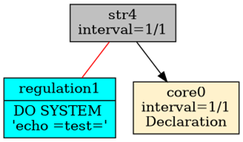
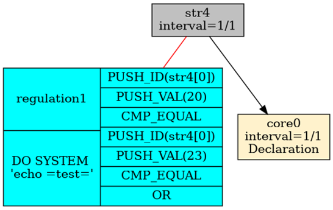

# Mechanism Construction

By alerting we mean the process of processing current data and having the system react in real time when it recognizes a phenomenon that has occurred. For alerting to work, the system needs mechanisms supporting this process. In RetractorDB I developed an alerting model based on declaring rules tied to the observation of data streams. These rules contain mathematical operations allowing analysis of logical conditions and the triggering of external processes, or performing a data dump within a chosen time window.

> **_NOTE:_** The functionality described here is covered by the tests: `issue42_rule`, described in the appendix [Integration Tests](../../appendices/integration-tests.md).

The presentation of the RULE command's syntax on page 24 already touches on this functionality. In this chapter I would like to explain in more detail how this solution works.

To build an example demonstrating how alerting works, let's create the following query file — query.rql:

```
DECLARE a UINT STREAM core0, 1 FILE 'datafile1.txt'
SELECT str4[0] STREAM str4 FROM core0>1

RULE regulation1 \
ON str4 \
WHEN str4[0] = 20 or str4[0] = 23 \
DO SYSTEM 'echo "test"'
```

The file datafile1.txt contains numbers, as text, from 20 to 28.

```
$ seq 20 28 > datafile1.txt
```

The three commands above declare an ephemeral data source, one data-processing command that shifts it in time by one sample, and an alerting rule. Running the following command:

```
$ xretractor -c query.rql -d -u -p -i > out.dot &&
dot -Tpng out.dot -o out.png
```

Viewing the resulting out.png file, we will see something like this (Fig. 9):

<figure><figcaption><p>Fig. 9. Dependency between objects when using alerting</p></figcaption></figure>

The image shows the relationship between the processes responsible for artifacts, alerting, and ephemerides. It should equally be possible to attach the process responsible for alerting to a substrate.

Alerting objects are shown in blue and connected, via red undirected lines, to the objects they monitor.

More than one alerting object can be attached. Multiple RULE commands can be associated with a given data-stream-creating command.

Looking more closely, we see that the process responsible for alerting is triggered by a condition. The following command lets us inspect what's actually happening there:

```
$ xretractor -c query.rql -d -u -p > out.dot &&
dot -Tpng out.dot -o out.png
```

The output file looks as follows (Fig. 10):

<figure><figcaption><p>Fig. 10. Code responsible for the alerting trigger condition.</p></figcaption></figure>

In its final form, this condition must evaluate to an expression representing true or false.
