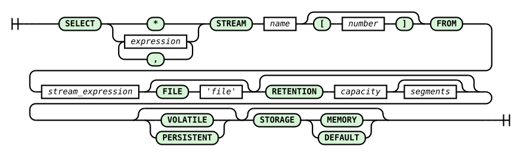

# SELECT Command

Every SELECT command in RetractorDB creates a continuous query. These queries run from the moment they appear in the system until the system shuts down.

The syntax of the SELECT command is as follows:

```
SELECT algebraic_expression [, algebraic_expression] 
STREAM output_stream_name [instance_count]
FROM stream_algebraic_expression 
[FILE 'artifact_file_name'] 
[RETENTION capacity [segments]]
[VOLATILE]
[STORAGE profile]
```



_Fig. 4. SELECT command syntax diagram_

The railroad diagram in Fig. 4 was generated from the `select_statement` rule in the system's ANTLR4 grammar (`RQL.g4`). The diagram is read by following the lines from left to right: rounded green boxes are keywords and symbols entered literally, rectangles are values supplied by the user. The branch after the word SELECT shows that the field list is either an asterisk (the full record) or one or more expressions separated by commas (a loop looping back through a comma). An optional size in square brackets after the stream name creates a stream family. Tracks bypassing the FILE, RETENTION (with an optional second parameter — the number of segments), VOLATILE, and STORAGE clauses mean each of them is optional.

Readers familiar with SQL will immediately notice that the command shown above differs significantly from what they know from relational databases.

The first difference, beyond syntax, is that once entered into the system, these commands run until the system shuts down. Every SELECT command is a continuous query. The STREAM clause requires the author to give every query a unique name. While the algebraic expressions in the SELECT clause's field list don't differ from the form familiar from relational systems, the stream algebraic expression must satisfy the conditions presented in the previous chapter on algebraic expressions. The optional FILE and RETENTION clauses provide processes for directing results and managing their retention. Old, segmented output files can be deleted on an ongoing basis, keeping room in the system for new data in continuous motion.

An example of a query creating a new data stream might be the following RQL command.

```
SELECT str1[0]*10 + str1[1]*10, str1[2] \
STREAM str1 \
FROM A+B
```

A query built this way assumes that someone has declared streams A and B. This could have been done with the DECLARE keyword or with another SELECT command. Based solely on the line containing the query, we cannot tell how fast the data of stream str1 arrives. This information is computed at compile time, based on streams A and B and the algebraic expression in the FROM clause.

## Stream generators

An optional size after the name in the `STREAM` clause expands one template into that many queries. The `$` symbol denotes a zero-based instance ordinal:

```rql
DECLARE cell INTEGER[4] STREAM cells, 1/10 FILE 'cells.txt'

SELECT cells[$] STREAM cell[4] FROM cells
SELECT * STREAM grouped FROM cell[0]#cell[1]#cell[2]#cell[3]
```

The first `SELECT` creates the physical streams `cell$0`, `cell$1`, `cell$2`, and `cell$3`. A reference such as `cell[2]` in the `FROM` clause denotes instance `cell$2`; in a `SELECT`-list expression, `cells[2]` still denotes field index 2.

Within a template, `$` may occur:

- as a field index, for example `cells[$]` or `cells[3-$]`;
- as an expression value, for example `cells[0]+$`;
- in a reference to another family in the `FROM` clause, for example `cell[$]@(2,4)`.

A generator-index expression is integral and may contain literals, `$`, parentheses, and the operators `*`, `+`, and `-`. The family size must be positive and the template must actually use `$`. A generator cannot carry a `FILE` clause because one file name cannot serve multiple streams. The compiler also rejects family indices outside the declared range, negative field indices, and collisions between generated and existing stream names.

Expansion is the compiler's first pass. Afterwards the plan is identical to one containing hand-written `cell$0`...`cell$3` streams; runtime has no separate generator mechanism.

> **_NOTE:_** The functionality described here is covered by the tests: `simple`, `Pattern2`, described in the appendix [Integration Tests](../../appendices/integration-tests.md).

The VOLATILE clause creates an ephemeral form of the query. A query with this clause holds only a single record in memory — only the descriptor describing the data structure appears on disk.

The STORAGE clause allows choosing how the artifacts created are managed and stored. The full table of types, with a description of each, is in the chapter [Storage Types](storage-types.md).

## FROM clause operators

The stream algebraic expression in the `FROM` clause can include:

| Operator | Syntax | Description |
| --- | --- | --- |
| Sum | `A + B` | Concatenates the schemas of two streams — see [Summation Sequencing](summation-sequencing.md) |
| Interleave | `A # B` | Interleaves two streams — see [Interleaving Sequencing](interleaving-sequencing.md) |
| Shift | `A > N` | Shifts reads by `N` samples |
| Interval conversion | `A - r` | Retimes a stream to rational interval `r` |
| De-interleave | `A & r` / `A % r` | Recovers the left or right interleave component for ratio `r` |
| AGSE window | `A @ (k, w)` | Builds a sliding data window — see [AGSE Sliding Data Window](../../query-execution/agse-sliding-window/) |
| Reduction | `MIN(A)` / `MAX(A)` / `AVG(A)` / `SUMC(A)` | Reduces a multi-field record to one value — see [Aggregate Operators](aggregate-operators.md) |

### Precedence and associativity

From strongest to weakest binding:

1. a reducer call, stream name, or parenthesized expression;
2. the chainable postfix operators `@`, `&`, `%`, `>`, `-`, and the deprecated `.aggregator` form;
3. interleave `#`;
4. sum `+`.

The binary operators `#` and `+` are left-associative. Postfix operators also compose from the left, so `A@(1,4)&2` means `(A@(1,4))&2`.

> **⚠️ Warning** `A#B>N` means `A#(B>N)`, because shift binds more tightly than interleave. To shift the interleave result, write `(A#B)>N`. The same rule applies to `A#B-r`.

Whitespace around `#` does not affect its meaning: `A # B` and `A#B` are the same interleave.

## Exponentiation in field expressions

The `^` operator exponentiates numeric values in the `SELECT` list and in `RULE` conditions. It binds more tightly than `*` and `/`, which in turn bind more tightly than `+` and `-`. Exponentiation is right-associative:

```rql
SELECT v*w^2, v^w^2 STREAM powers FROM source
```

This means `v*(w^2)` and `v^(w^2)`. Writing `(v*w)^2` requires explicit parentheses.

For integer and rational types, a non-negative integral power has exactly the semantics of repeated multiplication, including type promotion and overflow. Other cases use floating-point computation; an infinite or `NaN` result becomes `NULL`. Text operands are not allowed.

> **ℹ️ Info** A negative literal is one grammar atom: `-2^2` means `(-2)^2`. For a field, `-v^2` means `-(v^2)`. Use parentheses whenever the intended grouping might be unclear.

> **⚠️ Warning** After an interleave `A#B`, do not refer to its components as `A[0]`, `A.field`, `A[_]`, or `A.*`. An interleave has one shared schema; use the output stream name or recover a component with `&`/`%`. See [Aliasing](../../query-compilation/aliasing.md) for details.

> **_NOTE:_** The shift operator `A > N` is covered by the test: `issue56_timeshift`, described in the appendix [Integration Tests](../../appendices/integration-tests.md).

> **_NOTE:_** Null-value propagation through SELECT expressions is covered by the test: `issue121_null_propagation`, described in the appendix [Integration Tests](../../appendices/integration-tests.md).
