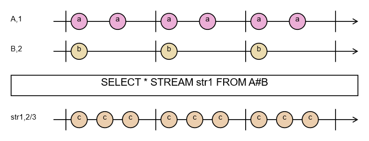

# Interleaving Operation Sequencing

Let's now analyze the interleaving operation. Let's create a file qplan2.rql with the following content:

```
DECLARE a BYTE STREAM A, 1 FILE 'data1.txt'
DECLARE a BYTE STREAM B, 2 FILE 'data2.txt'
SELECT * STREAM str1 FROM A#B
```

Aside from the # symbol instead of the + symbol in the from clause, the two files are identical. Let's run the compilation and the swirly program. The resulting graphic will look as follows:

<figure><figcaption><p>Fig. 7. Marble diagram — the interleaving operation</p></figcaption></figure>

In Fig. 7 we see a change. The marbles of stream str1 have been evenly arranged in time. The events occurring in the declared input data streams have not changed. What has changed is the way the output stream str1 is built.

If we look at the generated text schema, we'll see that the time values have changed too:

```
% Minimum interval is 666ms
% Maximum interval is 2000ms
% Grid time is 333ms, divider:2
% Full cycle step count in grid is 6
```

I encourage further experimentation with this way of presenting the defined operations on time series.

> **_NOTE:_** The functionality described here is covered by the tests: `operations`, `Pattern1`, described in the appendix [Integration Tests](../../appendices/integration-tests.md).
