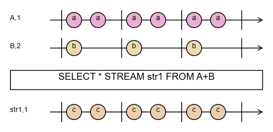

# Summation Operation Sequencing

Data flows into the system and is processed within it. The order in which it arrives and is processed can be described by the term sequencing. The way data is combined is described by the algebraic expression placed in the FROM clause. These expressions are written as a series of algebraic operations subject to strict rules — rules similar to those we learned in elementary school, governing arithmetic operations on numbers such as addition, multiplication, division, and subtraction.

Let's start by analyzing the following query:

```
DECLARE a BYTE STREAM A, 1 FILE 'data1.txt'
DECLARE a BYTE STREAM B, 2 FILE 'data2.txt'
SELECT * STREAM str1 FROM A+B
```

I'll save the query in a file named qplan1.rql. Then I'll run the following commands:

```
$ xretractor -c qplan1.rql -w 1:3 > out.txt
$ swirly out.txt -o out.svg
```

The swirly program was installed from its GitHub repository \[[6](../../references.md#6)]. This program is used to generate marble diagrams used to explain the behavior of RxJs asynchronous operations \[[7](../../references.md#7)].

The modification I applied for my use case is an alternative meaning for the vertical lines. In my case, vertical lines separate uniform time intervals — showing the number of cycles requested at invocation time (in this case, 3 cycles). The generated image is shown in Fig. 5:

<figure><figcaption><p>Fig. 5. Marble diagram — the sum operation</p></figcaption></figure>

A few words of explanation are needed here about this generator and how its input is produced. I built into the compiler an option for visualizing the execution of a sequence of operations. Diagrams produced by the Swirly program are one convenient way of presenting time dependencies. On input, the Swirly program expects a text file describing the diagram. A generator that simulates the requested number of cycles and builds a file for Swirly has been built into the compiler.

When xretractor is given, as its first parameter, the name of the file containing the query execution plan, it requires a second parameter ( -w \[--diagram] ) — indicating that we expect marble-diagram output. The required argument of the -w parameter is two numbers separated by a colon. The first tells the program whether to insert time separators into the diagram (the vertical lines separating cycles); the second parameter is how many cycles should be shown in the diagram.

If you look at the generated out.txt file, you'll see the following content:

```
% Creating diagram output grid is on, cycle count:3
% Minimum interval is 1000ms
% Maximum interval is 2000ms
% Grid time is 500ms, divider:2
% Full cycle step count in grid is 4
-|a-a-|a-a-|a-a-|-
title = A,1

-|b---|b---|b---|-
title = B,2

> SELECT * STREAM str1 FROM A+B

-|c-c-|c-c-|c-c-|-
title = str1,1
```

In this file, note the data shown in the comments. These are the times computed while generating the diagram, relative to the scale shown in the marble diagram. As you can see, for our query the minimum window interval is 1 second and the maximum is 2 seconds. The identified and computed grid is half a second. On the diagram, each letter or dash represents a half-second period between successive operations.

We can manually change the generated content. If we replace the content as follows:

```
-|a-b-|c-d-|e-f-|-
title = A,1

-|g---|h---|i---|-
title = B,2

> SELECT * STREAM str1 FROM A+B

-|j-k-|l-m-|n-o-|-
title = str1,1
j:=ag
k:=bg
l:=ch
m:=dh
n:=ei
o:=fi
```

and then run the swirly program again, we'll see a more detailed picture showing the sequence of events occurring in the system.

<figure><figcaption><p>Fig. 6. Marble diagram — Sum, modified diagram</p></figcaption></figure>

In the diagram shown in Fig. 6, you can see which marbles were joined and which marbles they were formed from. Remember, though, that this is a manually corrected image, made for the purposes of this work — the generator built into the compiler does not implement this functionality.

> **_NOTE:_** The functionality described here is covered by the tests: `Pattern1`, `issue167_triarg`, described in the appendix [Integration Tests](../../appendices/integration-tests.md).
