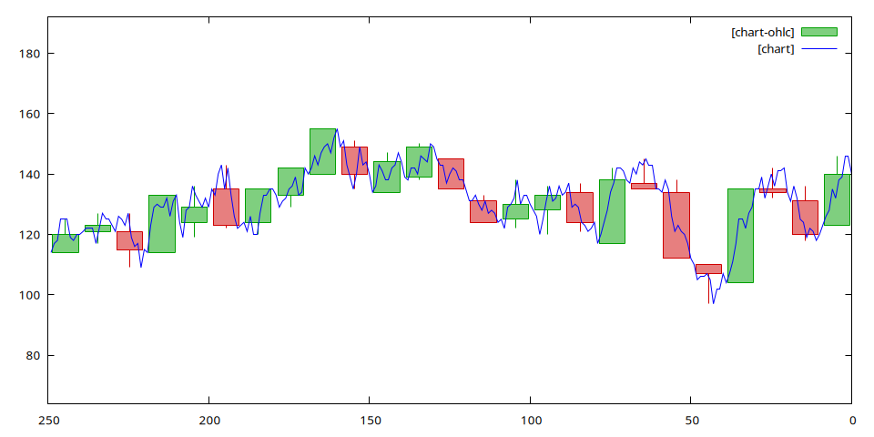

# Candlestick Chart (OHLC)

A candlestick chart is the basic way of presenting quotes in technical analysis. Each time interval is described by four values: open, high, low and close. The candle body spans from the open to the close, and the wicks reach the high and the low of the interval.

This example shows how to build candles from a regular stream using RQL queries alone, and how `xqry --gnuplot-ohlc` draws them on a shared axis together with the samples they were built from. The data source is random bytes, smoothed by a moving average into a trace that resembles a price. This is not market data - the example demonstrates the mechanism, not the analysis of quotes.

## The RQL query

The file `examples/candlestick/candlestick.rql`:

```rql
STORAGE 'temp'
DEFAULT VOLATILE

DECLARE v BYTE STREAM source, 0.02 FILE '/dev/random'

SELECT int(AVG(source[0] : 25)) STREAM price FROM source
SELECT * STREAM bar FROM price@(10,-10)
SELECT * STREAM hi FROM MAX(bar)
SELECT * STREAM lo FROM MIN(bar)
SELECT bar[0], int(hi[0]), int(lo[0]), bar[9] STREAM ohlc FROM bar + hi + lo
SELECT * STREAM chart FROM ohlc + bar
```

The plan consists of the following streams:

| Stream   | Interval       | Fields | Role                                                  |
| -------- | -------------- | ------ | ----------------------------------------------------- |
| `source` | 0.02 s (50 Hz) | 1      | bytes read from `/dev/random`                         |
| `price`  | 0.02 s         | 1      | moving average of 25 samples - the "price"            |
| `bar`    | 0.2 s          | 10     | tumbling window: 10 price samples in arrival order    |
| `hi`     | 0.2 s          | 1      | maximum of the `bar` record                           |
| `lo`     | 0.2 s          | 1      | minimum of the `bar` record                           |
| `ohlc`   | 0.2 s          | 4      | open, high, low, close                                |
| `chart`  | 0.2 s          | 14     | the candle and the ten samples it was built from      |

The `DEFAULT VOLATILE` directive keeps all results and substrates in memory, so the example persists nothing to disk (→ [VOLATILE Clause](../query-language-construction/select-command/volatile-clause.md)). The `temp` directory named by `STORAGE` must still exist before the server starts.

The `price` stream comes from the record-window aggregate `AVG(source[0] : 25)`. An aggregate in the `SELECT` list reduces vertically, over successive history records, so it turns white noise into a slowly varying trace, and the result interval stays equal to the source interval. The average has type `RATIONAL`, so the query casts it to an integer with `int(...)` - for the same reason as in the [signal filter](signal-filter-implementation.md) example: gnuplot would read only the numerator of a fraction.

The `bar` stream is the window `price@(10,-10)`. The step and the width are equal, so this is a tumbling window: every price sample falls into exactly one candle, and a new record appears every 10 × 0.02 s = 0.2 s. The negative width means mirrored aggregation - the fields are ordered by arrival, so `bar[0]` is the oldest sample of the window (the open) and `bar[9]` the newest (the close) (→ [Window Types](../query-execution/agse-sliding-window/window-types.md)).

The `hi` and `lo` streams use the `MAX(bar)` and `MIN(bar)` reducers in the `FROM` clause. A stream reducer folds the fields of one record horizontally, so it yields the maximum and minimum of the candle's ten samples at an unchanged 0.2 s interval (→ [Aggregate Operators](../query-language-construction/select-command/aggregate-operators.md)). The reducer result also has type `RATIONAL`, hence `int(hi[0])` and `int(lo[0])` in the next query.

A record-window aggregate could not replace the `@` window here. `MAX(price[0] : 10)` in the `SELECT` list slides by one record and emits a result every 0.02 s, so it would produce ten overlapping candles for every real one. Only the tumbling window defines the candle's boundaries and its interval.

The sum `bar + hi + lo` joins three streams with the same interval into a 12-field record, from which `ohlc` selects the four candle values. The last query, `ohlc + bar`, appends the candle's ten samples to it. The `chart` record therefore has 14 fields: open, high, low, close, and the samples in arrival order. Since a candle and its samples arrive in one record, the client does not need to align two separate streams in time.

## The `--gnuplot-ohlc` mode

The `--gnuplot-ohlc` option is a modifier of the `-p` / `--gnuplot` mode of `xqry` (→ [xqry](../appendices/command-line-options/xqry.md)). It expects a record with the layout:

```
open, high, low, close, sample_1, ..., sample_N
```

The number of samples N follows from the record length (N = number of fields - 4) and needs no separate parameter. Drawing follows these rules:

- Each record gives one candle, placed over the middle of the span occupied by its N samples. The candle body is 80% of that span wide.
- A candle whose close is not lower than its open is green (rising); the others are red (falling). The samples are drawn as a blue line.
- The first `-p` parameter counts **samples**, as in the ordinary gnuplot mode. The window therefore holds as many candles as the window width divided by N.
- The newest sample sits at x = 0. The `--gnuplot-rtl` modifier reverses the axis, so the newest candles appear on the right.
- A candle in which any of the four values is `NULL` is skipped entirely; its samples stay on the chart.
- A record without samples (4 fields or fewer) is not drawn. `xqry` then prints a one-time message on `stderr`, e.g. `xqry: --gnuplot-ohlc needs open, high, low, close and at least one sample; stream 'ohlc' sends 4`. Standard output goes to gnuplot, so without this message the window would stay empty with no explanation.
- Calling `--gnuplot-ohlc` without `--gnuplot` ends with the error `--gnuplot-ohlc requires --gnuplot/-p mode.`

## Running

The `candlestick` target in the build system displays the chart:

```bash
# from build/Debug or build/Release
ninja candlestick
```

CMake runs the following invocation in the `examples/candlestick` directory:

```bash
scripts/xplot.sh chart candlestick.rql 250,64,192 "--gnuplot-ohlc --gnuplot-rtl"
```

Meaning of the parameters:

| Parameter                      | Meaning                                                           |
| ------------------------------ | ----------------------------------------------------------------- |
| `chart`                        | The name of the output stream                                     |
| `candlestick.rql`              | The query file                                                    |
| `250`                          | The window width in samples - 25 candles of 10 samples            |
| `64,192`                       | The Y-axis range; the average of 25 random bytes centers on 127.5 |
| `--gnuplot-ohlc --gnuplot-rtl` | Candlestick mode, newest candles on the right                     |

The `scripts/xplot.sh` script works the same way as in the [ECG signal analysis](ecg-visualization-mit-bih.md#on-screen-visualization) example: it recreates the `temp` directory, starts a named `xretractor` instance in the background, and pipes the stream through `xqry` into `gnuplot`.

Without the script, the example can be run in two terminal windows from the `examples/candlestick` directory:

```
$ mkdir -p temp && xretractor candlestick.rql
```

```
$ xqry -s chart -p 250,64,192 --gnuplot-ohlc --gnuplot-rtl | gnuplot
```

<figure><figcaption><p>Fig. 63. Candlestick chart of the <code>chart</code> stream - 25 candles of 10 samples, newest on the right</p></figcaption></figure>

Fig. 63 shows one data frame sent by `xqry --gnuplot-ohlc --gnuplot-rtl` and rendered by gnuplot. Each candle covers exactly ten samples of the blue line: one edge of the body lies on the first sample of the span (the open), the opposite edge on the last one (the close), and the wicks reach the highest and lowest sample of the span. The open of each candle lies close to the close of the previous one, because `price` is a moving average and changes smoothly across spans.

> **_NOTE:_** The `--gnuplot-ohlc` mode is checked by the `ut_formatter` unit tests: candle placement over its samples, window width counted in samples, skipping a candle with a `NULL` value, and a record without samples.
