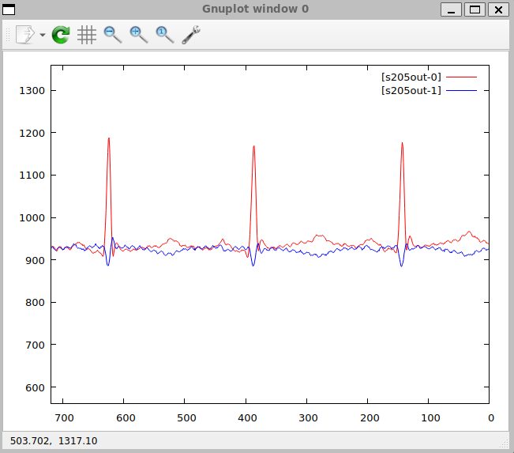
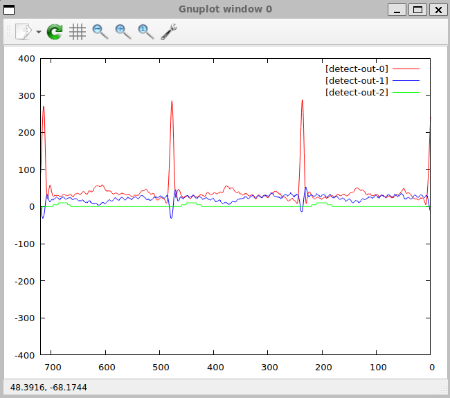
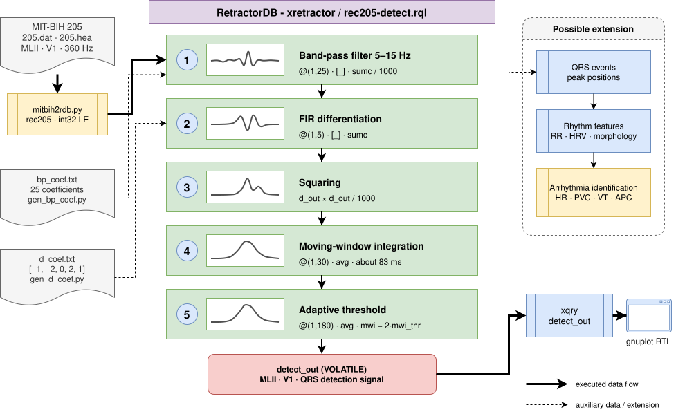

# ECG Visualization and Arrhythmia Detection — the MIT-BIH Database

## Data source — the PhysioNet MIT-BIH Arrhythmia Database

The MIT-BIH Arrhythmia Database is a publicly available collection of electrocardiogram recordings published by PhysioNet at:

```
https://physionet.org/content/mitdb/1.0.0/
```

It contains 48 half-hour, two-channel recordings collected from 47 patients at Beth Israel Hospital in Boston between 1975 and 1979. The recordings were manually annotated by at least two independent cardiologists and are widely used in research on automatic arrhythmia detection.

### Record 205

The example uses record **205** — a recording from a 59-year-old man treated with Digoxin and Quinaglute. The record contains episodes of ventricular tachycardia (VT) and is often cited in the literature as diagnostically challenging, due to two morphologically distinct forms of premature ventricular contractions (PVC).

Recording parameters:

| Parameter                  | Value                                             |
| ------------------------- | --------------------------------------------------- |
| Duration                   | ≈ 30 min                                            |
| Sampling rate              | 360 Hz                                              |
| Number of samples          | 650,000                                             |
| Channel 1 (MLII)           | Modified limb lead II                                |
| Channel 2 (V1)             | Precordial lead V1                                    |
| Resolution                 | 12 bits, gain 200 LSB/mV, zero point 1024            |

Raw values are stored as unitless integers (so-called ADC values). Conversion to millivolts:

\\[\text{mV} = \frac{\text{ADC} - 1024}{200}\\]

The range of actual values in the rec205 file falls between 589–1315 (MLII) and 718–1106 (V1), corresponding to a signal amplitude of roughly ±1.5 mV.

## Data preparation

The original recording files (`205.hea`, `205.dat`, `205.atr`) are provided in the MIT-BIH format and need to be converted into a binary format recognized by RetractorDB.

### The MIT-BIH format 212

The signal in the `205.dat` file is packed 12-bit in format 212: every three bytes store two consecutive samples of both channels according to the scheme:

```
[B0][B1][B2] → MLII = B0  | ((B1 & 0x0F) << 8)
               V1   = B2  | ((B1 >>  4)  << 8)
```

The values are 12-bit signed (range –2048..2047).

### Converting to the RetractorDB format

The script `examples/ecg/mitbih2rdb.py` reads the `205.hea` header, decodes the sample pairs, and writes them as little-endian `int32` records into the `rec205` file:

```
650,000 records × 2 fields × 4 bytes = 5,200,000 bytes
```

At the same time, the script generates an RQL script that plays back the signal (`rec205-replay.rql`). The descriptor file `rec205.desc` is created by `build.sh`.

The whole preparation process is run with a single command from the project's root directory:

```bash
bash examples/ecg/build.sh
```

The result is three files in the `examples/ecg/rec205/` directory:

| File                | Generated by    | Description                    |
| ------------------- | --------------- | ----------------------- |
| `rec205`            | `mitbih2rdb.py` | Binary data (int32 LE) |
| `rec205.desc`       | `build.sh`      | Stream descriptor   |
| `rec205-replay.rql` | `mitbih2rdb.py` | RQL playback script  |

## The RQL query

The file `rec205-replay.rql` defines two streams:

```rql
DECLARE MLII INTEGER, V1 INTEGER STREAM ecg, 1/360 FILE 'rec205'

SELECT ecg.MLII, ecg.V1 STREAM s205out FROM ecg VOLATILE
```

The `STREAM ecg, 1/360` clause sets the time interval of a single sample to 1/360 s, matching the actual sampling rate of 360 Hz. The `TYPE DEVICE` clause in the descriptor causes the `rec205` file to be read sequentially in a loop (after the last sample, reading returns to the beginning), enabling continuous playback of the recording.

The output stream `s205out` is declared `VOLATILE`, so it is not written to disk — the data only reaches the consumer process (`xqry`).

## On-screen visualization

The `ecg` target in the build system is used to display the chart in real time. It runs the script `scripts/xplot.sh`, which starts `xretractor` in the background, and then pipes the data stream through `xqry` into `gnuplot`.

```bash
# from build/Debug
ninja ecg
```

The invocation CMake expands this into:

```bash
scripts/xplot.sh s205out rec205-replay.rql 720,560,1360 --gnuplot-rtl
```

Meaning of the parameters:

| Parameter            | Meaning                                                                  |
| ------------------- | -------------------------------------------------------------------------- |
| `s205out`           | The name of the output stream                                                |
| `rec205-replay.rql` | The query file                                                               |
| `720`               | The data window width (samples visible at once)                       |
| `560,1360`          | The Y-axis range (ADC values matching the actual signal)              |
| `--gnuplot-rtl`     | Newest samples on the right, chart scrolls right to left |

The `--gnuplot-rtl` option is an `xqry` parameter that reverses gnuplot's X axis (`set xrange [720:0]`). The effect is that the freshest samples appear on the right side of the window, and older ones scroll to the left — similar to the classic ECG printout on paper tape.

<figure><figcaption><p>Fig. 59. View of the gnuplot window with the ECG signal being played back (record 205)</p></figcaption></figure>

The window shown in Fig. 59 displays 720 samples, i.e. exactly 2 seconds of signal at 360 Hz, matching the typical width of a single ECG strip used in diagnostics.

## QRS Detection and Arrhythmia Identification

### Context — the Pan-Tompkins algorithm

QRS-complex detection is the foundation of automatic ECG analysis. The QRS complex represents ventricular depolarization and corresponds to every heartbeat, visible as a sharp spike in the signal. Knowing the positions of the QRS complexes in time, RR intervals can be computed, and from them, basic rhythm disturbances can be identified:

| Measure derived from QRS | Use                                      |
| --------------------- | ------------------------------------------------- |
| RR intervals          | Heart rate (HR), VT, bradycardia   |
| RR variability (HRV)  | Autonomic nervous system, event prediction |
| QRS morphology        | Distinguishing PVC from a normal rhythm, APC         |
| QRS duration          | Bundle branch block (BBB)                       |

The Pan-Tompkins algorithm (1985) is a classic, five-stage, pipelined digital-signal-processing algorithm implemented with FIR filters. RetractorDB implements it directly as an RQL query stream, without specialized DSP libraries.

### Generating the signal filters (coef)

The algorithm requires two sets of FIR coefficients, stored as text files (`bp_coef.txt`, `d_coef.txt`). They are generated once, with Python scripts, before running detection.

#### The band-pass filter — `gen_bp_coef.py`

Step 1 of the algorithm requires a filter that cuts out noise and artifacts outside the QRS band. A passband of 5–15 Hz at fs = 360 Hz produces a response containing the QRS morphology, while attenuating baseline wander (< 5 Hz) and muscle noise (> 15 Hz).

The design method is a **windowed sinc**:

```
h_bp[n] = (h_lp2[n] − h_lp1[n]) · w[n]
```

where:

* `h_lp[n] = 2·fc·sinc(2·fc·(n−M))` — the ideal low-pass filter
* `w[n] = 0.54 − 0.46·cos(2πn/(N−1))` — the Hamming window, damping Gibbs effects
* `M = (N−1)/2 = 12` — the filter's center point (group delay = 12 samples)

Parameters:

| Parameter                | Value                      |
| ----------------------- | ----------------------------- |
| Filter length N          | 25 coefficients            |
| Lower cutoff fc₁  | 5 Hz (normalized 5/360)          |
| Upper cutoff fc₂  | 15 Hz (normalized 15/360)        |
| Integer scale | ×1000 (divided /1000 in RQL) |

Running the script:

```bash
cd examples/ecg/rec205
python3 gen_bp_coef.py
# Saved 25 coefficients to bp_coef.txt
# Coefficients: [-2, -2, -1, 0, 3, 8, 14, 23, 32, 41, 49, 54, 56, ...]
# Sum (DC gain): 5 / 1000 = 0.0050
```

The coefficients are symmetric about the center (n=12), confirming the filter's linear phase — an essential property when analyzing ECG, since it guarantees no phase distortion of the QRS morphology.

#### The differentiating filter — `gen_d_coef.py`

Step 2 of the algorithm applies a filter that emphasizes the steep edges of the QRS. Pan and Tompkins proposed a 5-point derivative estimator:

```
y[n] = (1/8T) · (−x[n−4] − 2·x[n−3] + 2·x[n−1] + x[n])
```

Coefficients (from oldest to newest sample):

```
h = [−1, −2, 0, 2, 1]
```

Filter properties:

| Property           | Value                                           |
| -------------------- | ------------------------------------------------- |
| Sum of coefficients  | 0 (zero DC gain — eliminates offsets)     |
| Maximum response | f ≈ 10–25 Hz (the QRS-edge range)                  |
| Scale factor (1/8T) | 360/8 = 45 Hz (ignored — does not affect detection) |

```bash
cd examples/ecg/rec205
python3 gen_d_coef.py
# Saved 5 coefficients to d_coef.txt
# Coefficients: [-1, -2, 0, 2, 1]
# Sum (DC gain): 0  (should be 0)
```

### Implementing the pipeline in RQL — `rec205-detect.rql`

The file `rec205-detect.rql` implements the complete five-stage pipeline for both ECG channels (MLII and V1):

```rql
DECLARE MLII INTEGER, V1 INTEGER STREAM ecg, 1/360 FILE 'rec205'
DECLARE bp_coef INTEGER[25] STREAM bpf, 1 FILE 'bp_coef.txt'
DECLARE d_coef INTEGER[5]   STREAM df,  1 FILE 'd_coef.txt'

# Extracting the channels
SELECT ecg.MLII STREAM mlii FROM ecg VOLATILE
SELECT ecg.V1   STREAM v1   FROM ecg VOLATILE

# 1. Band-pass filter (5-15 Hz) — 25-tap FIR convolution
SELECT *                        STREAM mlii_win FROM mlii@(1,25)  VOLATILE
SELECT mlii_win[_]*bpf[_]       STREAM bp_acc   FROM mlii_win+bpf VOLATILE
SELECT bp_acc[0]/1000           STREAM bp_out   FROM SUMC(bp_acc) VOLATILE

# 2. Differentiation — 5-tap FIR convolution
SELECT *                        STREAM bp_win   FROM bp_out@(1,5) VOLATILE
SELECT bp_win[_]*df[_]          STREAM d_acc    FROM bp_win+df    VOLATILE
SELECT d_acc[0]                 STREAM d_out    FROM SUMC(d_acc)  VOLATILE

# 3. Squaring (/1000 prevents int32 overflow)
SELECT d_out[0]^2/1000          STREAM sq_out   FROM d_out        VOLATILE

# 4. Moving-window integration over 30 samples (~83 ms)
SELECT *                        STREAM mwi_win  FROM sq_out@(1,30) VOLATILE
SELECT *                        STREAM mwi      FROM AVG(mwi_win)  VOLATILE

# 5. Adaptive threshold — 2x moving average over 180 samples (0.5 s)
SELECT *                        STREAM mwi_long FROM mwi@(1,180)  VOLATILE
SELECT *                        STREAM mwi_thr  FROM AVG(mwi_long) VOLATILE

# Output: MLII centered, V1 centered, detection signal ×5
SELECT mlii[0]-900, v1[0]-900, (mwi[0]-mwi_thr[0]*2)*5 \
STREAM detect_out FROM mlii+v1+mwi+mwi_thr VOLATILE
```

#### Rationale for the parameters

The `@(1,25)` operator creates a sliding window of 25 samples, while `[_]` and `sumc` implement discrete convolution — see the chapter [Underscore Symbol Processing](../query-compilation/underscore-symbol-processing.md).

The `/1000` division in step 3 compensates for the integer scale of the coefficients — without it, the product `d_out × d_out` would exceed the `int32` range (2,147,483,647) for typical ECG amplitudes.

The output expression `(mwi[0]-mwi_thr[0]*2)*5` implements the adaptive threshold: the value is positive only when the MWI envelope exceeds twice the current moving average — indicating a detected QRS. The `×5` multiplier scales the detection signal to a range visually comparable to the raw ECG on the chart.

### Running it — ninja ecg-detect-qrs

The process is started with a single command from the `build/Debug` directory:

```bash
cd build/Debug
ninja ecg-detect-qrs
```

CMake expands this target into the command:

```bash
scripts/xplot.sh detect_out rec205-detect.rql 720,-400,400 --gnuplot-rtl
```

Meaning of the parameters:

| Parameter            | Meaning                                          |
| ------------------- | -------------------------------------------------- |
| `detect_out`        | The name of the output stream (3 fields)               |
| `rec205-detect.rql` | The query file with the pipeline above                  |
| `720`               | Window width: 720 samples = 2 seconds at 360 Hz |
| `−400,400`          | Y-axis range in ADC units (≈ ±2 mV)           |
| `--gnuplot-rtl`     | Newest samples on the right (right-to-left)    |

The `xplot.sh` script starts `xretractor` in the background (compiling and executing the queries), then pipes the `detect_out` stream through `xqry` into `gnuplot` in continuous mode. The `gnuplot` window refreshes with every new batch of samples.

### Figure description — the gnuplot window

<figure><figcaption><p>Fig. 60. The gnuplot window from running <code>ninja ecg-detect-qrs</code> — MIT-BIH record 205, 720 samples (2 s), RTL</p></figcaption></figure>

In Fig. 60, three signals are visible, corresponding to the three fields of the `detect_out` stream:

**\[detect-out-0] red line — MLII centered (mlii − 900)**

The raw ECG signal from lead MLII, shifted by the 900 ADC baseline point so that the zero axis corresponds to the isoline. Two sharp spikes (amplitude ≈ 280 ADC ≈ 1.4 mV) around samples 520 and 350 from the right edge represent two consecutive QRS complexes. The clear QRS morphology, with a dominant R peak, confirms the band-pass filter is working correctly — noise has been suppressed while the peak retained its amplitude.

**\[detect-out-1] blue line — V1 centered (v1 − 900)**

The signal from lead V1 of the same recording. QRS morphology in V1 is, as a rule, less pronounced than in MLII, which is visible in the figure — the blue signal shows a smaller R-peak amplitude at similar QRS time positions. Having both channels available at once allows distinguishing supraventricular contractions (APC) from ventricular ones (PVC), since ventricular QRS complexes show a distinct morphology in V1.

**\[detect-out-2] green line — the QRS detection signal ((mwi − 2·mwi\_thr) × 5)**

The algorithm's output signal. A **positive** value means a detected QRS complex — the moving-window-integration envelope exceeded twice the adaptive threshold. In the figure, two clear positive pulses are visible, coinciding in time with the QRS peaks on the MLII channel. Between beats, the line stays close to zero or slightly below — confirming the detector's specificity.

The gap between the two visible QRS complexes is approximately 170 samples, which at 360 Hz gives:

```
RR ≈ 170 / 360 ≈ 0.47 s  →  HR ≈ 127 bpm
```

This value falls within the range of ventricular tachycardia (VT, 79–216 bpm) recorded in record 205, suggesting that the visualized fragment of the recording comes from one of the 6 VT episodes noted by the MIT-BIH cardiologists.

### Process flow diagram

The diagram below (Fig. 61) shows the complete data flow from the raw MIT-BIH recording to arrhythmia identification, indicating where RetractorDB carries out the Pan-Tompkins algorithm, and its relationship to classic arrhythmia-recognition methods:

<figure><figcaption><p>Fig. 61. Data flow — from the MIT-BIH recording, through the Pan-Tompkins pipeline in RQL, to visualization and arrhythmia identification</p></figcaption></figure>

The right branch of the diagram — **Arrhythmia identification** — represents classic post-QRS-detection analysis methods, which can be built as further RQL queries layered on top of the `detect_out` stream:

| Method           | Description                                   | Relationship to QRS                |
| ---------------- | --------------------------------------- | ------------------------------- |
| RR intervals     | Time between consecutive QRS complexes → HR         | directly from detection positions |
| HRV (variability)  | Standard deviation of RR              | RR-stream statistics        |
| PVC classification | QRS width > 120 ms, V1 morphology  | width of the `mwi` window            |
| VT detection      | Sequence of ≥ 3 PVCs with HR > 100 bpm       | RULE on the HR+PVC stream           |
| APC detection     | An early, narrow QRS preceding a pause | MLII vs V1 morphology              |

RetractorDB provides `RULE` operators and windowed reducers (`AVG`, `SUMC`), which make it possible to implement the methods above in the same RQL query language, without leaving the system's environment. QRS detection is the first and necessary step in this hierarchy.
