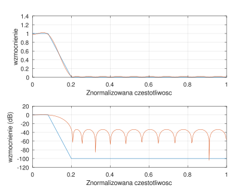
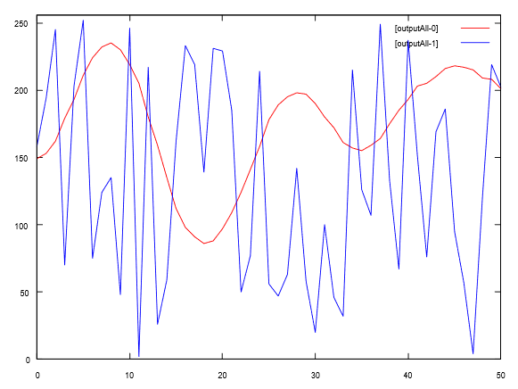

# Signal Filter Implementation

Problems related to digital signal processing include problems related to filtering. The goal of filtering is to separate the information contained within a signal. Usually the goal is to separate the signal from its noise.

Filters can be analog or digital. In this solution, we'll focus on digital filters. A digital filter is implemented as a sequence of operations on successive data points of the processed signal within a given time window. As a rule, when choosing a digital filter we must decide what compromises we're willing to accept. In addition, we may run into legal restrictions related to certain algorithms or methods \[[9](../references.md#9)].

### Designing a filter in Octave

When designing a digital filter, we need to determine what range of frequencies we want to attenuate, and what we want to amplify or leave unaffected. We define these parameters as the stopband and the passband. One tool I know of, used for constructing digital filters, is the GNU Octave program ([https://octave.org](https://octave.org)). With this tool we can generate the coefficients needed to compute a simple digital signal filter.

As an example, let's take the following values needed to construct a signal filter:

* Input signal sampling rate: 50 Hz
* Passband: 0–2 Hz
* Stopband: 5–25 Hz

An input-signal sampling rate of 50 Hz means 50 samples will appear within a second. In RetractorDB, this means the source signal should arrive at a rate of Delta = 0.02. And the defined data source should support that rate.

For these filter assumptions, the Octave program that builds the signal filter looks as follows:

```
pkg signal load
filtord = 25 % Filter length
Fs = 50;     % Sampling rate 50Hz
FNq = Fs/2;  % Nyquist frequency
F1c = 2;     % Passband 0 - 2Hz
F2c = 5;     % Stopband 5 Hz ->
F3c = 25;    % Stopband <- 25 Hz
f=[0,F1c/FNq,F2c/FNq,F3c/FNq]
m = [ 1 , 1 , 0, 0 ]
freqz ( remez(filtord,f,m) );
```

A file prepared this way should be saved to disk, or pasted directly into the Octave terminal window.

We can display the filter's floating-point parameters by issuing the command remez(filtord,f,m). We get a graphical representation of the filter by issuing the following command:

```
octave:1> [h, w] = freqz ( remez(filtord,f,m) );
subplot(2,1,1);
plot (f, m, '', w/pi, abs (h), '');
xlabel('Normalized frequency')
ylabel('gain')
grid on
subplot(2,1,2);
plot(f,20*log10(m+1e-5),'', w/pi,20*log10(abs(h)),'');
xlabel('Normalized frequency')
ylabel('gain (dB)')
grid on
```

Running the code above in Octave produces the following graphical response (Fig. 55):

<figure><figcaption><p>Fig. 55. Graphical representation, in the frequency domain, of the computed digital filter</p></figcaption></figure>

On the y-axis, Octave shows the normalized frequency. The frequency range shown on the y-axis, from 0 to 1, corresponds to a frequency range of 0Hz to 25Hz. On the x-axis, the first plot shows the linear gain, the second the same quantity but on a logarithmic scale.

The filter's parameters can be displayed with the command:

```
octave:11> remez(filtord,f,m)
ans =
  -4.2689e-03
  -2.0148e-02
  -1.4865e-02
  -1.8188e-02
  -1.4031e-02
  -4.5861e-03
…
```

To get fixed-point parameters for a 16-bit filter, run the command:

```
octave:12> floor(remez(filtord,f,m) * 32767)
ans =
   -140
   -661
   -488
   -596
   -460
```

### Implementation in RetractorDB

We should transfer the values obtained into a text file named filterremez.txt.

For testing purposes, we'll take the source signal from a pseudo-random number generator. We'll pull the ephemeral data directly from the source at a rate of 50Hz.

The initial part of the query.rql file, containing the source declarations for RetractorDB, looks as follows:

```
DECLARE coef INTEGER[25] \
STREAM filter, 1 \
FILE 'filterremez.txt'

DECLARE data BYTE \
STREAM source, 0.02 \
FILE '/dev/urandom'
```

The next part contains the commands that build the signal-processing pipeline.

```rql
SELECT source[_] * filter[_] \
STREAM accRow \
FROM source@(1,25)+filter

SELECT accRow[0] \
STREAM output \
FROM SUMC(accRow)

SELECT (output[0]/25)/1000,source[0] \
STREAM outputAll \
FROM output+source
```

The first of these three queries places the window directly in the `FROM` clause. The `source[_]` index takes the width of the 25 slots contributed by `source@(1,25)`, so the compiler creates 25 products with the corresponding `filter[_]` coefficients. A separate named window stream is unnecessary; the compiler extracts it as a plan substrate. `SUMC(accRow)` then sums the products, and the final query joins the filtered result with the current source sample.

After `[_]` is expanded, the plan contains many fields, so the full compilation result spans several screens. A compact view of the process can be generated with:

```
$ xretractor -c query.rql -p -d > out.dot && dot -Tsvg out.dot -o out.svg
```

We'll see the following picture (Fig. 56):

<figure><figcaption><p>Fig. 56. Dependency between the processed data streams while carrying out the signal filter</p></figcaption></figure>

### Running it

Trying to inspect the contained fields and data types would expand the generated figure so much that it's impossible to include the generated result here without losing readability.

To watch the signal-processing pipeline in real time, we should issue the following sequence of commands:

- in the first window, start the server process that processes the collected data. The files query.rql and filterremez.txt should be present in this directory, with the command:

```
$ xretractor query.rql
```

- in the second window, issue the following command:

```
$ xqry -s outputAll -p 50:256 | gnuplot
```

On screen we should see the following chart, running from left to right, continuously filled with data (Fig. 57):

<figure><figcaption><p>Fig. 57. Signal filtering carried out inside RetractorDB</p></figcaption></figure>

In Fig. 57 we see two charts overlaid on each other. The more erratic one — shown on screen as a blue line with a lot of variability — is the visualization of the input signal. Data taken from the pseudo-random number generator at a rate of 50 samples per second. And the second chart, wrapping around the input data — shown on screen in red, smoother, flowing around it — is exactly the data filtered by the signal filter we built. A signal whose passband has been restricted to 0–2Hz (low frequencies) and stopped in the region of 5–25Hz (high frequencies). Figuratively speaking, we've isolated the bass line.

Keep in mind that, on screen, this chart scrolls to the right very quickly, showcasing the current data-processing capabilities carried out in RetractorDB.

A screen recording during the processing run is shown in Fig. 58:

<figure><figcaption><p>Fig. 58. Animation of the real-time signal-filtering process</p></figcaption></figure>

> **_NOTE:_** The functionality described here is covered by the test: `dsp`, described in the appendix [Integration Tests](../appendices/integration-tests.md).
